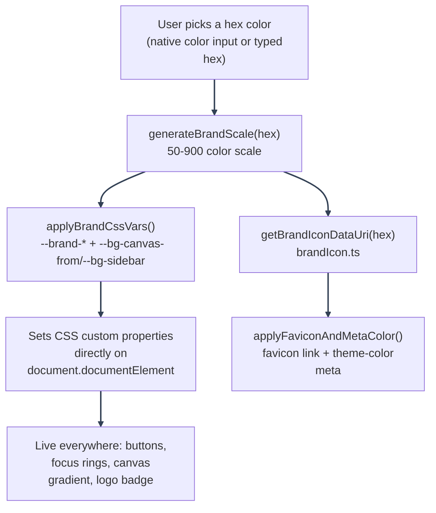

# Appearance: Per-User Brand Color

---

_New to a term here? See the [Frontend Glossary](../glossary/frontend.md)._

Lets a signed-in user pick their own brand accent color from Account Settings, re-skinning buttons, focus rings, the page-background gradient, the in-app logo badge, and the browser-tab favicon for themselves, on any device they sign into. This is separate from the app-wide default brand color (`BRAND_COLOR`/`VITE_BRAND_COLOR`, see below), which is what every user starts from. A user's own pick, once saved, overrides that default client-side, only for them; it never changes what anyone else sees.

---

## Default brand color

The app-wide default is one env var, not a code edit: `BRAND_COLOR` in the root `.env` (aliased to `VITE_BRAND_COLOR` for the frontend build, the same pattern `APP_NAME` uses, see [Using This Repository as a Template: Environment configuration](../template-usage/quickstart.md#environment-configuration)). Ships as amber. `frontend/src/mystic_auth/core/settings.ts` reads it (falling back to that same amber if unset), and `frontend/src/mystic_auth/theme/applyBrandCssVars.ts` feeds it through `generateBrandScale`, the same generator described below, to write the whole `--brand-*` CSS variable scale plus the canvas-gradient/sidebar tints onto `<html>` at startup - after `frontend/src/app/theme.ts`'s own `brandColor` override (if any), and before a signed-in user's own pick, which still wins client-side for that user.

Need more than a single color, for example a hand-authored scale that doesn't fit the generator's lightness ladder? `frontend/src/app/theme.ts` still exists for that; see [Frontend Customization: Theme](../template-usage/frontend-customization.md#frontend-customization-1).

---

## Feature map

| Layer                  | Files                                                                                                                       | Responsibility                                                                                                                                                                                                                                                                                                      |
| ---------------------- | --------------------------------------------------------------------------------------------------------------------------- | ------------------------------------------------------------------------------------------------------------------------------------------------------------------------------------------------------------------------------------------------------------------------------------------------------------------- |
| Persistence            | `backend/alembic/versions/c8e2a4f6b9d3_add_user_brand_color.py`, `backend/mystic_auth/user/user_model.py`, `user_schema.py` | Nullable `users.brand_color` column (`#rrggbb`, max length 7). `NULL` means "use the app default," never a stored literal default, so re-skinning `app/theme.ts` still reaches every user who hasn't set their own.                                                                                                 |
| API                    | `PUT /users/me` (`UserUpdate.brand_color`, validated against a hex-color regex)                                             | Same route self-service name/password updates go through; an explicit `null` resets to the app default, using the same `exclude_unset` semantics as every other field on that schema.                                                                                                                               |
| Client cache           | `frontend/src/mystic_auth/store/appearanceStore.ts`                                                                         | Zustand store holding the active `brandColor` (`string \| null`), backed by a `localStorage` cache (`brand-color` key), the same "store + localStorage" split used for color mode, font size, and language.                                                                                                         |
| CSS variable overrides | `frontend/src/mystic_auth/theme/applyBrandCssVars.ts`, `theme/appearanceThemeOverrides.ts`                                  | Subscribes to the store (and to `themeStore.ts`'s color mode) and writes `--brand-50..900` plus `--bg-canvas-from`/`--bg-sidebar` straight onto `<html>.style` whenever either changes - no rebuild step, since every other brand-derived token in `theme/tailwind.css` already references `var(--brand-*)` itself. |
| Scale generation       | `frontend/src/mystic_auth/theme/generateBrandScale.ts`                                                                      | Turns one picked hex into a full 50-900 color scale.                                                                                                                                                                                                                                                                |
| Favicon/meta           | `frontend/src/mystic_auth/theme/applyFaviconAndMetaColor.ts`, `theme/brandIcon.ts`                                          | Updates the `<link rel="icon">` and `<meta name="theme-color">` DOM elements directly, since those sit outside the CSS variable system entirely.                                                                                                                                                                    |
| UI                     | `frontend/src/mystic_auth/account_settings/AppearanceCard.tsx`                                                              | The Account Settings card: color picker, hex input, live light/dark preview, contrast warning, Save/Reset.                                                                                                                                                                                                          |
| Server reconciliation  | `frontend/src/mystic_auth/auth/current_user/useCurrentUserQuery.ts` (`useAuthSession`)                                      | Applies the server's real, stored `brand_color` once `GET /auth/me` resolves, overriding whatever the local cache guessed.                                                                                                                                                                                          |

---

## How overriding CSS variables directly stays correct in both modes

Back when this app rendered with Chakra UI, an earlier version of this feature tried to apply a picked color by overriding Chakra's generated CSS variables after the fact, and silently failed to apply dark-mode values: Chakra compiled its `_light`/`_dark` semantic-token conditions as one CSS rule per usage site (`.dark &`), not a single global custom-property override, so a plain post-hoc variable set only ever reached the light-mode rule. Now that theming is plain `theme/tailwind.css` (a `:root` block plus a single `.dark`-scoped override block), that failure mode doesn't apply: every brand-derived token (`--brand-fg`, `--brand-subtle`, `--brand-selected`, etc.) is itself just `var(--brand-*)`, resolved once per paint, so overriding the raw `--brand-50..900` steps in `applyBrandCssVars.ts` is enough for all of them to follow in both modes. The one exception is `--bg-canvas-from`/`--bg-sidebar`, which don't derive from the brand scale at all (see below) - `applyBrandCssVars.ts` reads `themeStore.ts`'s current color mode directly to pick the right value of the pair.

Because `AppearanceCard.tsx` reads and writes the same store `applyBrandCssVars.ts` subscribes to, every pick applies live across the whole app immediately: there is no separate preview mechanism to keep in sync. The color picker's own preview boxes call `generateBrandScale`/`deriveCanvasFrom` directly, so what's shown on the card is provably the same output the rest of the app will render, not an approximation of it.

---

## Color scale generation

`generateBrandScale(hex)` (`theme/generateBrandScale.ts`) keeps the picked color's hue (and roughly its saturation) fixed, and interpolates lightness across a `LIGHTNESS_LADDER` calibrated against the shipped default's amber scale (Tailwind's amber scale), so an arbitrary input hue lands at roughly the same visual weight and contrast per step as that hand-tuned scale, without per-color manual re-tuning. Saturation is tapered slightly at the darkest steps (`SATURATION_MULTIPLIER`) so `900` doesn't read as an oversaturated near-black. `contrastRatio(a, b)` (WCAG contrast, via the `colord` `a11y` plugin) backs `AppearanceCard.tsx`'s low-contrast warning, checked against `scale["600"]` on white.

The page background gradient's start color (`--bg-canvas-from`, the CSS variable every `AppLayout`/`AuthLayout`/`LandingPage` gradient reads) is derived from this same scale rather than picked separately (`deriveCanvasFrom` in `appearanceThemeOverrides.ts`, the same function `applyBrandCssVars.ts` calls to build the app-wide default's canvas tint from `BRAND_COLOR`): a muted tint of `scale["600"]` in light mode, and a 75/25 blend of a stock near-black with `scale["900"]` in dark mode. A flat `scale["900"]` wash read as too strong at the top of a dark viewport; plain gray alone read as unbranded. `--bg-canvas`, `--bg-canvas-to`, and `--bg-surface` stay at their stock values in both modes; only the gradient's start color (and, via the matching `deriveSidebar`, `--bg-sidebar`) moves with the user's pick.

---

## Applying and persisting a pick

1. **Every drag/keystroke on the picker** updates `AppearanceCard`'s own local `draftBrand` state immediately (cheap, local only), so the swatch and this card's own preview boxes track the pointer with no lag.
2. **Committing to `appearanceStore`** (which triggers `applyBrandCssVars.ts`'s CSS variable writes) is debounced 100ms (`COMMIT_DEBOUNCE_MS`). Committing on every single `input` event while dragging the native color picker's saturation/hue square previously blocked the main thread continuously: Chromium's built-in color picker popup shares the page's renderer process, so a busy main thread stalls the picker's own drag tracking too, not just React's re-render.
3. **Save** (`handleSave`) commits the debounced value immediately, then calls `PUT /users/me` with `{ brand_color: draftBrand }` via `useUpdateMyAccountMutation`, which invalidates the current-user query on success.
4. **Reset** (`handleReset`) sets the local store back to `null` (the app-wide default from `BRAND_COLOR`, shown in the picker) and calls `PUT /users/me` with `{ brand_color: null }`, clearing the stored override.
5. Both mutations reuse the same `PUT /users/me` route self-service name/password changes go through; a `brand_color` change alone never rotates session cookies (only a password change does, see `sessionRotationGuard.ts`).

---

### Reconciliation on login and across devices

The store's `initialBrandColor` (read from `localStorage` at module load, before React's first paint, same as `themeStore.ts`'s color-mode handling) is only ever a locally cached guess, applied eagerly so there's no flash of the default color before the app finishes loading. `useAuthSession` (`useCurrentUserQuery.ts`) is the source of truth: once `GET /auth/me` resolves, it calls `appearance.setBrandColor(data.brand_color ?? null)` with the server's real, stored value, overriding whatever the local cache guessed, e.g. after picking a color on another device, or on a browser that never set anything locally. On a failed/expired session, it resets to `null` (the app default) the same way.

---

## Production checks

- Backend unit tests cover `UserUpdate.brand_color`'s hex-format validation and the `PUT /users/me` handler's null-reset behavior.
- Frontend unit tests cover `generateBrandScale`'s output shape and `contrastRatio`, and `AppearanceCard.tsx`'s debounced commit, save, and reset flows.

---

## Where to go next

- [Frontend Customization](../template-usage/frontend-customization.md): the app-wide default brand color (`app/theme.ts`) this feature overrides per user.
- [Frontend Architecture](../architecture/frontend.md): where `theme/` and `store/` fit into the rest of `frontend/src/mystic_auth/`.

---
