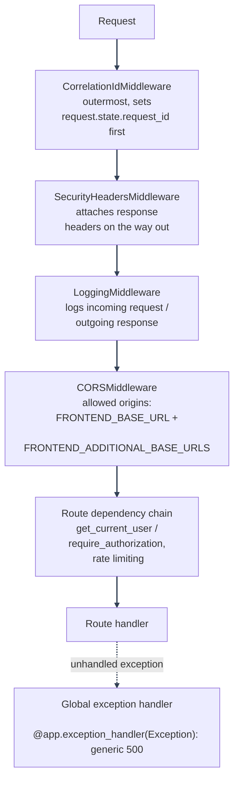

# Backend Architecture

---

_New to a term here? See the [Infrastructure Glossary](../glossary/infrastructure.md) or [Frontend Glossary](../glossary/frontend.md)._

## Purpose

FastAPI application (`backend/mystic_auth/`, with the entry point and extension surface, namely `main.py`, `sdk.py`, `app_sdk.py`, in the sibling `backend/app/`; see [Using This Repository as a Template: the `app/` + `mystic_auth/` split](../template-usage/overview.md#the-app--mystic_auth-split)), async throughout: SQLAlchemy async engine, async Redis client, async SMTP. One codebase, three container roles (`backend`, `procrastinate_worker`, `alembic`) built from the same image with different `command:` overrides. See [Docker Overview](../docker/overview.md).

---

## Module layout

| Module                 | Purpose                                                                                                                                                                                                                                                                                                                                                                                                                                                                                                                                                                                                                                                                                                                                                                                                                                                                                                                                                                                                                                                                                                                                                                                                                                                                                                                                                                                                            |
| ---------------------- | ------------------------------------------------------------------------------------------------------------------------------------------------------------------------------------------------------------------------------------------------------------------------------------------------------------------------------------------------------------------------------------------------------------------------------------------------------------------------------------------------------------------------------------------------------------------------------------------------------------------------------------------------------------------------------------------------------------------------------------------------------------------------------------------------------------------------------------------------------------------------------------------------------------------------------------------------------------------------------------------------------------------------------------------------------------------------------------------------------------------------------------------------------------------------------------------------------------------------------------------------------------------------------------------------------------------------------------------------------------------------------------------------------------------ |
| `api/`                 | Route registration only: one `APIRouter` per feature, no business logic. Grouped: `auth_routes/`, `user_routes/` (`user_self_service_routes.py`, `user_management_query_routes.py`, `user_management_update_routes.py`, `user_lifecycle_routes.py`), `pbac_routes/` (`policies/` for `policy_crud_routes.py`/`policy_history_routes.py`/`policy_assignment_routes.py`, `permissions/` for `permission_assignment_routes.py`/`permission_catalog_routes.py`, `bulk/` for `bulk_policy_routes.py`/`bulk_permission_routes.py`/`bulk_role_routes.py`, plus `authorization_check_routes.py` and `pbac_audit_log_routes.py` at the top level), `audit_log_routes/`, `rate_limit_routes/`, `health_routes/`, plus `get_or_404/get_or_404.py` (the single `get_or_404` helper every route module above uses for its "fetch by id/email/name, 404 if missing" lookups). The per-operation authorization dependencies and protected-policy-name guard those pbac_routes files depend on live in `authorization/dependencies/policy_route_dependencies.py` and `permission_route_dependencies.py`, not here, since they're authorization wiring rather than routes; the password-validate-then-hash prep shared by the two user-update routes lives in `user/user_crud_modules/user_update_payload_preparation.py` for the same reason                                                                                       |
| `auth/`                | Authentication: signup, login, logout, logout-all, refresh-token rotation, password reset, account verification, Google OAuth2/PKCE, JWT/cookie handling; `auth/security/` holds `client_ip.py` (trusted-proxy-aware IP resolution), `security_headers_middleware.py`, `rate_limiter_service.py`, `login_protection_service.py`. See [Authentication Overview](../authentication/overview.md)                                                                                                                                                                                                                                                                                                                                                                                                                                                                                                                                                                                                                                                                                                                                                                                                                                                                                                                                                                                                                      |
| `authorization/`       | PBAC engine: policies, conditions, evaluator, caching, its own audit log. See [PBAC Architecture](../authorization/architecture/README.md)                                                                                                                                                                                                                                                                                                                                                                                                                                                                                                                                                                                                                                                                                                                                                                                                                                                                                                                                                                                                                                                                                                                                                                                                                                                                         |
| `audit_log/`           | Security/session-event audit log (`security_audit_log` table), distinct from the PBAC audit log, see [Database Design](../database/design.md#why-two-audit-tables-not-one)                                                                                                                                                                                                                                                                                                                                                                                                                                                                                                                                                                                                                                                                                                                                                                                                                                                                                                                                                                                                                                                                                                                                                                                                                                         |
| `core/`                | Cross-cutting config: `settings.py` (pydantic-settings, env-driven)                                                                                                                                                                                                                                                                                                                                                                                                                                                                                                                                                                                                                                                                                                                                                                                                                                                                                                                                                                                                                                                                                                                                                                                                                                                                                                                                                |
| `database/`            | `connection.py` for the async SQLAlchemy engine/session factory; `base.py` for the declarative base                                                                                                                                                                                                                                                                                                                                                                                                                                                                                                                                                                                                                                                                                                                                                                                                                                                                                                                                                                                                                                                                                                                                                                                                                                                                                                                |
| `emails/`              | `email_template_service.py` for shared HTML email template rendering; `email_sender.py` for the SMTP transport boundary (swappable provider); `email_normalization.py` canonicalizes stored/looked-up email addresses                                                                                                                                                                                                                                                                                                                                                                                                                                                                                                                                                                                                                                                                                                                                                                                                                                                                                                                                                                                                                                                                                                                                                                                              |
| `error_monitoring/`    | `sentry_service.py` for error reporting via the Sentry SDK protocol (works against Sentry itself or a self-hosted compatible server, e.g. Bugsink, which runs by default). A complete no-op unless `SENTRY_DSN` is set. See [Error Monitoring](../error-monitoring/overview.md)                                                                                                                                                                                                                                                                                                                                                                                                                                                                                                                                                                                                                                                                                                                                                                                                                                                                                                                                                                                                                                                                                                                                    |
| `logging/`             | `logging_config.py` provides `get_logger()` (structured, module-scoped loggers; INFO+ to a rotating JSON file, WARNING+ also to the terminal), `get_startup_logger()` (a handful of one-time, boot-relevant facts, e.g. whether error monitoring is enabled, always visible in the terminal at INFO, not file-only), and `get_worker_logger()` (same file output as `get_logger()`, but INFO is also terminal-visible, for background jobs like `procrastinate_tasks/email_tasks.py` that have no HTTP access log marking when they start/finish); also `correlation_id_middleware.py`, `logging_middleware.py` (request/response logging)                                                                                                                                                                                                                                                                                                                                                                                                                                                                                                                                                                                                                                                                                                                                                                         |
| `redis/`               | `client.py`: single async Redis client, shared by rate limiting, lockout, caching, and account/chain token-version counters                                                                                                                                                                                                                                                                                                                                                                                                                                                                                                                                                                                                                                                                                                                                                                                                                                                                                                                                                                                                                                                                                                                                                                                                                                                                                        |
| `scripts/`             | `create_system_user.py`: interactive CLI to bootstrap the reserved system account, or promote an existing account to it (never exposed via any API route either way). See [System Superuser: Bootstrapping and Promotion](../authentication/system-superuser/README.md)                                                                                                                                                                                                                                                                                                                                                                                                                                                                                                                                                                                                                                                                                                                                                                                                                                                                                                                                                                                                                                                                                                                                            |
| `procrastinate_tasks/` | `procrastinate_app.py`: the `procrastinate.App`/connector; `email_tasks.py`: the async email-sending task; `account_purge_tasks.py`: the daily scheduled purge job. See [Background Workers](../background-workers/procrastinate.md)                                                                                                                                                                                                                                                                                                                                                                                                                                                                                                                                                                                                                                                                                                                                                                                                                                                                                                                                                                                                                                                                                                                                                                               |
| `user/`                | `user_crud_collector.py` + `user_crud_modules/`: CRUD orchestration for the `users` table; `user_model.py` (SQLAlchemy model, `UserRole` enum), `user_schema.py` (Pydantic schemas)                                                                                                                                                                                                                                                                                                                                                                                                                                                                                                                                                                                                                                                                                                                                                                                                                                                                                                                                                                                                                                                                                                                                                                                                                                |
| `user_session/`        | Best-effort database mirror of active login sessions for the Manage Sessions dashboard card: stable session ids, current refresh-token `jti`, request metadata, expiry, and revoke markers. Also `session_events.py`: the Server-Sent Events stream + Redis Pub/Sub publish/subscribe backing real-time cross-tab/cross-device revocation push. See [Session Management](../authentication/session-management/README.md)                                                                                                                                                                                                                                                                                                                                                                                                                                                                                                                                                                                                                                                                                                                                                                                                                                                                                                                                                                                           |
| `main.py`              | App entrypoint: middleware registration, router mounting, global exception handler, lifespan (starts `watch_for_late_dsn()` as a background task, see [Error Monitoring](../error-monitoring/overview.md), plus DB pool / Redis client cleanup on shutdown)                                                                                                                                                                                                                                                                                                                                                                                                                                                                                                                                                                                                                                                                                                                                                                                                                                                                                                                                                                                                                                                                                                                                                        |
| `sdk.py`               | Public extension surface for your own domain code: the intended single import point for anything you build on top of this template, rather than reaching into the internal modules above directly. Groups roughly into: **PBAC** (`require_authorization`, `authorization_service`, `build_authorization_context`, `Permission`), **auth/DB** (`get_current_user`, `database`, `settings`, `get_or_404`, `UserRole`, `redis_client`), **middleware** (`SecurityHeadersMiddleware`, `LoggingMiddleware`, `CorrelationIdMiddleware`), **logging/errors** (`get_logger`, `init_sentry`, `capture_exception`, `watch_for_late_dsn`), and every built-in **router** (`auth_router`, `refresh_token_router`, `user_self_service_router`, `user_management_query_router`, `user_management_update_router`, `user_lifecycle_router`, `policy_crud_router`, `policy_history_router`, `policy_assignment_router`, `permission_assignment_router`, `permission_catalog_router`, `bulk_policy_router`, `bulk_permission_router`, `bulk_role_router`, `authorization_check_router`, `pbac_audit_log_router`, `security_audit_router`, `rate_limit_router`, `health_router`), mounted in `main.py`, re-exported here in case your own `main.py` customization needs to reference one directly. See [Using This Repository as a Template: the app/ + mystic_auth split](../template-usage/overview.md#the-app--mystic_auth-split) |

---

## Request pipeline

---

Starlette applies middleware in reverse of add order, which is why `CorrelationIdMiddleware` is added _last_ in `main.py` to end up _outermost_; see the inline comment there for the exact reasoning. See [Security Hardening: HTTP Layer](../security/hardening-http.md#middleware-ordering).

In production (`ENVIRONMENT=production`), `/docs`, `/redoc`, and `/openapi.json` are disabled entirely (`main.py`), leaving one less surface to lock down at a reverse proxy.

---

## Configuration

All configuration is centralized in `core/settings.py` (`pydantic-settings`, loaded from `env/.env`); every setting is documented inline there with a one-line comment. No module reads an environment variable directly outside of `settings`. See `env/.env.example` for the full list, grouped by category.

---

## Database layer

SQLAlchemy 2.0, fully async (`asyncpg` driver). `database/connection.py`'s `Database` class wraps the async engine (`pool_pre_ping=True`, `pool_recycle=1800`) and session factory; a module-level `database` singleton is imported everywhere a session is needed (`Depends(database.get_session)`). Schema is managed entirely through Alembic migrations (`backend/alembic/versions/`); there's no `create_all()` anywhere in application startup. See [Database Design](../database/design.md).

---

## Error handling

Two layers:

1. **Expected failures**: routes/services raise `HTTPException` with a specific status code and `detail`, or a service method returns `None`/`False` that the route translates into one.
2. **Unexpected failures**: `main.py`'s global exception handler catches anything that escapes both layers, logs the full traceback, and returns a generic `500` with no internal detail. Several service-layer methods (e.g. `signup_service.py`, `oauth2_service.py`) additionally wrap their own bodies in a broad `except Exception` so a partial failure (e.g. a database race) degrades to a clean, generic error response rather than an unhandled 500. See [Security Decisions: the signup/OAuth2 email race](../security/decisions-auth.md#the-signupoauth2-email-race).

---

## Logging

Structured, module-scoped loggers via `logging/logging_config.py::get_logger(__name__)` throughout. Every request gets a correlation ID (`CorrelationIdMiddleware`) that's attached to every log line emitted while handling it, making it possible to grep one request's full trail. Routine INFO-level logging is deliberately file-only (`logs/access.log`, rotated JSON, unconditionally, see below), so a request's complete trail lives there; only WARNING and above also reach `docker compose logs backend`, by design, to keep the terminal free of routine per-request noise. `get_startup_logger()` is one deliberate exception: a small, separate set of one-time facts (e.g. whether error monitoring is enabled) that are always terminal-visible at INFO, since they're boot-time config an operator would want to see immediately, not per-request volume. `get_worker_logger()` is the other: background jobs (currently just `procrastinate_tasks/email_tasks.py::send_email_task`) have no HTTP access log entry marking when they start or finish, so their INFO-level lifecycle logs (`Sending email to {to_email}`, `Email sent successfully to {to_email}`) are also promoted to the terminal (`docker compose logs procrastinate_worker`), the same way Procrastinate's own job-execution log lines already are, while still writing to `logs/access.log` like `get_logger()`. See [PBAC Troubleshooting: logging and debugging](../authorization/troubleshooting/redis-and-logging.md#logging-and-debugging) for the specific log-message prefixes used by the caching/audit subsystems.

---

**Terminal output is human-readable in dev, structured JSON in production.** File output (`logs/access.log`) stays JSON unconditionally in every environment; this split is for the terminal/`StreamHandler` only. Keyed off `settings.ENVIRONMENT` (the same flag that already decides whether `/docs` is exposed, not a separate one): a person watches this terminal live in dev, where JSON only costs readability; nobody watches a production terminal directly, where logs get shipped to a real aggregator (Loki/ELK/CloudWatch/Datadog/etc.) that needs actual structured fields to filter/search/alert on, not a string to regex apart. Standard practice, not a new idea: `structlog`'s own documented default is the identical split (`ConsoleRenderer` for dev, `JSONRenderer` for prod). See `logging_config.py::_make_stream_formatter()`.

---

## Testing coverage

`tests/backend/mystic_auth/unit/`, `integration/`, `security/`, `performance/`. See [Testing Overview](../testing/overview.md).

---
