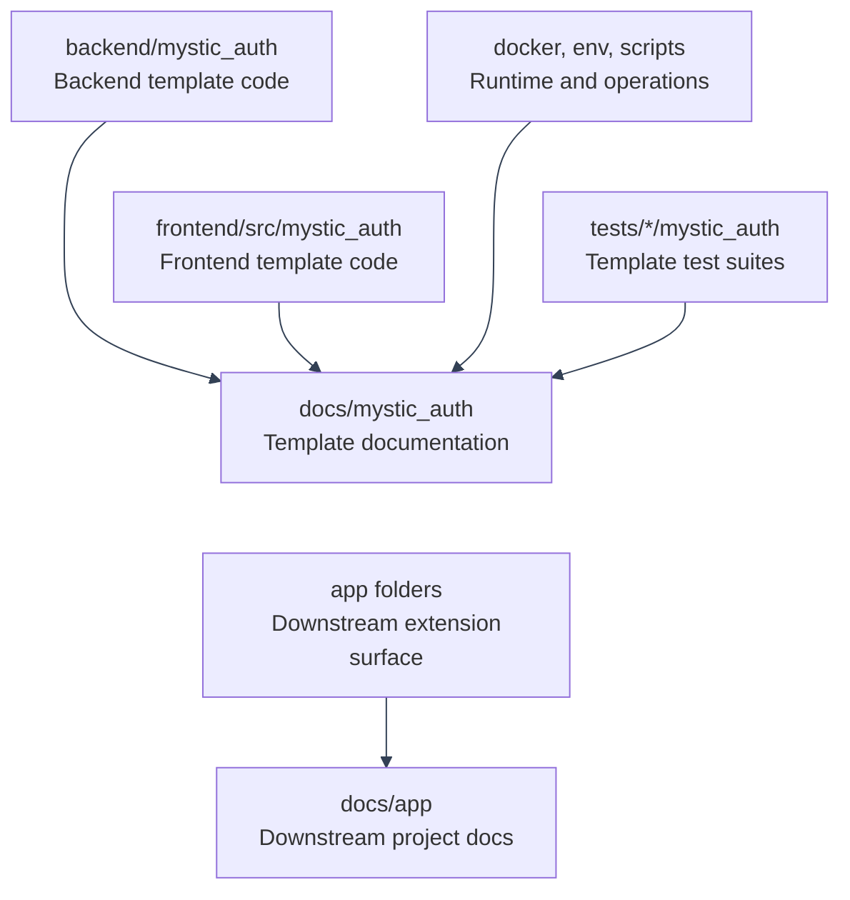

# Implementation Coverage Map

---

This page maps the current repository implementation to the documentation that explains it. Use it when you need to answer: "Where is this code documented?" It does not replace the deeper topic pages. It points to them and states what each code area owns.

The scope here is the template-owned implementation: `backend/mystic_auth/`, `frontend/src/mystic_auth/`, Docker, env templates, scripts, and tests. App-specific extension folders such as `backend/app/`, `frontend/src/app/`, and `docs/app/` are covered in [Using This Repository as a Template](../template-usage/overview.md).

---

---

## Backend Packages

| Code path                                  | What it owns                                                                                                                                              | Primary docs                                                                                                                                                                                                                                                                                                                                                                                | Edge cases documented                                                                                                                                                                                  |
| ------------------------------------------ | --------------------------------------------------------------------------------------------------------------------------------------------------------- | ------------------------------------------------------------------------------------------------------------------------------------------------------------------------------------------------------------------------------------------------------------------------------------------------------------------------------------------------------------------------------------------- | ------------------------------------------------------------------------------------------------------------------------------------------------------------------------------------------------------ |
| `backend/mystic_auth/api/`                 | FastAPI route modules, grouped by feature.                                                                                                                | [API Reference](../api/reference.md), [Backend Architecture](backend.md#module-layout)                                                                                                                                                                                                                                                                                                      | Mounted OpenAPI paths, auth requirements, list query behavior, `X-Total-Count`, `AppError` shape, and `DELETE /rate-limits/{key:path}`.                                                                |
| `backend/mystic_auth/audit_log/`           | Security audit model, repository, service logic, and event capture.                                                                                       | [Database Design](../database/design.md#tables), [API Reference](../api/reference.md), [Security Hardening](../security/hardening.md)                                                                                                                                                                                                                                                       | Separate security vs authorization audit tables, snapshot emails, audit retention after purge, filters, and sorting.                                                                                   |
| `backend/mystic_auth/auth/`                | Signup, login, logout, logout-all, refresh, OAuth2 PKCE, password reset, account verification, current user, tokens, cookies, rate limiting, and lockout. | [Authentication Overview](../authentication/overview.md), [Login](../authentication/login.md), [Logout](../authentication/logout.md), [Session Management](../authentication/session-management/README.md), [Password Reset](../authentication/password-reset.md), [Signup And Verification](../authentication/signup-and-verification.md), [OAuth2 PKCE](../authentication/oauth2-pkce.md) | Timing resistance, lockout order, Redis outage behavior, idempotent logout, refresh-token reuse scoping, verification expiry, OAuth2 state/PKCE validation, and cookie flags.                          |
| `backend/mystic_auth/authorization/`       | PBAC permission vocabulary, policies, direct grants, cache, evaluator, condition handlers, context builder, dependencies, and authorization audit writes. | [PBAC Architecture](../authorization/architecture/README.md), [Condition Schema Reference](../authorization/condition-schema-reference.md), [Adding Permissions](../authorization/adding-permissions.md), [Writing And Testing Policies](../authorization/writing-testing-policies.md)                                                                                                      | Protected baseline policies, caller-holds-what-they-grant checks, cache invalidation, real-time frontend nudges, direct-grant validation gap, condition size/depth limits, and fail-closed evaluation. |
| `backend/mystic_auth/core/`                | Settings, structured errors, and shared core primitives.                                                                                                  | [Environment Configuration](../configuration/environment.md), [API Reference](../api/reference.md#error-responses), [Security Decisions: Infrastructure](../security/decisions-infra.md)                                                                                                                                                                                                    | `SECRET_KEY` length validation, shared env `extra = "ignore"`, `AppError` translation flow, and backend runtime vs frontend build-time env.                                                            |
| `backend/mystic_auth/database/`            | Async SQLAlchemy engine, session dependency, and DB lifecycle.                                                                                            | [Database Design](../database/design.md), [Backend Architecture](backend.md#database-layer), [Deployment Guide](../deployment/migrations-and-backups.md#1-database-migrations)                                                                                                                                                                                                              | `APP_DATABASE_URL` fallback, Alembic-only schema changes, migration role vs runtime role, and dedicated test database behavior.                                                                        |
| `backend/mystic_auth/emails/`              | Email address normalization, templates, SMTP sending, and enqueue helpers.                                                                                | [Background Email Delivery](../background-workers/procrastinate.md), [Signup And Verification](../authentication/signup-and-verification.md), [Password Reset](../authentication/password-reset.md)                                                                                                                                                                                         | Disabled email mode, SMTP failure isolation, retry behavior, and links generated from `FRONTEND_BASE_URL`.                                                                                             |
| `backend/mystic_auth/error_monitoring/`    | Sentry SDK initialization and Bugsink-compatible exception reporting.                                                                                     | [Error Monitoring](../error-monitoring/overview.md), [Security Decisions: Infrastructure](../security/decisions-infra.md#a-malformed-sentry_dsn-must-never-crash-the-app)                                                                                                                                                                                                                   | Empty DSN means off, malformed DSN cannot crash startup, late Bugsink DSN watch, and no-op capture when monitoring is unavailable.                                                                     |
| `backend/mystic_auth/logging/`             | Request logging, correlation IDs, access logs, and startup logging.                                                                                       | [Backend Architecture](backend.md#logging), [Security Decisions: Infrastructure](../security/decisions-infra.md#dockerignore-previously-let-local-files-leak-into-built-images), [Docker Validation History](../docker/validation-history.md)                                                                                                                                               | Local access logs excluded from images, correlation ID propagation, and generic client errors without traceback leaks.                                                                                 |
| `backend/mystic_auth/procrastinate_tasks/` | Postgres-backed jobs, email tasks, account-purge periodic job, and worker lifecycle.                                                                      | [Background Email Delivery](../background-workers/procrastinate.md), [Account Deletion And Purge](../authentication/account-deletion/README.md), [Security Decisions: Infrastructure](../security/decisions-infra.md#taskiq-replaced-with-procrastinate)                                                                                                                                    | No separate scheduler, job persistence in Postgres, retry and failed-job behavior, Alembic-managed queue schema, and daily purge timing.                                                               |
| `backend/mystic_auth/redis/`               | Shared Redis client singleton and lifecycle.                                                                                                              | [Backend Architecture](backend.md#request-pipeline), [Session Management](../authentication/session-management/README.md), [Security Hardening: Infrastructure](../security/hardening-infra.md#redis-authentication)                                                                                                                                                                        | Password-authenticated Redis URLs, shutdown behavior, cache, rate limits, lockout, OAuth2 state, token versions, and SSE Pub/Sub.                                                                      |
| `backend/mystic_auth/scripts/`             | Backend CLI entry points.                                                                                                                                 | [System Superuser](../authentication/system-superuser/README.md), [RBAC Quickstart](../authorization/rbac-quickstart.md)                                                                                                                                                                                                                                                                    | Reserved system account creation, promotion of existing accounts, stale token invalidation, baseline policies, and no API endpoint for system account creation.                                        |
| `backend/mystic_auth/user/`                | User model, role enum, CRUD helpers, list/search/sort behavior, and schemas.                                                                              | [API Reference](../api/reference.md), [Database Design](../database/design.md#tables), [Security Decisions: Auth](../security/decisions-auth.md#role-is-never-used-to-decide-access)                                                                                                                                                                                                        | Role is display metadata, self vs admin updates, password-change session revocation, sorting/filtering constraints, and soft-deleted rows.                                                             |
| `backend/mystic_auth/user_lifecycle/`      | Admin and self-service deletion, reactivation, purge, and shared purge service.                                                                           | [Account Deletion And Purge](../authentication/account-deletion/README.md), [Security Decisions: Product](../security/decisions-product.md#account-lifecycle-soft-delete-by-default), [Database Design](../database/design.md#account-lifecycle)                                                                                                                                            | Soft delete vs purge, grace-period purge job, non-self purge guard, session revocation, audit snapshots, and self-delete current-password confirmation.                                                |
| `backend/mystic_auth/user_session/`        | Manage Sessions rows, targeted revoke, SSE session events, and current-session detection.                                                                 | [Session Management](../authentication/session-management/README.md), [Database Design](../database/design.md#tables), [Frontend Architecture](frontend.md#api-layer)                                                                                                                                                                                                                       | `chain_id` identity, `current_jti` rotation, self-revoke rejection, real-time permission/session refresh, and graceful SSE shutdown.                                                                   |

---

## Frontend Folders

| Code path                                    | What it owns                                                                                                                  | Primary docs                                                                                                                                                                                                                                                                                                          | Edge cases documented                                                                                                                                              |
| -------------------------------------------- | ----------------------------------------------------------------------------------------------------------------------------- | --------------------------------------------------------------------------------------------------------------------------------------------------------------------------------------------------------------------------------------------------------------------------------------------------------------------- | ------------------------------------------------------------------------------------------------------------------------------------------------------------------ |
| `frontend/src/mystic_auth/__tests__/`        | Frontend Vitest helpers and template-owned frontend regression tests.                                                         | [Testing Overview](../testing/overview.md), [Frontend Coverage](../testing/coverage-frontend.md)                                                                                                                                                                                                                      | Coverage thresholds, providers, routing behavior, and auth state under tests.                                                                                      |
| `frontend/src/mystic_auth/account_settings/` | Profile editing, password changes, appearance controls, self-delete, and app extra tabs.                                      | [Account Deletion And Purge](../authentication/account-deletion/README.md), [Appearance](../appearance/overview.md), [Frontend Customization](../template-usage/frontend-customization.md#shared-chrome-extension-points)                                                                                             | Current-password rules, OAuth-only first password, delete confirmation token flow, unsaved-change warning, and app-supplied tabs.                                  |
| `frontend/src/mystic_auth/api/`              | Axios client, typed API wrappers, auth interceptor, error extraction, and translated backend errors.                          | [Frontend Architecture](frontend.md#api-layer), [API Reference](../api/reference.md), [Translations](../translations/overview/ui-and-errors.md#5-backend-error-codes-frontendsrcmystic_authapiapierrorts)                                                                                                             | `withCredentials`, `401` cleanup, translated `AppError` codes, fallback details, `X-Total-Count`, and OAuth2 redirect errors.                                      |
| `frontend/src/mystic_auth/audit_log/`        | Security and authorization audit UI tabs, filters, extension props, and list rendering.                                       | [API Reference](../api/reference.md), [Frontend Customization](../template-usage/frontend-customization.md#shared-chrome-extension-points), [Database Design](../database/design.md#tables)                                                                                                                           | Separate audit sources, app resource/action vocabularies, filters, pagination counts, and translated event display.                                                |
| `frontend/src/mystic_auth/auth/`             | Login, signup, OAuth2 error display, logout hooks, password reset, verification, current user, and session lifecycle helpers. | [Authentication Overview](../authentication/overview.md), [Login](../authentication/login.md), [Logout](../authentication/logout.md), [Signup And Verification](../authentication/signup-and-verification.md), [Password Reset](../authentication/password-reset.md), [OAuth2 PKCE](../authentication/oauth2-pkce.md) | Cookie-only token storage, query-cache cleanup, translated OAuth2 redirect errors, password rules, resend/confirm flows, and stale-session handling.               |
| `frontend/src/mystic_auth/authorization/`    | Permission-check hooks and UI helpers that mirror backend PBAC decisions.                                                     | [PBAC Architecture](../authorization/architecture/frontend-ui.md#frontend-policy-management-ui), [Frontend Architecture](frontend.md#authorization-on-the-frontend-pbac-aware-ui)                                                                                                                                     | Server remains authoritative, frontend hides controls only, batch permission checks, and stale permission refresh through SSE.                                     |
| `frontend/src/mystic_auth/core/`             | Frontend settings and shared constants.                                                                                       | [Environment Configuration](../configuration/environment.md), [Appearance](../appearance/overview.md)                                                                                                                                                                                                                 | Build-time `VITE_*` values, fallback app name, support email, default brand color, and logo URL behavior.                                                          |
| `frontend/src/mystic_auth/dashboard/`        | Dashboard and Manage Sessions card.                                                                                           | [Session Management](../authentication/session-management/README.md), [Frontend Architecture](frontend.md#routing)                                                                                                                                                                                                    | Device labels, current-session detection, targeted revoke, SSE events, empty/error states, and query invalidation.                                                 |
| `frontend/src/mystic_auth/layout/`           | App shell, auth layout, sidebar, navbar, command palette, language/theme controls, and nav extension points.                  | [Frontend Architecture](frontend.md#routing), [Frontend Customization](../template-usage/frontend-customization.md#shared-chrome-extension-points), [Translations](../translations/overview/README.md)                                                                                                                | Permission-gated nav, mixed-language chrome mode, command palette search, app nav/search entries, and responsive layout.                                           |
| `frontend/src/mystic_auth/permissions/`      | Permission catalog page and action vocabulary display.                                                                        | [Adding Permissions](../authorization/adding-permissions.md), [API Reference](../api/reference.md)                                                                                                                                                                                                                    | Catalog read dependency, enum-backed sensitive permissions, and custom app action strings.                                                                         |
| `frontend/src/mystic_auth/policies/`         | Policy list/detail/edit dialogs, condition editor support, history UI, rollback, assignment, and revoke flows.                | [Writing And Testing Policies](../authorization/writing-testing-policies.md), [Condition Schema Reference](../authorization/condition-schema-reference.md), [Policy Examples](../authorization/policy-examples.md)                                                                                                    | Protected baseline policies, snapshots, rollback history, condition validation, cache handling, and privilege-escalation guard errors.                             |
| `frontend/src/mystic_auth/rate_limits/`      | Rate Limit Dashboard and reset UI.                                                                                            | [Security Hardening: Abuse Prevention](../security/hardening-abuse-prevention.md#rate-limiting), [API Reference](../api/reference.md), [Concerns](../concerns/README.md#security)                                                                                                                                     | `key:path` reset route, lockout counters beside rate-limit counters, global threshold limitation, and permission-gated reset behavior.                             |
| `frontend/src/mystic_auth/store/`            | Zustand stores for auth, appearance, color mode, language, and client-only preferences.                                       | [Frontend Architecture](frontend.md#state-management), [Appearance](../appearance/overview.md), [Translations](../translations/overview/ui-and-errors.md#3-the-language-store-frontendsrcmystic_authstorelanguagestorets)                                                                                             | Tokens never enter JS state, localStorage persistence, auth cleanup after `401`, and mixed-language resolution.                                                    |
| `frontend/src/mystic_auth/theme/`            | Chakra system extension, brand scale generation, canvas tint, and token wiring.                                               | [Appearance](../appearance/overview.md), [Frontend Customization](../template-usage/frontend-customization.md#frontend-customization-1)                                                                                                                                                                               | Env default color, user override color, generated favicon behavior, custom logo URL, and `frontend/src/app/theme.ts` overrides.                                    |
| `frontend/src/mystic_auth/translations/`     | Translation setup, namespace files, language modes, date/month/numeral formatting, and language toggle data.                  | [Translations](../translations/overview/README.md), [Adding A Language](../translations/adding-a-language.md)                                                                                                                                                                                                         | Thirteen namespace files per language, mixed chrome/page language modes, native digits, date formatting outside i18next, and dev warnings for missing error codes. |
| `frontend/src/mystic_auth/ui/`               | Shared components, DataTable, routing wrappers, toaster, network status, styles, table actions, and hooks.                    | [Frontend Architecture](frontend.md#module-layout), [API Reference](../api/reference.md#list-endpoint-conventions), [Testing Overview](../testing/overview.md)                                                                                                                                                        | Table pagination contracts, protected routing, translated toasts, network failure display, and shared icon/button styling.                                         |
| `frontend/src/mystic_auth/users/`            | User management, dialogs, bulk operations, queries, role/policy/permission actions.                                           | [API Reference](../api/reference.md), [PBAC Architecture](../authorization/architecture/full-route-list.md#full-route-list), [Users And Sessions Coverage](../testing/coverage-users-and-sessions.md)                                                                                                                 | Bulk per-item results, `system` role special case, direct permission conditions, self-action guards, soft delete, reactivate, and purge.                           |

---

## Runtime And Operations

| Code path                | What it owns                                                    | Primary docs                                                                                                                                                                                          | Edge cases documented                                                                                                                       |
| ------------------------ | --------------------------------------------------------------- | ----------------------------------------------------------------------------------------------------------------------------------------------------------------------------------------------------- | ------------------------------------------------------------------------------------------------------------------------------------------- |
| `docker/compose/`        | Dev, local-prod tunnel variants, and prod Compose files.        | [Docker Overview](../docker/overview.md), [Deployment Guide](../deployment/guide.md), [Local-Prod Deployment](../deployment/local-prod/README.md), [Prod Deployment](../deployment/prod.md)           | Explicit project names, healthcheck sequencing, tunnel IP trust, optional GeoIP profile, backup sidecar limits, and production build args.  |
| `docker/dockerfiles/`    | Backend multi-stage Python image and frontend Vite/nginx image. | [Docker Overview](../docker/overview.md), [Docker Validation History](../docker/validation-history.md), [Security Decisions: Infrastructure](../security/decisions-infra.md)                          | Runtime vs test backend target, non-root user, production frontend copying only `dist`, `.dockerignore` leak fixes, and `VITE_*` injection. |
| `docker/postgres-init/`  | Postgres bootstrap scripts for extra databases and roles.       | [Error Monitoring](../error-monitoring/overview.md), [Docker Overview](../docker/overview.md), [Deployment Guide](../deployment/migrations-and-backups.md#1-database-migrations)                      | Init scripts only run on fresh volumes, Bugsink database creation, and separation from Alembic app migrations.                              |
| `env/`                   | Mode-specific env examples and git-ignored real env files.      | [Environment Configuration](../configuration/environment.md), [Deployment Guide](../deployment/environment.md#1-choosing-the-right-env-template)                                                      | Backend runtime env, frontend build-time env, Compose-only env, tunnel-specific env, required replacements, and fallback rules.             |
| `scripts/docker/`        | Cross-platform stack startup helpers and backend exec helper.   | [Docker Overview](../docker/dev-workflow.md#day-to-day-dev-up-helpers), [Testing Overview](../testing/overview.md)                                                                                    | Healthcheck wait behavior, focused logs, Git Bash path conversion, Linux coverage permissions, and mode-specific compose/env selection.     |
| `scripts/db/`            | Backup and restore helpers.                                     | [Deployment Guide](../deployment/migrations-and-backups.md), [Concerns](../concerns/README.md#database-backups-are-scheduled-and-integrity-checked-but-not-shipped-off-host-or-continuously-archived) | Verified custom-format dumps, restore discipline, same-host limitation, off-host copy requirement, retention, and no PITR.                  |
| `scripts/upstream-sync/` | Template sync script and regression tests.                      | [Staying In Sync With Upstream](../template-usage/syncing-upstream/README.md), [Template Usage](../template-usage/overview.md)                                                                        | Silent partial apply detection, Alembic multi-head detection, git rerere, binary file handling, and executable-bit restoration.             |
| `local-scripts/`         | Operator shortcuts for mode-specific system-user bootstrapping. | [System Superuser](../authentication/system-superuser/README.md)                                                                                                                                      | Fresh-account creation only, ignored `system-user.env`, per-mode compose targeting, and no replacement for interactive promotion.           |

---

## Test Suites

| Code path                                | What it owns                                                                         | Primary docs                                                                                                                                                                                                                              | Edge cases documented                                                                                                  |
| ---------------------------------------- | ------------------------------------------------------------------------------------ | ----------------------------------------------------------------------------------------------------------------------------------------------------------------------------------------------------------------------------------------- | ---------------------------------------------------------------------------------------------------------------------- |
| `tests/backend/mystic_auth/unit/`        | Backend unit tests for services, helpers, schema behavior, settings, and edge cases. | [Testing Overview](../testing/overview.md), [Authentication Coverage](../testing/coverage-authentication.md), [Authorization Coverage](../testing/coverage-authorization/README.md), [Security Coverage](../testing/coverage-security.md) | Token logic, condition validation, route helpers, email tasks, settings validation, and fail-safe behavior.            |
| `tests/backend/mystic_auth/integration/` | Backend routes and database behavior against real Postgres/Redis.                    | [Testing Overview](../testing/overview.md), [Users And Sessions Coverage](../testing/coverage-users-and-sessions.md), [Infrastructure Coverage](../testing/coverage-infrastructure/README.md)                                             | Auth flows, session rows, PBAC route guards, audit writes, migrations, and dedicated test database separation.         |
| `tests/backend/mystic_auth/security/`    | Backend security regression tests.                                                   | [Security Coverage](../testing/coverage-security.md), [Security Hardening](../security/hardening.md)                                                                                                                                      | Privilege escalation, malformed/forged tokens, condition abuse shapes, rate limiting, lockout, and protected policies. |
| `tests/backend/mystic_auth/performance/` | Non-blocking performance regression alarms.                                          | [Testing Overview](../testing/overview.md), [Concerns](../concerns/README.md#performance-tests-are-non-blocking-in-ci)                                                                                                                    | Shared-runner timing noise, real Postgres/Redis dependency, and non-blocking CI behavior.                              |
| `tests/backend/app/`                     | App extension test placeholder area owned by downstream projects.                    | [Template Usage](../template-usage/overview.md), [Testing Overview](../testing/overview.md)                                                                                                                                               | Separation from upstream-owned `tests/backend/mystic_auth/`.                                                           |
| `tests/frontend/mystic_auth/`            | Template frontend behavior tests.                                                    | [Frontend Coverage](../testing/coverage-frontend.md), [Testing Overview](../testing/overview.md)                                                                                                                                          | Router behavior, query providers, translated states, forms, and user interaction flows.                                |
| `tests/frontend/app/`                    | App extension test placeholder area owned by downstream projects.                    | [Template Usage](../template-usage/overview.md), [Testing Overview](../testing/overview.md)                                                                                                                                               | Separation from upstream-owned `tests/frontend/mystic_auth/`.                                                          |

---
