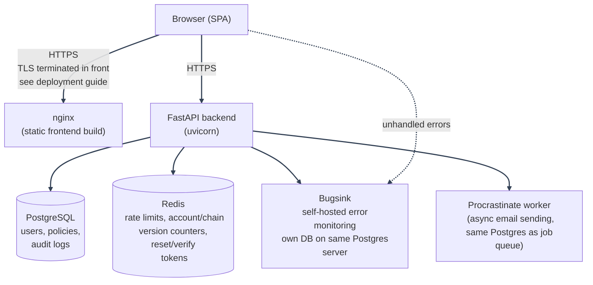
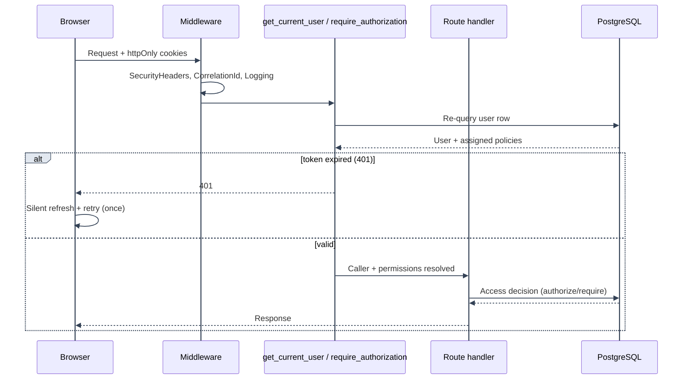

# System Architecture

---

High-level overview of the whole stack. For the PBAC authorization pipeline specifically, see [../authorization/architecture/README.md](../authorization/architecture/README.md); for deployment/runtime topology, see [../deployment/guide.md](../deployment/guide.md).

---

## Components

---

- **Frontend**: React + TypeScript + Chakra UI + Zustand (client state) + TanStack Query (server state). Built as a static SPA, served by nginx in production-style Compose files or Vite's dev server locally (`docker-compose.dev.yml`).
- **Backend**: FastAPI, async throughout (SQLAlchemy async engine, async Redis client). One process type (`backend/app/main.py`), shared by the `backend`, `procrastinate_worker`, and `alembic` containers via the same Docker image (`docker/dockerfiles/backend.Dockerfile`) with different `command:` overrides.
- **PostgreSQL**: system of record: users, policies, policy history, both audit log tables (authorization decisions and security events), and the Procrastinate job queue (`procrastinate_jobs`).
- **Redis**: ephemeral/derived state only, never the source of truth for anything that must survive a flush: rate-limit/lockout counters, the account/chain token-version counters (logout-all and single-session revocation), single-use refresh-token rotation claims, single-use password-reset/email-verification/OAuth2-state tokens (all with TTLs matching their expiry).
- **Email queue**: uses Procrastinate, backed by the same Postgres instance as everything else (no Redis broker). Auth flows enqueue email jobs with `send_email_task.defer_async(...)`, and the `procrastinate_worker` sends them through the configured SMTP sender. Failed sends are retried with exponential backoff, tracked directly on the job's own row; the worker's internal periodic-task deferrer also drives the daily scheduled account-purge job, so no separate scheduler process exists.
- **Bugsink**: self-hosted error monitoring, enabled by default: starts with the stack alongside everything else. Backend and frontend both report unhandled exceptions to it over the Sentry SDK wire protocol. Runs as its own container, using a second database on the same Postgres server (not a second Postgres instance). See [Error Monitoring](../error-monitoring/overview.md).

---

## Why this split

- **Redis vs. Postgres**: everything in Redis is either a cache, a rate/lockout counter, or a single-use token: losing it on a restart degrades gracefully (a user re-requests a password reset; a rate limit resets) rather than corrupting state. Nothing that needs to survive indefinitely (users, policies, audit history, or the background job queue) lives there.
- **Queued email**: email delivery is the one slow, failure-prone I/O call in the auth flows. Queuing it means signup and password-reset requests are not held open waiting on SMTP. Procrastinate fits this stack because Postgres (already the system of record here) is also its job queue: no separate broker infrastructure. See [Security Decisions: Taskiq replaced with Procrastinate](../security/decisions-infra.md#taskiq-replaced-with-procrastinate).
- **One backend image, three roles**: `backend`, `procrastinate_worker`, and `alembic` all run from `docker/dockerfiles/backend.Dockerfile` with different commands, rather than three separate images: keeps dependency versions/code identical across all three by construction, at the cost of the worker/alembic containers also containing an unused `uvicorn` entrypoint they never run.

---

## Request lifecycle (authenticated request)

---

1. Browser sends a request with `access_token`/`refresh_token` httpOnly cookies (never accessible to frontend JS: see [Authentication Flows](../authentication/overview.md)).
2. `SecurityHeadersMiddleware` and `CorrelationIdMiddleware`/`LoggingMiddleware` wrap every request (see `backend/app/main.py`, `backend/mystic_auth/auth/security/`, `backend/mystic_auth/logging/`).
3. `Depends(get_current_user)` (or, for a specific action, `Depends(require_authorization(action, resource_type))`) verifies the JWT, re-queries the user row (so a since-deactivated/deleted account is rejected even with a still-valid, unexpired token: see [Security Decisions](../security/decisions-auth.md#why-current-user-lookups-re-query-the-database-every-time)), and resolves the caller's current PBAC permissions from their assigned policies.
4. On a 401 specifically, `frontend/src/mystic_auth/auth/session_lifecycle/setupAuthInterceptor.ts` attempts one silent refresh-and-retry before giving up and marking the session invalid: see [Authentication Flows](../authentication/overview.md#refresh-token-rotation).
5. The route handler runs, using `authorization_service.authorize()`/`.require()` for any access decision beyond "is there a valid session": every such call also writes an audit log row (allow or deny).

---

## Database design

See [../database/design.md](../database/design.md) for the schema itself (tables, columns, foreign keys, and why several audit tables deliberately store `user_email` as a snapshot string rather than a foreign key).

---
