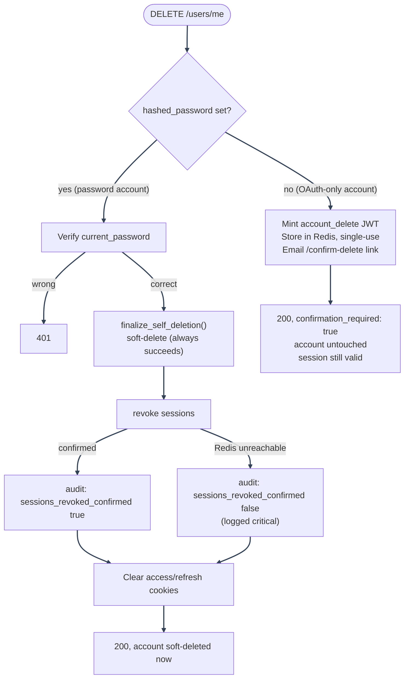
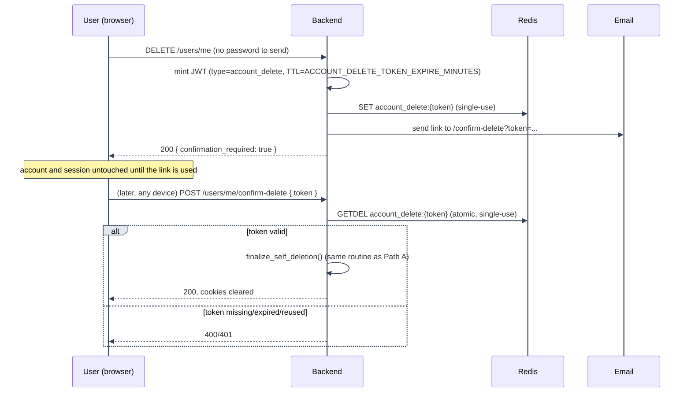
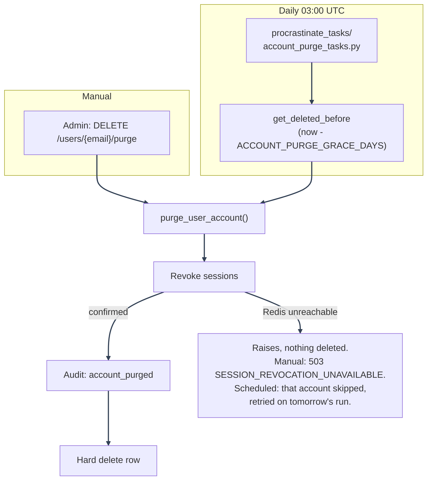

# Account Deletion and Purge

---

This doc covers the full account-deletion lifecycle across backend, frontend, and the scheduled
cleanup job: self-service delete (both the password-account and OAuth-only-account paths), admin
delete/reactivate/purge, and the automatic grace-period purge. It is split out of
[Database Design: Account lifecycle](../database/design.md#account-lifecycle) and
[Security Decisions: Product](../security/decisions-product.md) so the full flow, end to end, lives in one place
with the sequence of each path made explicit.

---

## Feature map

| Layer                 | Files                                                                                                                                    | Responsibility                                                                                      |
| --------------------- | ---------------------------------------------------------------------------------------------------------------------------------------- | --------------------------------------------------------------------------------------------------- |
| Self-service route    | `backend/mystic_auth/api/user_routes/user_self_service_routes.py`                                                                        | `DELETE /users/me`, `POST /users/me/confirm-delete`                                                 |
| Self-service services | `backend/mystic_auth/user_lifecycle/user_self_deletion_service.py`, `account_deletion_service.py`, `account_deletion_confirm_handler.py` | Shared soft-delete routine, deletion-confirmation token issue/verify, confirm-endpoint handler      |
| Admin routes          | `backend/mystic_auth/api/user_routes/user_lifecycle_routes.py`                                                                           | `DELETE /users/{email}`, `DELETE /users/{email}/purge`, `PATCH /users/{email}/reactivate`           |
| Purge routine         | `backend/mystic_auth/user_lifecycle/user_purge_service.py`                                                                               | `purge_user_account()`, shared by the manual purge route and the scheduled job                      |
| Soft-delete mechanics | `backend/mystic_auth/user/user_crud_modules/user_lifecycle_crud.py`                                                                      | `soft_delete`, `reactivate`, `get_deleted_before(cutoff)`                                           |
| Scheduled job         | `backend/mystic_auth/procrastinate_tasks/account_purge_tasks.py`                                                                         | Daily 03:00 UTC purge of accounts past their grace period                                           |
| Frontend              | `frontend/src/mystic_auth/account_settings/DeleteAccountCard.tsx`, `confirm_delete/ConfirmDeleteAccountPage.tsx`                         | Delete UI, password re-confirm, "check your email" state, the public `/confirm-delete` landing page |
| Tests                 | `tests/backend/mystic_auth/integration/user_lifecycle/`, matching unit suites, `tests/frontend/mystic_auth/*/account_settings/`          | End-to-end and unit coverage for every path below                                                   |

---

## Why there are two self-service paths

A hijacked access-token cookie (e.g. via XSS) should never be enough on its own to destroy an
account. For a password account, re-submitting the current password is a cheap, immediate proof
that beats the cookie alone. An OAuth-only account (`hashed_password is None`) has no password to
re-submit, so it gets an async, email-confirmed equivalent instead, modeled on the existing
password-reset flow: a signed, single-use link sent to the address on file. Both converge on the
exact same soft-delete routine, so neither path can drift from the other in what it actually does
to the account.

---

---

### Path A: password account (synchronous)

`user_self_service_routes.py::delete_my_account` verifies `current_password` via the same
`password_service.verify_password` call the change-password flow uses, then calls
`user_self_deletion_service.finalize_self_deletion(user, db, request)`, which:

1. Soft-deletes the row (`user_lifecycle_crud.soft_delete`: `is_active=False`, `deleted_at=now()`).
   This Postgres write always succeeds, independent of Redis.
2. Revokes every session on the account (`refresh_token_service.revoke_all_tokens_for_user`, one
   `account_ver` bump, see [Session Management](session-management.md#source-of-truth)). If the
   bump can't be confirmed (Redis unreachable), that's logged at `critical` rather than raised: the
   soft-delete already happened, so there's no recoverable failure to report back to the caller,
   see [Bump failure handling](session-management.md#bump-failure-handling).
3. Writes an `account_deleted_self` security audit event, distinct from admin-initiated
   `account_deleted`, so the audit log can tell the two apart at a glance - its metadata carries
   `sessions_revoked_confirmed` so an unconfirmed revoke stays visible in the audit trail even
   though the deletion itself succeeded.

The route then clears the `access_token`/`refresh_token` cookies on its response, the same shape
`logout_handler.py` uses, before returning. All of this happens within the one request; the
account is gone from the caller's perspective by the time the response arrives.

---

### Path B: OAuth-only account (asynchronous, email-confirmed)

---

1. **Send.** `DELETE /users/me` on an account with no password mints a signed JWT carrying a
   `type` claim of `"account_delete"`, scoping it away from access/refresh/reset tokens that share
   the same `SECRET_KEY`, so a valid deletion link can never be replayed as a login or
   password-reset token or vice versa. It's stored in Redis under `account_delete:{token}` with a
   TTL from `ACCOUNT_DELETE_TOKEN_EXPIRE_MINUTES`, then emailed as a link to `/confirm-delete`. The
   account and the calling session are both left untouched at this point.
2. **Confirm.** `POST /users/me/confirm-delete` is deliberately unauthenticated (the token itself
   is the proof, the same trust model `POST /auth/password-reset/confirm` uses), so the link must
   work from whatever device the caller opens their email on, not just the one that requested
   deletion.
3. **Redeem.** The token is redeemed via an atomic Redis `GETDEL`, so two concurrent submissions of
   the same link can never both succeed; the first wins, the second sees the key already gone.
4. **Finalize.** A valid, unexpired, unredeemed token runs the exact same
   `finalize_self_deletion()` routine as the password-account path (Path A above).
5. **Rate limiting.** The confirm endpoint is separately rate-limited via
   `login_protection_service` under its own `account_delete_confirm_lock:email:` namespace, kept
   distinct from `login_lock:email:` and `password_reset_confirm_lock:email:` so a stale or reused
   deletion link can never trip, or count towards, an unrelated lockout for that address.

---

## Admin actions

All under `backend/mystic_auth/api/user_routes/user_lifecycle_routes.py`, mounted at `/users`:

| Route                             | Permission         | Effect                                                                                                                                                                                                                                                                                                                      |
| --------------------------------- | ------------------ | --------------------------------------------------------------------------------------------------------------------------------------------------------------------------------------------------------------------------------------------------------------------------------------------------------------------------- |
| `DELETE /users/{email}`           | `users:delete_any` | Soft-delete: same routine as self-service, admin-initiated audit event (`account_deleted`). Same bump-failure handling as self-delete: the soft-delete always succeeds, an unconfirmed revoke is logged critical and recorded as `sessions_revoked_confirmed: false` in the audit metadata rather than erroring the request |
| `PATCH /users/{email}/reactivate` | `users:reactivate` | Clears `is_active`/`deleted_at`; the only way to recover a soft-deleted account, self- or admin-deleted                                                                                                                                                                                                                     |
| `DELETE /users/{email}/purge`     | `users:purge`      | Irreversible hard delete via the shared `purge_user_account()`                                                                                                                                                                                                                                                              |

`users:purge` is a distinct, more sensitive permission from `users:delete_any`, granted only by the
seeded `system_superuser` policy: an admin who can delete accounts day to day cannot irreversibly
destroy one. Both admin routes reject the system account and the caller's own account as targets
(a sole admin purging themselves through the admin route would be an unrecoverable lockout);
self-service delete has no such guard, since acting on your own account is the entire point.

---

## Purge: manual and scheduled

`user_lifecycle/user_purge_service.py::purge_user_account(user, db, *, purged_by, request=None)` is
the one routine both purge paths call, so they can never drift apart:

1. Revoke every session on the account. Unlike every other revoke-adjacent path in the app, this
   one **fails closed**: revocation happens before the irreversible hard delete below, so if the
   bump can't be confirmed (Redis unreachable), `purge_user_account` raises
   `TokenVersionUnavailableError` and nothing past this step runs - no audit write, no delete. See
   [Bump failure handling](session-management.md#bump-failure-handling) for why this one path is
   the exception to "the primary action still succeeds."
2. Write the `account_purged` security audit event, **before** the row is deleted, since that event
   is what makes the irreversible action reviewable afterward.
3. Hard-delete the row. `user_policies` rows cascade-delete (`ON DELETE CASCADE`);
   `authorization_audit_log`/`security_audit_log` rows are untouched, since they store `user_email`
   as a snapshot string rather than a foreign key, so the historical record of what the account did
   survives the account itself.

---

---

The scheduled job (`account_purge_tasks.py::purge_expired_soft_deleted_accounts`) is registered via
`@app.periodic(cron="0 3 * * *")` and deferred automatically by the Procrastinate worker's own
internal periodic-task deferrer: no separate scheduler process is involved (see
[Background Email Delivery](../background-workers/procrastinate.md)). It queries
`user_lifecycle_crud.get_deleted_before(cutoff)` for every account whose `deleted_at` predates
`now - settings.ACCOUNT_PURGE_GRACE_DAYS` (default 30 days) and purges each one with
`purged_by="system:grace_period_purge"`. This is what gives self-service deletion (and admin
soft-delete) an actual recovery window, restorable via `PATCH /users/{email}/reactivate` for the
whole grace period, instead of either purging synchronously (no recovery at all) or accumulating
soft-deleted rows forever.

---

## Frontend behavior

`DeleteAccountCard.tsx` (`frontend/src/mystic_auth/account_settings/`) reads `hasPassword` off the
current user to decide which flow to render: a `PasswordInput` re-confirm field for password
accounts, or a plain confirm button for OAuth-only accounts. Either way it opens a `ConfirmDialog`
before submitting. On success:

- If the response is `{ confirmation_required: true }` (OAuth-only path), it shows a "check your
  email" state without navigating away, since the account and session are still both valid.
- Otherwise (password path), it clears every "me"-scoped TanStack Query cache (current user,
  sessions, own policies, own audit history, matching the same cache-clearing
  [Session Management](session-management.md#frontend-behavior) describes for logout) and navigates
  to `/login`.

`account_settings/confirm_delete/ConfirmDeleteAccountPage.tsx` is the public `/confirm-delete`
route the emailed link opens: it reads `token` from the query string, calls
`POST /users/me/confirm-delete`, and shows success/error/expired states. It renders outside
`AppLayout`/`ProtectedRoute` (like `/login`), since the caller may not have an active session on
whatever device they open the email link from.

---

## Configuration

| Setting                               | Meaning                                                                          | Default |
| ------------------------------------- | -------------------------------------------------------------------------------- | ------- |
| `ACCOUNT_PURGE_GRACE_DAYS`            | Days a soft-deleted account stays recoverable before the scheduled job purges it | 30      |
| `ACCOUNT_DELETE_TOKEN_EXPIRE_MINUTES` | Lifetime of the OAuth-only-account confirmation link                             | 60      |

Both live in `backend/mystic_auth/core/settings.py` and are set via `.env`.

---

## Production checks

- Backend integration tests cover both self-service paths (password re-confirm success/failure,
  OAuth-only send-and-confirm, expired/reused token, rate limiting on the confirm endpoint), admin
  soft-delete/reactivate/purge, self-targeting and system-account guards, and that the scheduled job
  only purges accounts past their grace period.
- Backend unit tests cover `account_deletion_service` token issue/verify and
  `user_purge_service.purge_user_account` in isolation.
- Frontend integration tests cover `DeleteAccountCard` for both account types (password re-confirm
  validation, the "check your email" state) and `ConfirmDeleteAccountPage`'s success/error/expired
  states.

---

## See also

- [Database Design: Account lifecycle](../database/design.md#account-lifecycle): schema-level view
  of soft delete vs. purge, foreign keys, and cascade behavior.
- [Security Decisions: Product](../security/decisions-product.md): the _why_ behind re-authentication requirements
  on both paths.
- [Session Management](session-management.md): how session revocation (step 2 of every path above)
  actually works.

---
