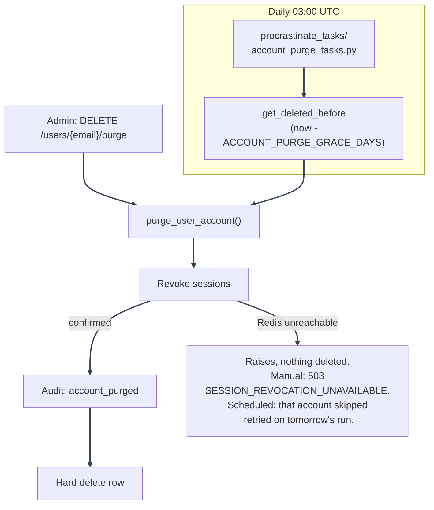

# Account Deletion: Admin Actions and Purge

---

## Admin actions

All under `backend/mystic_auth/api/user_routes/user_lifecycle_routes.py`, mounted at `/users`:

| Route                             | Permission         | Effect                                                                                                                                                                                                                                                                                                                      |
| --------------------------------- | ------------------ | --------------------------------------------------------------------------------------------------------------------------------------------------------------------------------------------------------------------------------------------------------------------------------------------------------------------------- |
| `DELETE /users/{email}`           | `users:delete_any` | Soft-delete: same routine as self-service, admin-initiated audit event (`account_deleted`). Same bump-failure handling as self-delete: the soft-delete always succeeds, an unconfirmed revoke is logged critical and recorded as `sessions_revoked_confirmed: false` in the audit metadata rather than erroring the request |
| `PATCH /users/{email}/reactivate` | `users:reactivate` | Clears `is_active`/`deleted_at`; the only way to recover a soft-deleted account, self- or admin-deleted                                                                                                                                                                                                                     |
| `DELETE /users/{email}/purge`     | `users:purge`      | Irreversible hard delete via the shared `purge_user_account()`                                                                                                                                                                                                                                                              |

`users:purge` is a distinct, more sensitive permission from `users:delete_any`, granted only by the
seeded `system_superuser` policy: an admin who can delete accounts day to day cannot irreversibly
destroy one. Both admin routes reject the system account and the caller's own account as targets
(a sole admin purging themselves through the admin route would be an unrecoverable lockout);
self-service delete has no such guard, since acting on your own account is the entire point.

---

## Purge: manual and scheduled

`user_lifecycle/user_purge_service.py::purge_user_account(user, db, *, purged_by, request=None)` is
the one routine both purge paths call, so they can never drift apart:

1. Revoke every session on the account. Unlike every other revoke-adjacent path in the app, this
   one **fails closed**: revocation happens before the irreversible hard delete below, so if the
   bump can't be confirmed (Redis unreachable), `purge_user_account` raises
   `TokenVersionUnavailableError` and nothing past this step runs - no audit write, no delete. See
   [Bump failure handling](../session-management/token-lifecycle.md#bump-failure-handling) for why this one path is
   the exception to "the primary action still succeeds."
2. Write the `account_purged` security audit event, **before** the row is deleted, since that event
   is what makes the irreversible action reviewable afterward.
3. Hard-delete the row. `user_policies` rows cascade-delete (`ON DELETE CASCADE`);
   `authorization_audit_log`/`security_audit_log` rows are untouched, since they store `user_email`
   as a snapshot string rather than a foreign key, so the historical record of what the account did
   survives the account itself.

---

## Purge flow

---

The scheduled job (`account_purge_tasks.py::purge_expired_soft_deleted_accounts`) is registered via
`@app.periodic(cron="0 3 * * *")` and deferred automatically by the Procrastinate worker's own
internal periodic-task deferrer: no separate scheduler process is involved (see
[Background Email Delivery](../../background-workers/procrastinate.md)). It queries
`user_lifecycle_crud.get_deleted_before(cutoff)` for every account whose `deleted_at` predates
`now - settings.ACCOUNT_PURGE_GRACE_DAYS` (default 30 days) and purges each one with
`purged_by="system:grace_period_purge"`. This is what gives self-service deletion (and admin
soft-delete) an actual recovery window, restorable via `PATCH /users/{email}/reactivate` for the
whole grace period, instead of either purging synchronously (no recovery at all) or accumulating
soft-deleted rows forever.

---

See [Account Deletion](README.md) for the feature map, or [Self-Service Paths](self-service.md)
for the user-initiated flows.

---
