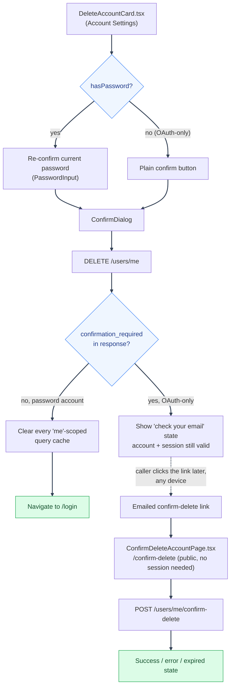

# Account Deletion: Frontend

---

## Frontend behavior

`DeleteAccountCard.tsx` (`frontend/src/mystic_auth/account_settings/`) reads `hasPassword` off the
current user to decide which flow to render: a `PasswordInput` re-confirm field for password
accounts, or a plain confirm button for OAuth-only accounts. Either way it opens a `ConfirmDialog`
before submitting. On success:

- If the response is `{ confirmation_required: true }` (OAuth-only path), it shows a "check your
  email" state without navigating away, since the account and session are still both valid.
- Otherwise (password path), it clears every "me"-scoped TanStack Query cache (current user,
  sessions, own policies, own audit history, matching the same cache-clearing
  [Session Management](../session-management/frontend-and-checks.md#frontend-behavior) describes for logout) and navigates
  to `/login`.

`account_settings/confirm_delete/ConfirmDeleteAccountPage.tsx` is the public `/confirm-delete`
route the emailed link opens: it reads `token` from the query string, calls
`POST /users/me/confirm-delete`, and shows success/error/expired states. It renders outside
`AppLayout`/`ProtectedRoute` (like `/login`), since the caller may not have an active session on
whatever device they open the email link from.

---

---

See [Account Deletion](README.md) for the feature map.

---
