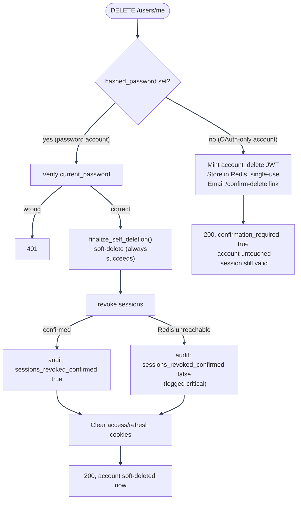
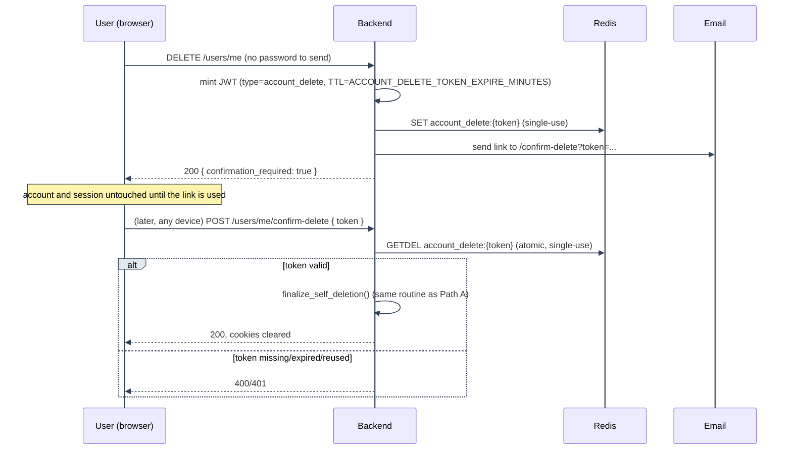

# Account Deletion: Self-Service Paths

---

## Why there are two self-service paths

A hijacked access-token cookie (e.g. via XSS) should never be enough on its own to destroy an
account. For a password account, re-submitting the current password is a cheap, immediate proof
that beats the cookie alone. An OAuth-only account (`hashed_password is None`) has no password to
re-submit, so it gets an async, email-confirmed equivalent instead, modeled on the existing
password-reset flow: a signed, single-use link sent to the address on file. Both converge on the
exact same soft-delete routine, so neither path can drift from the other in what it actually does
to the account.

---

## Which path a request takes

---

## Path A: password account (synchronous)

`user_self_service_routes.py::delete_my_account` verifies `current_password` via the same
`password_service.verify_password` call the change-password flow uses, then calls
`user_self_deletion_service.finalize_self_deletion(user, db, request)`, which:

1. Soft-deletes the row (`user_lifecycle_crud.soft_delete`: `is_active=False`, `deleted_at=now()`).
   This Postgres write always succeeds, independent of Redis.
2. Revokes every session on the account (`refresh_token_service.revoke_all_tokens_for_user`, one
   `account_ver` bump, see [Session Management](../session-management/README.md#source-of-truth)). If the
   bump can't be confirmed (Redis unreachable), that's logged at `critical` rather than raised: the
   soft-delete already happened, so there's no recoverable failure to report back to the caller,
   see [Bump failure handling](../session-management/token-lifecycle.md#bump-failure-handling).
3. Writes an `account_deleted_self` security audit event, distinct from admin-initiated
   `account_deleted`, so the audit log can tell the two apart at a glance - its metadata carries
   `sessions_revoked_confirmed` so an unconfirmed revoke stays visible in the audit trail even
   though the deletion itself succeeded.

The route then clears the `access_token`/`refresh_token` cookies on its response, the same shape
`logout_handler.py` uses, before returning. All of this happens within the one request; the
account is gone from the caller's perspective by the time the response arrives.

---

## Path B: OAuth-only account (asynchronous, email-confirmed)

---

1. **Send.** `DELETE /users/me` on an account with no password mints a signed JWT carrying a
   `type` claim of `"account_delete"`, scoping it away from access/refresh/reset tokens that share
   the same `SECRET_KEY`, so a valid deletion link can never be replayed as a login or
   password-reset token or vice versa. It's stored in Redis under `account_delete:{token}` with a
   TTL from `ACCOUNT_DELETE_TOKEN_EXPIRE_MINUTES`, then emailed as a link to `/confirm-delete`. The
   account and the calling session are both left untouched at this point.
2. **Confirm.** `POST /users/me/confirm-delete` is deliberately unauthenticated (the token itself
   is the proof, the same trust model `POST /auth/password-reset/confirm` uses), so the link must
   work from whatever device the caller opens their email on, not just the one that requested
   deletion.
3. **Redeem.** The token is redeemed via an atomic Redis `GETDEL`, so two concurrent submissions of
   the same link can never both succeed; the first wins, the second sees the key already gone.
4. **Finalize.** A valid, unexpired, unredeemed token runs the exact same
   `finalize_self_deletion()` routine as the password-account path (Path A above).
5. **Rate limiting.** The confirm endpoint is separately rate-limited via
   `login_protection_service` under its own `account_delete_confirm_lock:email:` namespace, kept
   distinct from `login_lock:email:` and `password_reset_confirm_lock:email:` so a stale or reused
   deletion link can never trip, or count towards, an unrelated lockout for that address.

---

See [Account Deletion](README.md) for the feature map, or [Admin Actions and Purge](admin-and-purge.md)
for the admin-initiated and scheduled paths.

---
