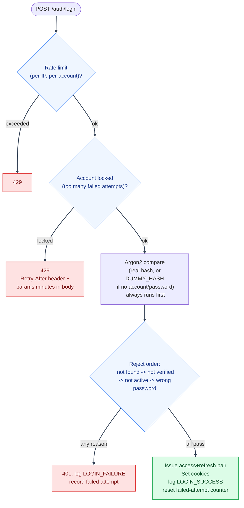

# Login

---

Split out of [Authentication Flows](overview.md) to give the rate-limiting/lockout/timing-safety
stack its own diagram; those three layers are the part of login worth seeing as a flow rather than
a bullet list.

---

## Components

| File                                                                      | Role                                                             |
| ------------------------------------------------------------------------- | ---------------------------------------------------------------- |
| `backend/mystic_auth/auth/login/login_service.py`, `login_handler.py`     | Credential check, ordering of rejection reasons, token issuance  |
| `backend/mystic_auth/auth/security/rate_limiting/rate_limiter_service.py` | Per-IP and per-account sliding-window request limits             |
| `backend/mystic_auth/auth/security/login_protection_service.py`           | Brute-force lockout after `MAX_FAILED_LOGIN_ATTEMPTS`(`_PER_IP`) |
| `backend/mystic_auth/api/auth_routes/auth_routes.py`                      | `POST /auth/login`                                               |
| `frontend/src/mystic_auth/auth/login/`                                    | `LoginPage`, `useLoginMutation`                                  |

---

## Login flow

---

1. **Dual [rate limiting](../glossary/authentication.md#rate-limiting).** A per-IP and a per-account
   sliding-window limit (`rate_limiter_service.py`) run before any credential check, alongside a
   separate [brute-force lockout](../glossary/authentication.md#brute-force-lockout)
   (`login_protection_service.py`) keyed by `MAX_FAILED_LOGIN_ATTEMPTS` per email and
   `MAX_FAILED_LOGIN_ATTEMPTS_PER_IP` per IP (`env/.env.example`).
2. **[Timing-attack-resistant](../glossary/authentication.md#timing-attack-resistance) comparison.**
   `login_service.py` always runs the [Argon2](../glossary/authentication.md#argon2) comparison,
   against the real `hashed_password` if the account exists and has one, or a fixed `DUMMY_HASH`
   otherwise, _before_ checking whether the account exists, is verified, or is active. "Wrong
   password," "no such account," and "account exists but is OAuth2-only (no password set)" all
   take the same amount of time to reject.
3. **Rejection order matters, separately from step 2.** Once the (constant-time) hash comparison
   has run, `login_service.py` checks, in order: account not found, not verified, not active, and
   only then whether the password actually matched. This lets a legitimate user who mistyped their
   password on an unverified account see "verify your email" instead of a generic "wrong password,"
   without weakening the timing protection above (the hash comparison already happened
   unconditionally).
4. **On success:** issue a fresh access+refresh pair, set both cookies, log `LOGIN_SUCCESS` to the
   security audit log, reset the account's failed-attempt counter.
5. **On any rejection:** log `LOGIN_FAILURE` (or `ACCOUNT_LOCKED` if the lockout itself is what
   blocked the attempt) and record a failed attempt against both the rate limiter and lockout
   counters.
6. **A lockout's 429 tells the caller how long to actually wait**, not just that they're locked
   out: `login_handler.py`'s `_lockout_response` reads the tripped lockout key's remaining Redis
   TTL (`login_protection_service.get_remaining_seconds`) and surfaces it two ways, matching how
   production APIs generally communicate a 429's cooldown - the standard `Retry-After` header (RFC 9110) for any client/proxy that already understands it, and `params.minutes` in the JSON body
   (rounded up, never down to 0) for the login form to interpolate into its own translated message
   (`errors.json`'s `ACCOUNT_LOCKED` entry), since a raw header isn't user-facing copy.

---

## Testing coverage

`tests/backend/mystic_auth/unit/auth/login/` covers the handler and service in isolation,
including the rejection-order and timing-safety behavior; `tests/backend/mystic_auth/unit/auth/security/test_login_protection_unit.py`
covers lockout independently; `tests/backend/mystic_auth/integration/auth/test_login_integration.py`
exercises the full path against real Postgres/Redis. See [Testing Overview](../testing/overview.md).

---

## See also

- [Authentication Flows](overview.md): tokens/cookies and how login fits alongside the other flows.
- [Session Management](session-management/README.md): what happens to `chain_id`/`account_ver` right after
  a successful login.
- [Security Hardening: Abuse Prevention](../security/hardening-abuse-prevention.md): the concrete rate-limit/lockout thresholds.

---
