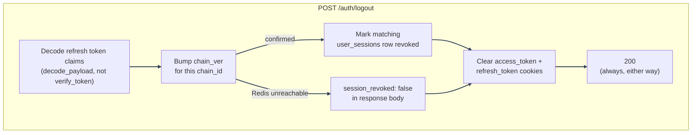
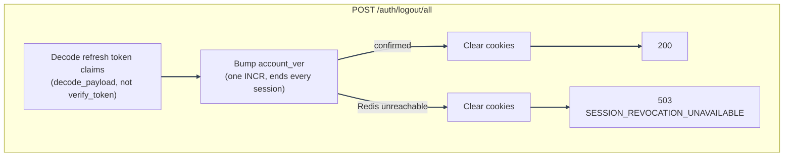

# Logout and Logout-All

---

Split out of [Authentication Flows](overview.md). Both endpoints end sessions by bumping a Redis
version counter, not by deleting or blacklisting tokens; see
[Session Management: source of truth](session-management.md#source-of-truth) for why that scheme
exists. This doc covers the two endpoints themselves and the idempotency behavior that makes them
safe to call against an already-dead token.

---

## Components

| File                                                        | Role                                                       |
| ----------------------------------------------------------- | ---------------------------------------------------------- |
| `backend/mystic_auth/auth/logout/logout_handler.py`         | `POST /auth/logout`: ends the current session only         |
| `backend/mystic_auth/auth/logout_all/logout_all_handler.py` | `POST /auth/logout/all`: ends every session on the account |
| `backend/mystic_auth/auth/token_logic/jwt_service.py`       | `bump_chain_version` / `bump_account_version`              |
| `frontend/src/mystic_auth/auth/logout/useLogoutMutation.ts` | Calls `/auth/logout`, clears "me"-scoped query caches      |

---

## Flow

---

---

1. **Decode without verifying revocation.** Both endpoints read the presented refresh token's
   claims via `jwt_service.decode_payload`, not `verify_token`, so they can still resolve the
   owning `email` and revoke whatever sessions remain even if the presented token is itself
   already stale (see idempotency below). Both still enforce the token's `type` claim, so a
   wrong-type token (e.g. an access token mistakenly presented here) is never treated as resolving
   a real session to revoke.
2. **`POST /auth/logout` bumps only that one session's `chain_ver`**, ending just this device, and
   marks the matching `user_sessions` row revoked (`session_service.revoke_session_on_logout`,
   functionally the same operation as a targeted Manage Sessions revoke, just triggered by the
   device ending its own session). This always returns `200` and clears cookies, even if the bump
   itself couldn't be confirmed (Redis unreachable): the caller's own browser session is gone
   regardless, so that isn't treated as a failure, but the response body carries
   `session_revoked: false` instead of silently pretending the leaked token was actually revoked.
   See [Bump failure handling](session-management.md#bump-failure-handling).
3. **`POST /auth/logout/all` bumps `account_ver` instead.** One Redis `INCR` ends every device
   immediately. The same mechanism backs refresh-token reuse detection for a pre-chain token and
   account soft-delete/purge. Unlike plain logout, revoking every other session _is_ this
   endpoint's whole purpose, so an unconfirmed bump is not treated as a quiet success: cookies are
   still cleared (this browser's own session is done regardless), but the response is
   `503 SESSION_REVOCATION_UNAVAILABLE` rather than `200`, so the caller knows the other devices
   were not actually logged out. See [Bump failure handling](session-management.md#bump-failure-handling).

---

### Idempotency against an already-dead token

Neither endpoint treats "the presented refresh token is already revoked/expired/malformed" as an
error: the caller's goal (no valid session left in this browser) is already true either way, so
both still clear cookies (`POST /auth/logout` also still reports `200`; see
[Bump failure handling](session-management.md#bump-failure-handling) for logout-all's own,
separate `503` case above, which is about an _unconfirmed_ Redis bump, not a stale token). This matters concretely right after a self- or
admin-initiated password change, which bumps `account_ver` and revokes every session for the
account, including the one the current browser is still holding. Clicking Logout immediately
afterward presents that now-stale token; it must still log the browser out cleanly rather than
surfacing an "invalid or already revoked" error while leaving stale cookies (and an
apparently-still-logged-in UI) behind.

---

## Frontend behavior

`useLogoutMutation` and the equivalent logout-all mutation `removeQueries` (not just invalidate)
every "me"-scoped TanStack Query cache: current user, sessions, own policy assignments, own audit
history. None of those caches are keyed by email, so leaving a stale response cached across a
logout could otherwise flash the previous account's data for whoever logs in next in the same
browser tab. See [Session Management: frontend behavior](session-management.md#frontend-behavior).

---

## Testing coverage

`tests/backend/mystic_auth/unit/auth/logout/test_logout_handler_unit.py` and
`tests/backend/mystic_auth/unit/auth/logout_all/test_logout_all_handler_unit.py` cover both
handlers, including the already-dead-token idempotency case;
`tests/backend/mystic_auth/integration/auth/test_logout_integration.py` and the
session-management integration suite exercise both against real Postgres/Redis. See
[Testing Overview](../testing/overview.md).

---

## See also

- [Session Management](session-management.md): the version-counter mechanism both endpoints use,
  and how a revoked session is pushed to every open tab in real time.
- [Authentication Flows](overview.md): tokens/cookies and how logout fits alongside the other flows.

---
