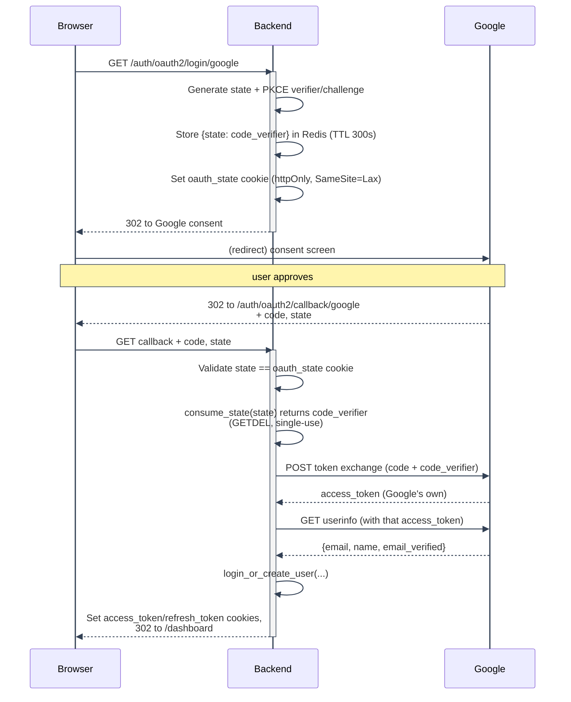

# OAuth2 / PKCE (Google Login)

---

## Purpose

Lets a user authenticate with their Google account instead of (or in addition to) a password, while defending against authorization-code interception (PKCE), CSRF/session fixation (`state`), and a specific pre-registration account-hijacking scenario unique to mixing password and OAuth2 signup on the same email.

---

## Components

| File                                                      | Role                                                                                                                                          |
| --------------------------------------------------------- | --------------------------------------------------------------------------------------------------------------------------------------------- |
| `backend/mystic_auth/auth/oauth2/oauth2_login_handler.py` | Route-facing orchestration: builds the Google redirect, validates the callback, issues the app's own JWTs                                     |
| `backend/mystic_auth/auth/oauth2/oauth2_service.py`       | State/PKCE generation and storage, Google token exchange, userinfo fetch, user creation/login                                                 |
| `backend/mystic_auth/api/auth_routes/auth_routes.py`      | `GET /auth/oauth2/login/google`, `GET /auth/oauth2/callback/google`                                                                           |
| `frontend/src/mystic_auth/auth/oauth2/`                   | `OAuth2LoginButton`/`OAuth2LoginButtonComponent`: a plain link/redirect to the backend's initiate endpoint, no client-side OAuth SDK involved |

---

## Data / request flow

---

## PKCE mechanics

1. **Initiate** (`generate_and_store_state`): generates a random `code_verifier` (`secrets.token_urlsafe(64)`), derives `code_challenge = base64url(SHA256(code_verifier))` (no padding, RFC 7636 S256), and sends only the `code_challenge` to Google in the authorization URL (`code_challenge_method=S256`). The `code_verifier` itself is stored server-side in Redis, keyed by the `state` value, so it never touches the browser.
2. **Callback** (`exchange_code_for_tokens`): the stored `code_verifier` is sent to Google's token endpoint alongside the authorization `code`. Google rejects the exchange if the verifier doesn't hash to the challenge it was given at the start, proving the same party that initiated the flow is the one completing it, even if the authorization `code` itself were intercepted in transit.

PKCE is applied here even though this is a confidential client (it has a `client_secret`), because OAuth 2.1 requires PKCE for every client type, and it defends against a different threat (code interception) than `client_secret`/`state` cover.

---

## CSRF protection (`state`)

A random `state = secrets.token_urlsafe(32)` is generated alongside the PKCE pair, stored in Redis (same TTL, same key as the `code_verifier`: `oauth_state:{state}`), and also set as an `oauth_state` httpOnly cookie (`SameSite=Lax`, since it must survive Google's top-level cross-site redirect back to the callback, which a `Strict` cookie would be dropped from). The callback requires the query-param `state`, the cookie value, and the Redis-stored entry to all agree, then atomically consumes the Redis entry (`GETDEL`) so the same `state` can never be redeemed twice, closing both a CSRF-via-forged-callback vector and a replay vector.

---

## Backend implementation details

- **Redirect URI is server-side fixed** (`settings.GOOGLE_REDIRECT_URI`), never influenced by the client, ruling out an open-redirect-via-OAuth attack.
- **`email_verified` is load-bearing**: a callback where Google's own `email_verified` is falsy (or missing) is rejected outright, since this is the only proof of email ownership the flow trusts. See `oauth2_login_handler.py`'s callback handler.
- **First-time login** creates a user with `role=UserRole.user` (display-only), `is_verified=True`, `hashed_password=None`, and assigns the `self_service` policy, mirroring `signup_service.py`'s policy assignment exactly (role never grants access; see [PBAC Architecture](../authorization/architecture/README.md)).
- **Pre-registration hijack guard**: if an email was already registered via password signup but never verified, and the real owner later authenticates via Google with that address, the existing account's `hashed_password` is cleared at that moment. This closes the window where an attacker's pre-chosen password would otherwise remain valid on an account Google has now confirmed belongs to someone else. An already-verified account's password is left untouched. See `oauth2_service.py::login_or_create_user`'s docstring for the full walkthrough.
- **System account is blocked from OAuth2 login entirely**: `role == UserRole.system` short-circuits before any user creation/update logic, forcing the reserved system account through password login only (`scripts/create_system_user.py`). See [System Superuser: Bootstrapping and Promotion](system-superuser/README.md) for why this script won't promote a Google-only account (no password at all) in place; it offers to delete and recreate it instead, and it promotes any other existing account by setting its `role` to `system` as part of the promotion, deliberately cutting off its own Google login going forward.
- **`access_type`/`prompt` are intentionally omitted** from the Google authorization URL, since this app never stores or uses Google's own refresh token, so there's no reason to force an offline-access grant or a full re-consent prompt on every login.
- Every rejection redirects back to `{FRONTEND_BASE_URL}/login?error=<CODE>` (`oauth2_login_handler.py`'s `_redirect_to_login_clearing_state`) rather than surfacing an API error, with a distinct `<CODE>` per failure reason - see "Edge cases / error handling" below. The frontend's `OAuth2LoginButton` reads that param, translates it via the same `errors:<code>` lookup every other backend error uses (see [Translations](../translations/overview/ui-and-errors.md#5-backend-error-codes-frontendsrcmystic_authapiapierrorts)), and strips it from the URL afterward so a refresh doesn't re-show it.

---

## Frontend integration

`OAuth2LoginButtonComponent` is a plain anchor/redirect to `GET {BACKEND_BASE_URL}/auth/oauth2/login/google`. No `@react-oauth/google` or similar client SDK is used; the entire flow is server-driven redirects. On success, the backend redirects to `{FRONTEND_BASE_URL}/dashboard` with the session cookies already set, so the frontend's normal `GET /auth/me` bootstrap (via `useAuthSession`) picks up the new session exactly as it would after a password login.

On failure, `OAuth2LoginButton.tsx` reads the `?error=<CODE>` param off `/login` (via `useSearchParams`) once on mount, translates it through `apiError.ts`'s `translateErrorCode` (the same `errors:<code>` i18n lookup `extractApiErrorMessage` uses for ordinary API responses, factored out so this redirect-based flow can reuse it without an axios error object to unpack), and passes the result to `OAuth2LoginButtonComponent`'s `error` prop, which renders it via `FormAlert`. The param is then stripped from the URL (`setSearchParams(..., { replace: true })`) so a refresh or back-navigation doesn't re-show a stale error.

---

## Configuration requirements

| Setting                                     | Purpose                                                                                  |
| ------------------------------------------- | ---------------------------------------------------------------------------------------- |
| `GOOGLE_CLIENT_ID` / `GOOGLE_CLIENT_SECRET` | Google Cloud OAuth2 credentials                                                          |
| `GOOGLE_REDIRECT_URI`                       | Must exactly match a redirect URI registered in the Google Cloud Console for this client |
| `FRONTEND_BASE_URL`                         | Where every outcome (success or failure) redirects back to                               |
| `BACKEND_BASE_URL`                          | Used by the frontend to construct the initiate-login URL                                 |

---

## Security considerations

See [Security Decisions: OAuth2 CSRF and account-hijacking protections](../security/decisions-auth.md#oauth2-csrf-and-account-hijacking-protections) for the consolidated rationale, and [Security Hardening: Abuse Prevention](../security/hardening-abuse-prevention.md#rate-limiting) for the rate limits applied to both OAuth2 routes.

---

## Edge cases / error handling

Each rejection redirects to `{FRONTEND_BASE_URL}/login?error=<CODE>` with a code the frontend translates via `errors.json` (see [Translations](../translations/overview/README.md)):

| Situation                                                                                         | Code                                         | Notes                                                                                                                                                                          |
| ------------------------------------------------------------------------------------------------- | -------------------------------------------- | ------------------------------------------------------------------------------------------------------------------------------------------------------------------------------ |
| User cancels the Google consent screen (`error=access_denied`), or `code` is missing              | `OAUTH_CANCELLED`                            | No state or Redis entry touched.                                                                                                                                               |
| `state` missing, doesn't match the `oauth_state` cookie, or was already consumed/expired          | `OAUTH_STATE_INVALID`                        | Logged at `warning`.                                                                                                                                                           |
| Token exchange fails, userinfo fetch fails, or the final token pair is malformed                  | `OAUTH_LOGIN_FAILED`                         | Each external call is independently wrapped in `try/except` and logs its own failure; also the generic fallback for any other unexpected error, including the outer catch-all. |
| Google's `email_verified` is falsy or missing                                                     | `OAUTH_EMAIL_NOT_VERIFIED`                   | An unverified email never reaches `login_or_create_user`.                                                                                                                      |
| `login_or_create_user` raises `OAuth2LoginRejected` for a soft-deleted account (`deleted_at` set) | `ACCOUNT_DELETED`                            | Distinct from plain deactivation - see `deleted_at` vs. `is_active` in [Account Deletion and Purge](account-deletion/README.md).                                               |
| ...for a deactivated-but-not-deleted account, or the reserved system account                      | `ACCOUNT_DEACTIVATED` / `OAUTH_LOGIN_FAILED` | The system-account case deliberately reuses the generic code rather than a distinct one, so it can't be told apart from any other failure.                                     |

In every `OAuth2LoginRejected` case (and the plain `None`-returning failure paths), a `OAUTH2_LOGIN_SUCCESS` security-audit event is still written with `success=False`, so a blocked takeover attempt is reviewable.

Rate-limiting either OAuth2 route (`oauth2_login`/`oauth2_callback` in `rate_limiter_service.py`) also redirects, with `?error=TOO_MANY_ATTEMPTS`, rather than the JSON `429` body every other rate-limited route returns - these are top-level browser navigations, not API calls with anywhere sensible to render JSON. See [Security Hardening: Rate limiting](../security/hardening-abuse-prevention.md#rate-limiting).

---

## Testing coverage

`tests/backend/mystic_auth/unit/auth/oauth2/` covers `oauth2_login_handler` (including CSRF
state validation, split into its own `test_oauth2_callback_state_validation_unit.py`) and
`oauth2_service` with Google HTTP calls mocked, including which `?error=<CODE>` each rejection
redirects with.
`tests/backend/mystic_auth/integration/auth/test_oauth_integration.py` exercises the
initiate-to-callback flow against a real Redis instance. See
[Testing Overview](../testing/overview.md).

---

## Troubleshooting

- **"redirect_uri_mismatch" from Google**: `GOOGLE_REDIRECT_URI` must be byte-for-byte identical to a URI registered in the Google Cloud Console (including scheme and trailing slash).
- **Callback redirects to `/login` with an unexpected or missing error message**: the redirect's `?error=<CODE>` query param is what the frontend translates (see "Edge cases / error handling" above); if it's missing entirely, or the browser shows the raw code instead of a translated message, check `docker compose logs backend` for the specific reason logged at `warning`/`error`, and confirm the code has a matching `errors:<code>` entry in all four `frontend/src/mystic_auth/translations/languages/*/errors.json` files (a missing one logs a `console.error` in the browser dev console, DEV builds only).
- **A returning Google user is asked to "set a password"**: expected if their account has never had one, since `hashed_password` is `None` for OAuth2-only accounts. Use `PUT /users/me` with a `password` field to set one.

---
