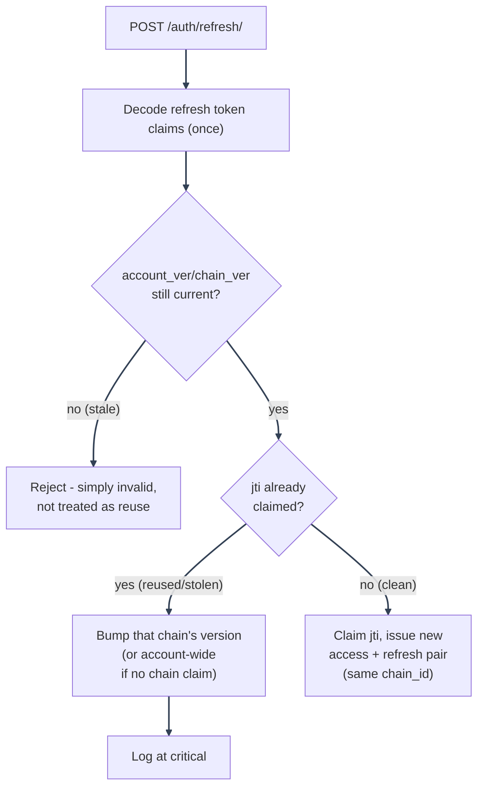

# Authentication Flows

---

_New to a term here? See the [Authentication & Sessions Glossary](../glossary/authentication.md)._

Covers the JWT/cookie mechanics shared by every flow, refresh-token rotation, and current-session
lookups. Each user-facing flow has its own doc, split out so every flow gets its own diagram
instead of competing for space in one long page:

- [Signup and Email Verification](signup-and-verification.md)
- [Login](login.md)
- [Logout and Logout-All](logout.md)
- [Password Reset and Password Change](password-reset.md)
- [Google OAuth2 / PKCE](oauth2-pkce.md)
- [Session Management](session-management/README.md): active-session tracking, refresh-token rotation mirror, real-time revocation push
- [Account Deletion and Purge](account-deletion/README.md)

For _authorization_ (what an authenticated caller is allowed to do, once identified), see
[../authorization/architecture/README.md](../authorization/architecture/README.md).

---

## Tokens and cookies

Every session is a pair of JWTs, delivered as httpOnly cookies: never readable by frontend JavaScript, never stored in `localStorage`/Zustand (see `frontend/src/mystic_auth/store/authStore.ts`, which holds only the profile/permissions `GET /auth/me` returns, not tokens).

| Cookie          | Path                                            | Attributes                              | Purpose                                                                        |
| --------------- | ----------------------------------------------- | --------------------------------------- | ------------------------------------------------------------------------------ |
| `access_token`  | `/`                                             | `httponly`, `secure`, `samesite=Strict` | Sent on every request; verified by `get_current_user` on each one (see below). |
| `refresh_token` | `/auth` (scoped; never sent to non-auth routes) | `httponly`, `secure`, `samesite=Strict` | Only used to mint a new token pair via `POST /auth/refresh/`.                  |

Expiry is configured via `ACCESS_TOKEN_EXPIRE_MINUTES`/`REFRESH_TOKEN_EXPIRE_MINUTES` (`env/.env.example`) and encoded in each JWT's own `exp` claim. The cookie's `max_age` is a separate, independent browser-side hint, not the source of truth; a request with an expired-but-not-yet-cookie-cleared token is still rejected by signature/`exp` verification (`jwt_service.verify_token`).

**Claims**: `email`, `type` (`"access"` or `"refresh"`; a refresh token can never be used where an access token is expected, and vice versa), `jti` (unique ID, used for refresh-token revocation; see below), `chain` (stable per-login-session id, see [Session Management](session-management/README.md#source-of-truth)), `exp`, `iss`/`aud` (`JWT_ISSUER`/`JWT_AUDIENCE`, `.env`, typically both `BACKEND_BASE_URL`; distinguishes this deployment's tokens from any other service/environment that happens to share `SECRET_KEY`). Signed with `HS256` using `SECRET_KEY` (`.env`, required, no default). Deliberately no `role` claim: role is display-only metadata, resolved fresh from the database on every request (alongside PBAC permissions) rather than trusted from a token that could go stale, see [Authorization Model](../authorization/architecture/README.md).

`verify_token` checks `iss`/`aud` itself (`has_valid_issuer_and_audience`), not PyJWT's own `issuer=`/`audience=` kwargs: a token is rejected only if the claim is _present and wrong_, never merely _absent_. That keeps any token minted before `JWT_ISSUER`/`JWT_AUDIENCE` existed valid until it naturally expires, instead of hard-invalidating every session on the deployment that first turns the setting on.

---

## Refresh token rotation

`POST /auth/refresh/` -> `refresh_token_service.refresh_tokens`:

---

1. Decode the refresh token's claims once (not the two-or-three separate decodes an earlier version did).
2. **Version check first**: if the token's embedded `account_ver`/`chain_ver` has already fallen behind Redis's current value after logout, logout-all, password change, or a targeted Manage Sessions revoke, it is rejected as stale. This runs _before_ the reuse check below, so an intentionally ended session is not treated as suspected theft.
3. **Reuse detection**: refresh tokens are still single-use, enforced by an atomic per-`jti` claim (`claim_jti_for_rotation`), independent of the version check above. If a token whose `jti` is _already_ claimed is presented again, the cause could be a stale retry, a race, or token theft. The response bumps that token's own `chain_ver` (`revoke_chain_for_user`), or `account_ver` account-wide for a pre-chain token with no lineage to scope to, and logs the incident at `critical`. See [Session Management](session-management/token-lifecycle.md#rotation-chains-and-reuse-detection) for why this stays scoped to the compromised chain instead of every session on the account.
4. On a clean (non-reused, current-version) token: claim the old `jti`, issue a new access+refresh pair carrying the same `chain_id` forward.

Token validity is version-based, governed by Redis (`account_ver`/`chain_ver` counters, not a registry of live tokens), not the database: `refresh_tokens()` does not re-check `is_active`/account existence itself. The `user_sessions` table mirrors the current `jti`/`chain_id` only for display and targeted revoke in the Manage Sessions card. See [Session Management](session-management/README.md) for the full source-of-truth breakdown.

---

## Current-session lookups (`GET /auth/me`)

Every call re-verifies the JWT _and_ re-queries the database for the user row. This is deliberate, not just "how it happened to be written": it's what makes `is_active=False` (deactivation, soft delete) take effect on the _very next request_, rather than only once the access token's own `exp` is reached. See [Security Decisions](../security/decisions-auth.md#why-current-user-lookups-re-query-the-database-every-time).

Server-side revocation (logout-all, password change, account deactivation, refresh-token reuse detection) is effective immediately: the very next request from an affected session gets `401`. Noticing that client-side is a separate concern. `useCurrentUserQuery` (`frontend/src/mystic_auth/auth/current_user/useCurrentUserQuery.ts`) is mounted once, at the app root, for the app's whole lifetime, so it does not re-run just because the user navigates between pages inside the SPA, and each page's own data query independently caches for the same 30s `staleTime`. Without a background poll, a tab that already had every page's data cached could sit showing "signed in" for a while after being revoked elsewhere, since nothing it does would happen to issue a fresh request that could actually surface the resulting `401`. `refetchInterval`/`refetchIntervalInBackground` on that query is what actually notices a revocation on its own, independent of user interaction or window focus.

---
