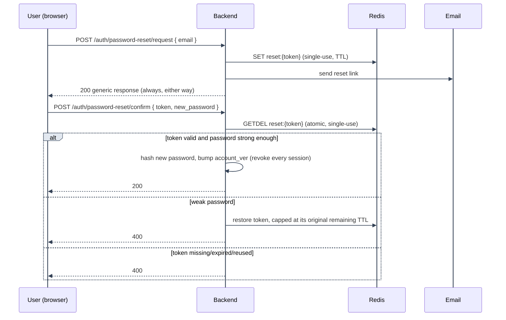
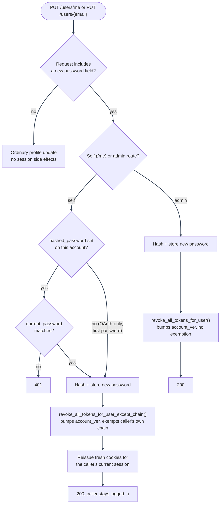

# Password Reset and Password Change

---

Split out of [Authentication Flows](overview.md). Covers the "forgot password" self-service reset
flow, plus the two places a password can otherwise change (self-service and admin), which share the
same session-revocation and current-password rules for the same reasons.

---

## Components

| File                                                                                                  | Role                                                                     |
| ----------------------------------------------------------------------------------------------------- | ------------------------------------------------------------------------ |
| `backend/mystic_auth/auth/password_logic/password_reset_service.py`                                   | Issues/redeems the reset token, enforces password strength               |
| `backend/mystic_auth/auth/password_reset_request/`, `password_reset_confirm/`                         | Route-facing handlers for request/confirm                                |
| `backend/mystic_auth/auth/password_logic/password_service.py`                                         | `hash_password`, `verify_password`, `validate_password_strength`         |
| `backend/mystic_auth/api/auth_routes/auth_routes.py`                                                  | `POST /auth/password-reset/request`, `POST /auth/password-reset/confirm` |
| `backend/mystic_auth/api/user_routes/user_self_service_routes.py`, `user_management_update_routes.py` | `PUT /users/me`, `PUT /users/{email}` (password change, not just reset)  |

---

## Forgot-password flow

---

1. **Request** issues a scoped, Redis-backed single-use token (`GETDEL` pattern, same as email
   verification), emailed to the address. **Always** the same generic response whether or not the
   email is registered, closing the same enumeration gap as signup.
2. **Confirm** atomically redeems the token, validates the new password's strength (the same rule
   signup enforces), rejects if it matches the current password, and, critically, **bumps
   `account_ver`**, so a reset actually ends every other session rather than just changing the
   password while old sessions stay valid.
3. **A recoverable failure (e.g. weak password) restores the Redis token entry**, capped at its
   _original_ remaining TTL: it doesn't get a fresh full-length window, closing a
   window-extension loophole where repeatedly failing validation could keep the same link alive
   indefinitely.

---

## Password change (self-service and admin)

---

1. `PUT /users/me` (self) and `PUT /users/{email}` (admin) both back onto the same `UserUpdate`
   schema, so a `password` field is handled identically by both once past the checks below.
2. **Self-service requests re-confirm the current password.** `PUT /users/me` requires a matching
   `current_password` whenever the request sets a new `password`: proof of the old credential, not
   just a valid session, since a hijacked `access_token` cookie alone would otherwise be enough to
   lock the real owner out. Skipped only for an OAuth-only account (`hashed_password is None`)
   setting a password for the first time, since there is no existing password to confirm.
3. **The admin route skips that check entirely.** `PUT /users/{email}` authenticates via the
   admin's own `users:update_any` permission, not the target account's old password.
4. **A successful self-service password change revokes every _other_ session on the account, but
   not the caller's own.** `PUT /users/me` calls
   `refresh_token_service.revoke_all_tokens_for_user_except_chain`, which still bumps
   `account_ver` but exempts the caller's current `chain_id` and reissues fresh cookies for it, so
   the device making the change stays logged in
   (`backend/mystic_auth/api/user_routes/user_self_service_routes.py`). This differs from
   password-reset-confirm, which has no session to keep: it always fully revokes with
   `revoke_all_tokens_for_user`. The self-service route falls back to the same full,
   no-exemption `revoke_all_tokens_for_user` only if the caller's chain can't be resolved from
   the request's own cookie.
5. **The admin route always fully revokes**, with no exemption:
   `PUT /users/{email}` (`user_management_update_routes.py`) calls
   `refresh_token_service.revoke_all_tokens_for_user` unconditionally, since the admin performing
   the change is not the account owner and has no session on that account to preserve. An ordinary
   profile update with no password field never triggers either revoke path.

See [Security Decisions: self-service password change requires the current password](../security/decisions-auth.md#self-service-password-change-requires-the-current-password).

---

## Testing coverage

`tests/backend/mystic_auth/unit/auth/password_logic/test_password_reset_unit.py` and
`tests/backend/mystic_auth/unit/auth/password_reset_confirm/` cover the token issue/redeem and
strength-validation logic; `tests/backend/mystic_auth/integration/auth/test_password_reset_integration.py`
exercises the full reset path, including the session-revocation side effect, against real
Postgres/Redis. See [Testing Overview](../testing/overview.md).

---

## See also

- [Authentication Flows](overview.md): tokens/cookies and how this fits alongside the other flows.
- [Account Deletion and Purge](account-deletion.md): the OAuth-only-account deletion-confirmation
  flow reuses this same signed-single-use-token pattern.

---
