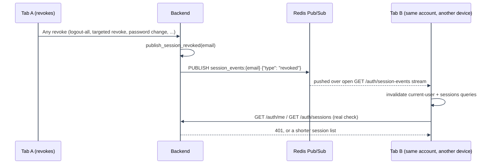
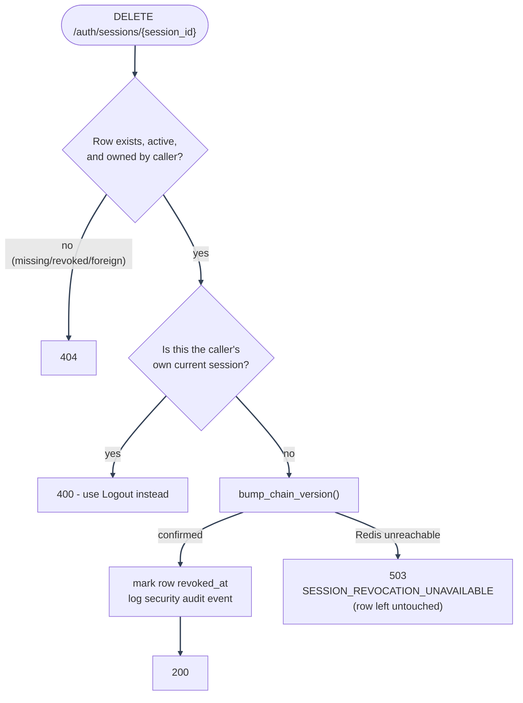

# Session Management

---

This doc covers the Manage Sessions feature across backend, frontend, database, and tests. It is split out of the main authentication overview so that login, refresh, and logout remain readable while the session-display edge cases stay documented in one place.

---

## Feature map

| Layer              | Files                                                                                                                                                         | Responsibility                                                                                                                                      |
| ------------------ | ------------------------------------------------------------------------------------------------------------------------------------------------------------- | --------------------------------------------------------------------------------------------------------------------------------------------------- |
| Routes             | `backend/mystic_auth/api/auth_routes/auth_routes.py`                                                                                                          | Mounts `GET /auth/sessions` and `DELETE /auth/sessions/{session_id}` under the auth router                                                          |
| Handlers           | `backend/mystic_auth/auth/manage_sessions/`                                                                                                                   | Builds response rows, computes `is_current`, rejects self-revoke, maps missing/foreign/revoked sessions to `404`                                    |
| Persistence mirror | `backend/mystic_auth/user_session/`                                                                                                                           | Stores one row per visible login session, updates the row when refresh tokens rotate, marks rows revoked                                            |
| Geolocation        | `backend/mystic_auth/user_session/session_geolocation.py`                                                                                                     | Best-effort city/country lookup for a login IP, via a local MaxMind GeoLite2-City `.mmdb` file                                                      |
| Token authority    | `backend/mystic_auth/auth/token_logic/jwt_service.py` and `auth/refresh_token_logic/refresh_token_service.py`                                                 | Redis-backed version counters (`account_ver`, `chain_ver`), single-use rotation claim, reuse detection                                              |
| Frontend           | `frontend/src/mystic_auth/dashboard/manage_sessions/`                                                                                                         | Dashboard card that lists sessions, formats device metadata, and revokes another active session                                                     |
| Real-time push     | `backend/mystic_auth/user_session/session_events.py`, `GET /auth/session-events`, `frontend/src/mystic_auth/auth/session_lifecycle/useSessionEventsStream.ts` | Server-Sent Events + Redis Pub/Sub nudge every open tab/device the instant a session is revoked or a new one is created. See "Real-time push" below |
| Tests              | `tests/backend/mystic_auth/integration/user_session/test_manage_sessions_integration.py` and matching unit suites                                             | End-to-end and handler/service coverage for list, revoke, self-revoke, foreign session, logout, logout-all, and rotation behavior                   |

---

## Source of truth

Token validity is version-based, not identity-based. Every access and refresh token embeds two numbers at mint time:

- `account_ver`: the whole account's version. Bumping it (`jwt_service.bump_account_version`, one Redis `INCR`) invalidates every token on the account immediately, with no per-token iteration.
- `chain_ver`, scoped to the token's `chain` claim. The `chain` value is a random id minted once at login and carried forward unchanged across every rotation of that login. Bumping it (`jwt_service.bump_chain_version`) ends exactly that one session and leaves every other session on the account untouched.

The actual Redis reads/writes (`account_ver:{email}` and `chain_ver:{email}:{chain_id}` keys) live in `auth/token_logic/token_version_store.py`'s `TokenVersionStore`, not in `jwt_service.py` itself. `jwt_service` imports it and re-exposes `get_account_version`/`get_chain_version`/`bump_account_version`/`bump_chain_version` as its own attributes, so every caller above (and everywhere else in this doc) goes through `jwt_service`, never `token_version_store` directly. `chain_ver` keys carry a TTL matching `REFRESH_TOKEN_EXPIRE_MINUTES`; `account_ver` never expires.

Reads and bumps fail differently on a Redis outage, deliberately. A **read** (`get_account_version`/`get_chain_version`) swallows the error and returns `0`, a version any real token will already exceed, so an outage fails open on the read side rather than locking every session out. A **bump** (`bump_account_version`/`bump_chain_version`) instead returns `False` rather than swallowing the failure: a bump that couldn't be confirmed hasn't actually revoked anything, so callers (`refresh_token_service`, `session_service`) raise `TokenVersionUnavailableError` and let each caller's own route handler decide what that means for its response, instead of quietly reporting success for a revoke that never happened. See "Bump failure handling" below.

`verify_token` rejects a token the instant either embedded number falls behind Redis's current value. There is no registry of live tokens to maintain, prune, or iterate: a revoke is always a single `INCR`, regardless of how many devices are logged in.

Refresh-token rotation is additionally single-use, a narrower and orthogonal concern versioning doesn't cover: `jwt_service.claim_jti_for_rotation` uses an atomic `SET...NX` per `jti` so the exact same refresh token can never be redeemed twice (a real replay, or two concurrent requests racing the same token), whether or not its version is still current.

The `user_sessions` table is a best-effort mirror for user experience, independent of the Redis versions that actually govern validity:

- `id` is the stable identifier returned to the frontend and used for targeted revoke.
- `current_jti` points at the refresh token that currently represents that session; `chain_id` is the stable identity across every rotation of it (what a targeted revoke actually bumps in Redis, and what `is_current`/self-revoke comparisons use, since a row's `current_jti` can be momentarily stale mid-rotation while `chain_id` never changes).
- `created_at` is the first login time for that session.
- `last_used_at` is updated when the session is created or its refresh token rotates.
- `expires_at` mirrors the current refresh token expiry, for display only.
- `revoked_at` marks the row as ended. Rows are not deleted during normal revoke, so session history remains inspectable in the database.
- `ip_address` and `user_agent` are display metadata only. They may be null because some tests and service calls do not have a live request object.
- `city` and `country` are a best-effort geolocation of `ip_address` at the time the row was created (`session_geolocation.resolve_city_country`), resolved against a local MaxMind GeoLite2-City `.mmdb` file. Both are `None` whenever `GEOIP_DB_PATH` is unset, the database fails to open, the IP is missing/private/unresolvable, or the lookup itself fails; every one of those cases fails open silently (logged at most once, at `error` for a bad `GEOIP_DB_PATH` and `warning` per failed lookup), never blocking login or refresh. The MaxMind `.mmdb` file itself is never shipped in this repo (MaxMind's license forbids redistribution); a deployment that wants geolocation needs its own free MaxMind account and license key to download one.

If a `user_sessions` write fails, auth still succeeds or fails based on the real Redis version checks. The service intentionally logs the failure and keeps the auth flow moving, matching the same design used for audit logging.

---

## Lifecycle

1. Password login and OAuth2 login mint a fresh `chain_id` and issue an access token and refresh token embedding it, plus the account's current `account_ver`/`chain_ver`.
2. The login service records a `user_sessions` row using the new refresh-token `jti`, `chain_id`, expiry, IP address, and user agent.
3. `POST /auth/refresh/` first checks that the presented token's own version is still current (`jwt_service.is_current_version`). A stale token already invalidated by a revoke elsewhere is rejected as invalid, not treated as reuse. It then claims the `jti` as single-use and rotates successfully by issuing a new pair carrying the same `chain_id`, then updating `current_jti`, `last_used_at`, and `expires_at` on the existing row.
4. Refresh-token reuse, where the claim step above finds a `jti` already claimed, revokes only the compromised rotation chain (`chain_ver`). It does not revoke every session on the account. See "Rotation chains and reuse detection" below.
5. `POST /auth/logout` bumps that one session's `chain_ver` and marks the matching session row revoked (`session_service.revoke_session_on_logout`). It is functionally the same operation as a targeted Manage Sessions revoke, triggered by the device ending its own session.
6. `POST /auth/logout/all`, password reset confirm, password changes, account soft delete, and account purge all bump `account_ver` through `refresh_token_service.revoke_all_tokens_for_user`. One `INCR` ends every session on the account at once.

---

## Rotation chains and reuse detection

Every refresh token carries a `chain` claim. It is a random id minted once at login and carried forward, unchanged, across every rotation of that login. See `jwt_service.create_refresh_token`, `login_service.py`, `oauth2_service.py`, and `refresh_token_service.refresh_tokens`.

When a refresh token is presented whose `jti` was already claimed (see "Source of truth" above), that is reuse. The cause could be a stale retry, two concurrent requests racing, or a stolen token replayed after the real client already rotated past it. The claim alone cannot distinguish those cases. The response bumps only that reused token's own `chain_ver` (`refresh_token_service.revoke_chain_for_user`). That kills both the reused token and any legitimate-looking rotated descendant sharing its chain, since there is no way to tell which copy belongs to the attacker. Every other chain on the account is unaffected because each chain uses a separate Redis key.

This scoping only applies to `chain_ver`. `account_ver` still gets bumped account-wide for the true whole-account actions (logout-all, password change, deactivation/purge), and access tokens (which carry both numbers, but have no per-device identity beyond their chain) die the instant either their account or chain version goes stale, the same as refresh tokens.

A token minted before chain tracking shipped carries no `chain` claim; reuse of one of those falls back to the original, maximally-safe response (`revoke_all_tokens_for_user`, bumping `account_ver`), since there is no lineage to scope to.

---

## Bump failure handling

A Redis outage means `bump_account_version`/`bump_chain_version` cannot be confirmed, so nothing was actually revoked. Each caller decides what that means for its own response, rather than one blanket policy:

| Endpoint                                                                               | Behavior when the bump can't be confirmed                                                                                                                                                                                                                                                                                                                                                                                                                                                                    |
| -------------------------------------------------------------------------------------- | ------------------------------------------------------------------------------------------------------------------------------------------------------------------------------------------------------------------------------------------------------------------------------------------------------------------------------------------------------------------------------------------------------------------------------------------------------------------------------------------------------------ |
| `POST /auth/logout/all`                                                                | Returns `503` (`SESSION_REVOCATION_UNAVAILABLE`) instead of a false "logged out from N devices". Cookies are still cleared, since this browser's own copy of the goal ("no session left here") is unaffected by whether _other_ devices got revoked.                                                                                                                                                                                                                                                         |
| `DELETE /auth/sessions/{id}` (Manage Sessions "End session")                           | Raises before writing anything to `user_sessions`, so the row is never marked revoked while the token backing it is still live. The route turns this into `503` (`SESSION_REVOCATION_UNAVAILABLE`). Ending one specific session is this endpoint's entire purpose, so it must not report success when that didn't happen.                                                                                                                                                                                    |
| `PUT /users/me` password change                                                        | The password write itself (Postgres, independent of Redis) still succeeds: blocking a password change on an unrelated Redis outage would be worse than the gap it's protecting against. The response carries `sessions_revoked: false` instead, so the caller (and `ChangePasswordCard.tsx`, which shows a distinct warning toast) can see that the account's _other_ sessions were not actually signed out.                                                                                                 |
| `PUT /users/{email}` admin-driven password change (`user_management_update_routes.py`) | Same contract as the self-service password change above: the write succeeds, the response carries `sessions_revoked: false` (`UserAdminUpdateResponse`).                                                                                                                                                                                                                                                                                                                                                     |
| `POST /auth/password-reset/confirm`                                                    | The new password is already written before the revoke is attempted, so a failed bump does not turn a genuine reset into `400 INVALID_RESET_TOKEN_OR_PASSWORD` (it used to, via a broad `except Exception` in `password_reset_service.reset_password` that swallowed the exception - fixed alongside this table). Returns `200` with `sessions_revoked: false`.                                                                                                                                               |
| `DELETE /users/me` self-delete, and `POST /users/me/confirm-delete` (OAuth-only)       | Both go through `finalize_self_deletion`, which soft-deletes first (a Postgres write, unrelated to Redis) and always succeeds regardless of the bump outcome. An unconfirmed bump is logged at `critical` and recorded as `sessions_revoked_confirmed: false` in the `ACCOUNT_DELETED_SELF` audit metadata, but the HTTP response is unaffected - the account really is gone either way.                                                                                                                     |
| `DELETE /users/{email}` admin delete (`delete_any_user`)                               | Same reasoning as self-delete: the soft-delete already succeeded, so an unconfirmed bump is logged at `critical` and recorded in the `ACCOUNT_DELETED` audit metadata (`sessions_revoked_confirmed: false`) rather than erroring the request.                                                                                                                                                                                                                                                                |
| `DELETE /users/{email}/purge` and the scheduled grace-period purge job                 | The only revoke-adjacent path that fails **closed**: `purge_user_account` revokes _before_ the irreversible hard delete, so an unconfirmed bump propagates and the row is never deleted - better to block a permanent action than purge an account whose sessions might still be alive. The admin route turns this into `503` (`SESSION_REVOCATION_UNAVAILABLE`); the scheduled job catches it per-account so one Redis hiccup skips just that account for the day rather than aborting the whole batch.     |
| Reuse detection (`_handle_reuse_detected`, internal to `refresh_tokens()`)             | Stays fail-closed regardless: the reused token itself is rejected (`refresh_tokens()` returns `None`) whether or not the chain/account bump could be confirmed, since that return already happens unconditionally after `_handle_reuse_detected` runs. The `REFRESH_TOKEN_REUSE_DETECTED` audit event still gets written either way, carrying `metadata.revocation_confirmed: false` when the bump failed, so the gap remains visible in the audit trail even though the immediate request was already safe. |

---

## Real-time push

Server-side revocation always takes effect immediately (the next request from an affected session gets `401`, see [Authentication overview](overview.md#current-session-lookups-get-authme)), but a browser tab that isn't actively making requests has no way to notice that on its own.

---

1. **Push (primary).** `GET /auth/session-events` is a Server-Sent Events stream, one per open tab,
   subscribed to a per-account Redis Pub/Sub channel (`session_events:{email}`).
   `user_session/session_events.publish_session_revoked` is called from every revocation path,
   including `refresh_token_service.revoke_all_tokens_for_user`, `revoke_chain_for_user`, and
   `session_service.revoke_one_session`. Logout-all, password changes, account
   deactivation/purge, reuse detection, and a targeted Manage Sessions revoke reach every open tab
   within milliseconds, not on the next poll.
2. **The published event is deliberately minimal**: just `{"type": "revoked"}` or `{"type":
"created"}`, a "something changed, go check now" nudge, not an authoritative "you are logged
   out" message. `publish_session_created` fires from `session_service.py` on every new login
   (password or OAuth2), so Manage Sessions on an already-open tab picks up a fresh device/session
   the same way it picks up a revoke, without waiting on the background poll below. The channel is
   shared by every session on the account, and a sibling session's event must never log an
   unrelated tab out by itself.
3. **On receiving it**, the frontend (`useSessionEventsStream.ts`) invalidates the current-user and
   sessions queries, so the answer always comes from a real `GET /auth/me` or `GET /auth/sessions`
   call, never the push event's own payload.
4. **Background poll (fallback).** `useCurrentUserQuery` and `useSessionsQuery` both independently
   refetch every 2 minutes, including in a backgrounded tab (`refetchIntervalInBackground`). This
   is what keeps a tab eventually correct even if the SSE connection above silently drops and
   doesn't reconnect.

The stream requires authentication the same way `GET /auth/me` does, sends a heartbeat comment line every 20s to keep proxies/load balancers from treating an idle-but-healthy connection as dead, and is not `@rate_limited`: that decorator is built around short request/response calls within a rolling window, not one connection a client holds open for its whole session.

This same channel also carries a third event type, `{"type": "permissions_changed"}`, published whenever an admin grants/revokes/edits a policy that changes what this account is granted. Unlike `revoked`/`created` (handled identically - invalidate the current-user/sessions/last-login queries), `permissions_changed` gets its own branch in `useSessionEventsStream.ts`'s handler: it synchronously fails every permission check closed (`authStore.dropPermissions()`) before any network round-trip, then evicts the entire TanStack Query cache (`queryClient.resetQueries()`, not just invalidate) and refetches. See [Authorization Architecture: Real-time push](../authorization/architecture.md#real-time-push) for why the plain invalidate-only handling this channel used to share across all three event types wasn't enough for this one.

---

## List sessions

`GET /auth/sessions` requires a valid caller session. The handler lists only active rows for the current user and returns `SessionRead` rows:

| Field              | Meaning                                                                                                                                                                                                                                       |
| ------------------ | --------------------------------------------------------------------------------------------------------------------------------------------------------------------------------------------------------------------------------------------- |
| `id`               | Stable session id used by `DELETE /auth/sessions/{session_id}`                                                                                                                                                                                |
| `ip_address`       | Best-effort request IP, resolved with the same trusted-proxy-aware helper used by audit logging (`auth/security/client_ip.py`)                                                                                                                |
| `city` / `country` | Best-effort geolocation of `ip_address`, `None`/`None` if `GEOIP_DB_PATH` is unset or the lookup failed                                                                                                                                       |
| `user_agent`       | Raw user-agent string captured at login or refresh                                                                                                                                                                                            |
| `created_at`       | First login time for this visible session                                                                                                                                                                                                     |
| `last_used_at`     | Last create/refresh time for this visible session                                                                                                                                                                                             |
| `is_current`       | Computed by comparing each row's `chain_id` with the caller's current refresh-token `chain` claim (not `current_jti`/`jti`: a row's jti can be momentarily stale mid-rotation, while chain_id never changes for the session's whole lifetime) |

The response never exposes `current_jti`, `chain_id`, raw JWTs, token expiry internals, or any other token material.

---

## Revoke one session

`DELETE /auth/sessions/{session_id}` ends another active session owned by the current user:

---

1. **Ownership check runs first.** A missing, already-revoked, or foreign (belongs to another
   user) session id returns `404`, before any version is touched, so a caller cannot use guessed
   ids to probe for or revoke another user's session.
2. **The caller's own current session is rejected with `400`**, not silently allowed: the UI
   should use the normal Logout action for the current device, keeping "end this device" and "end
   another device" as two distinct, unambiguous actions.
3. **A successful revoke bumps `chain_ver` first** (`jwt_service.bump_chain_version`), then marks
   the row `revoked_at` and records a security audit event, in that order - deliberately, so a bump
   that can't be confirmed (Redis unreachable) leaves the row untouched instead of marking a session
   "revoked" that's still actually valid. That case returns `503 SESSION_REVOCATION_UNAVAILABLE`
   rather than a false `200`. See [Bump failure handling](#bump-failure-handling).

---

## Active session count on `/auth/me`

`GET /auth/me`'s response includes `active_sessions`, a count of the caller's non-revoked `user_sessions` rows, shown on the dashboard next to the Manage Sessions card. It costs one extra query, so `get_current_user`'s `include_active_sessions` flag defaults to `False` and only `/auth/me` passes `True`: every other protected route resolves through the same shared dependency but never reads this field, so they don't pay for a query whose result they'd discard.

---

## Frontend behavior

`ManageSessionsCard.tsx` lives in `frontend/src/mystic_auth/dashboard/manage_sessions/`, alongside the page that's its only consumer, rather than a separate top-level folder: it owns its own API query and mutation, but nothing else in the app renders it. Device labels come from `parseUserAgent.ts`; failure and empty states are rendered locally by the card.

The table itself shows Device, Location, Signed In, and Last Seen columns, plus a row-actions column; `ip_address` is not one of the table's columns at all, and Location is truncated to fit its column width. A "View" action per row opens `SessionDetailsDialog.tsx`, a read-only panel showing the full device string, raw `ip_address` (or "Unknown"), the untruncated `city`/`country` location string, and both timestamps: everything the table's own columns cut off or truncate.

The current session is displayed but not offered as a targeted revoke action. That keeps the user flow unambiguous: use Logout for this device, use Revoke for other devices.

None of the "me"-scoped TanStack Query caches (sessions, policy assignments, own audit history, last login) are keyed by email, so a stale response from whoever was previously logged in in this same browser tab could otherwise flash for the next account before its own refetch lands. `useLogoutMutation`, `useLogoutAllMutation`, and `setupAuthInterceptor.ts`'s session-expiry handler all `removeQueries` (not just invalidate) these keys on the way out; `useLoginMutation` also invalidates them on the way in, as a second layer, since a login can happen without an explicit prior logout in this same tab (e.g. after a silent session expiry elsewhere).

---

## Production checks

The session feature is covered by:

- Backend unit tests for session list/revoke handlers and session repository/service behavior.
- Backend integration tests using real Postgres and Redis for multi-device login, refresh rotation, targeted revoke, self-revoke rejection, foreign-session rejection, logout, logout-all, and session cleanup after password/account lifecycle changes.
- Backend unit tests cover the SSE stream generator (`user_session/session_events.py`) against real Redis Pub/Sub, including publish/subscribe, heartbeats, and disconnect handling. An integration test confirms that a targeted session revoke publishes. The `GET /auth/session-events` route itself is only integration-tested for its auth contract because httpx's ASGITransport test harness does not reliably support a held-open streaming response.
- Frontend integration tests for the Manage Sessions card list, loading, error, empty, current-session, and revoke flows, plus a unit test for `useSessionEventsStream` (connects only while authenticated, closes on unmount, invalidates the relevant queries on a push event).

---
