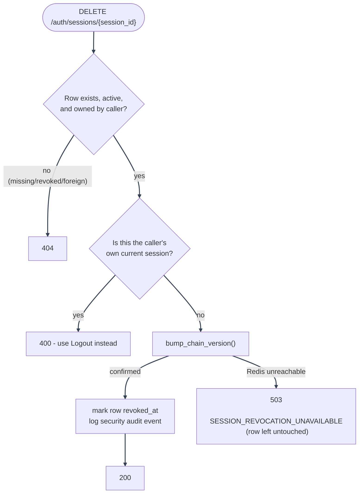

# Session Management: List and Revoke API

---

_New to a term here? See the [Authentication & Sessions Glossary](../../glossary/authentication.md)._

## List sessions

`GET /auth/sessions` requires a valid caller session. The handler lists only active rows for the current user and returns `SessionRead` rows:

| Field              | Meaning                                                                                                                                                                                                                                       |
| ------------------ | --------------------------------------------------------------------------------------------------------------------------------------------------------------------------------------------------------------------------------------------- |
| `id`               | Stable session id used by `DELETE /auth/sessions/{session_id}`                                                                                                                                                                                |
| `ip_address`       | Best-effort request IP, resolved with the same trusted-proxy-aware helper used by audit logging (`auth/security/client_ip.py`)                                                                                                                |
| `city` / `country` | Best-effort geolocation of `ip_address`, `None`/`None` if `GEOIP_DB_PATH` is unset or the lookup failed                                                                                                                                       |
| `user_agent`       | Raw user-agent string captured at login or refresh                                                                                                                                                                                            |
| `created_at`       | First login time for this visible session                                                                                                                                                                                                     |
| `last_used_at`     | Last create/refresh time for this visible session                                                                                                                                                                                             |
| `is_current`       | Computed by comparing each row's `chain_id` with the caller's current refresh-token `chain` claim (not `current_jti`/`jti`: a row's jti can be momentarily stale mid-rotation, while chain_id never changes for the session's whole lifetime) |

The response never exposes `current_jti`, `chain_id`, raw JWTs, token expiry internals, or any other token material.

---

## Revoke one session

`DELETE /auth/sessions/{session_id}` ends another active session owned by the current user:

---

1. **Ownership check runs first.** A missing, already-revoked, or foreign (belongs to another
   user) session id returns `404`, before any version is touched, so a caller cannot use guessed
   ids to probe for or revoke another user's session.
2. **The caller's own current session is rejected with `400`**, not silently allowed: the UI
   should use the normal Logout action for the current device, keeping "end this device" and "end
   another device" as two distinct, unambiguous actions.
3. **A successful revoke bumps `chain_ver` first** (`jwt_service.bump_chain_version`), then marks
   the row `revoked_at` and records a security audit event, in that order - deliberately, so a bump
   that can't be confirmed (Redis unreachable) leaves the row untouched instead of marking a session
   "revoked" that's still actually valid. That case returns `503 SESSION_REVOCATION_UNAVAILABLE`
   rather than a false `200`. See [Bump failure handling](token-lifecycle.md#bump-failure-handling).

---

## Active session count on `/auth/me`

`GET /auth/me`'s response includes `active_sessions`, a count of the caller's non-revoked `user_sessions` rows, shown on the dashboard next to the Manage Sessions card. It costs one extra query, so `get_current_user`'s `include_active_sessions` flag defaults to `False` and only `/auth/me` passes `True`: every other protected route resolves through the same shared dependency but never reads this field, so they don't pay for a query whose result they'd discard.

---

See [Session Management](README.md) for the feature map.

---
