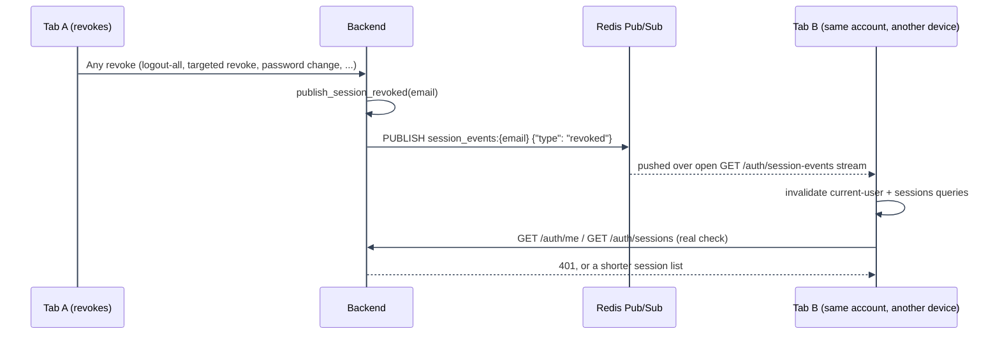

# Session Management: Real-Time Push

---

## Real-time push

Server-side revocation always takes effect immediately (the next request from an affected session gets `401`, see [Authentication overview](../overview.md#current-session-lookups-get-authme)), but a browser tab that isn't actively making requests has no way to notice that on its own.

---

1. **Push (primary).** `GET /auth/session-events` is a Server-Sent Events stream, one per open tab,
   subscribed to a per-account Redis Pub/Sub channel (`session_events:{email}`).
   `user_session/session_events.publish_session_revoked` is called from every revocation path,
   including `refresh_token_service.revoke_all_tokens_for_user`, `revoke_chain_for_user`, and
   `session_service.revoke_one_session`. Logout-all, password changes, account
   deactivation/purge, reuse detection, and a targeted Manage Sessions revoke reach every open tab
   within milliseconds, not on the next poll.
2. **The published event is deliberately minimal**: just `{"type": "revoked"}` or `{"type":
"created"}`, a "something changed, go check now" nudge, not an authoritative "you are logged
   out" message. `publish_session_created` fires from `session_service.py` on every new login
   (password or OAuth2), so Manage Sessions on an already-open tab picks up a fresh device/session
   the same way it picks up a revoke, without waiting on the background poll below. The channel is
   shared by every session on the account, and a sibling session's event must never log an
   unrelated tab out by itself.
3. **On receiving it**, the frontend (`useSessionEventsStream.ts`) invalidates the current-user and
   sessions queries, so the answer always comes from a real `GET /auth/me` or `GET /auth/sessions`
   call, never the push event's own payload.
4. **Background poll (fallback).** `useCurrentUserQuery` and `useSessionsQuery` both independently
   refetch every 2 minutes, including in a backgrounded tab (`refetchIntervalInBackground`). This
   is what keeps a tab eventually correct even if the SSE connection above silently drops and
   doesn't reconnect.

---

### Connection details

The stream requires authentication the same way `GET /auth/me` does, sends a heartbeat comment line every 20s to keep proxies/load balancers from treating an idle-but-healthy connection as dead, and is not `@rate_limited`: that decorator is built around short request/response calls within a rolling window, not one connection a client holds open for its whole session.

---

### A third event type: `permissions_changed`

This same channel also carries a third event type, `{"type": "permissions_changed"}`, published whenever an admin grants/revokes/edits a policy that changes what this account is granted. Unlike `revoked`/`created` (handled identically - invalidate the current-user/sessions/last-login queries), `permissions_changed` gets its own branch in `useSessionEventsStream.ts`'s handler: it synchronously fails every permission check closed (`authStore.dropPermissions()`) before any network round-trip, then evicts the entire TanStack Query cache (`queryClient.resetQueries()`, not just invalidate) and refetches. See [Authorization Architecture: Real-time push](../../authorization/architecture/real-time-push.md#real-time-push) for why the plain invalidate-only handling this channel used to share across all three event types wasn't enough for this one.

---

See [Session Management](README.md) for the feature map.

---
