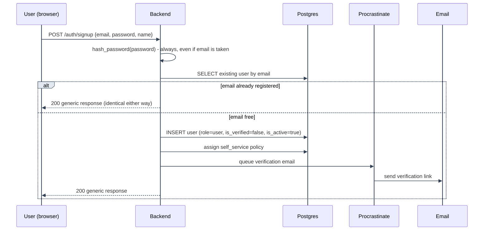
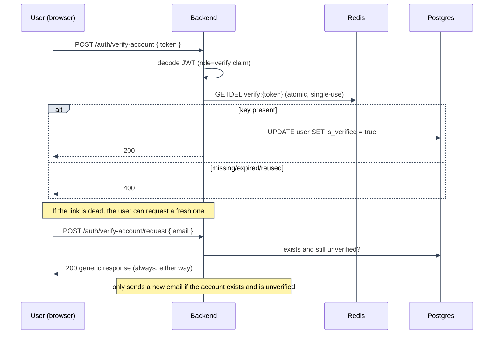

# Signup and Email Verification

---

Split out of [Authentication Flows](overview.md) so the account-creation path (signup, first
verification email, resend, redemption) has room for its own diagram instead of being a stepwise
list next to every other flow.

---

## Components

| File                                                                                                         | Role                                                                                        |
| ------------------------------------------------------------------------------------------------------------ | ------------------------------------------------------------------------------------------- |
| `backend/mystic_auth/auth/signup/signup_service.py`, `signup_handler.py`                                     | Creates the row, hashes the password, assigns `self_service`, queues the verification email |
| `backend/mystic_auth/auth/verify_account/account_verification_service.py`, `account_verification_handler.py` | Issues/redeems the verification token, resend logic                                         |
| `backend/mystic_auth/api/auth_routes/auth_routes.py`                                                         | `POST /auth/signup`, `POST /auth/verify-account`, `POST /auth/verify-account/request`       |
| `backend/mystic_auth/procrastinate_tasks/email_tasks.py`                                                     | Sends the verification email asynchronously                                                 |
| `frontend/src/mystic_auth/auth/signup/`, `auth/verify_account/`                                              | `SignupForm`, `VerifyAccountButton`, resend-cooldown UI                                     |

---

## Signup flow

---

1. **Hash unconditionally.** `password_service.hash_password` runs before the existing-account
   check, on both the free and taken paths. Argon2 hashing is the expensive step; skipping it only
   on the free-email path would let a timing attack distinguish "registered" from "not registered"
   even though both paths return the same HTTP response.
2. **Row creation.** `role=UserRole.user` is display-only (see
   [Security Decisions: role is never used to decide access](../security/decisions-auth.md#role-is-never-used-to-decide-access)).
   `is_verified=False`, `is_active=True`. The `self_service` policy assignment, not the role, is
   what actually grants the new account `users:read_own`/`users:update_own`.
3. **Always the same response.** Whether or not the email was already taken, the endpoint returns
   one generic success message, for the same enumeration-resistance reason as the unconditional
   hash above.

---

## Email verification flow

---

1. The verification token is a scoped JWT (`role="verify"` internally, distinct from a login
   token), paired with a Redis key `verify:{token}` that makes it single-use even within the JWT's
   own expiry window.
2. Redemption is an atomic `GETDEL`, the same single-use pattern used by password reset and
   account-delete confirmation tokens elsewhere in this app.
3. `POST /auth/verify-account/request` always returns the same generic response regardless of
   whether the account exists or is already verified, avoiding both account enumeration and
   spamming an already-verified user with a needless resend.

---

## Edge cases

- A verification link opened twice: the second `GETDEL` finds nothing, so it's rejected as
  invalid, never silently re-verifies or errors in a way that leaks whether the first redemption
  succeeded.
- Requesting a fresh link for an already-verified account is a silent no-op behind the generic
  response, not an error.
- Requesting a fresh link for a nonexistent email is likewise a silent no-op, indistinguishable
  from the "already verified" case above from the caller's side.

---

## Testing coverage

`tests/backend/mystic_auth/unit/auth/signup/test_signup_unit.py` and
`tests/backend/mystic_auth/unit/auth/verify_account/` cover the handler/service logic in
isolation; integration coverage exercises the full signup-to-verified path against real
Postgres/Redis. See [Testing Overview](../testing/overview.md).

---

## See also

- [Authentication Flows](overview.md): tokens/cookies, and how this fits alongside login/OAuth2.
- [Security Decisions: Auth & Session](../security/decisions-auth.md): the enumeration-resistance and timing rationale.

---
