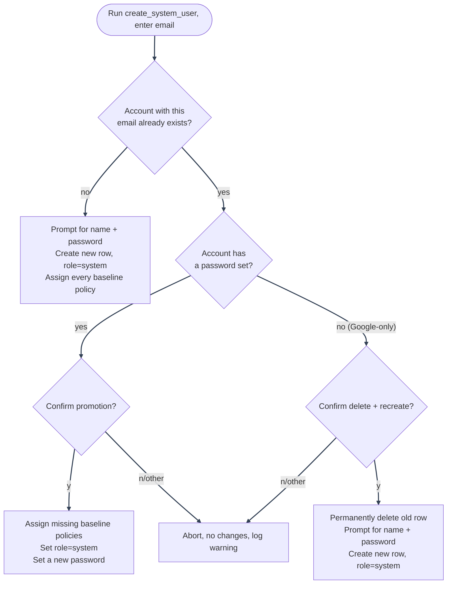

# System Superuser: Bootstrapping and Promotion

---

`backend/mystic_auth/scripts/create_system_user.py` is the only way the reserved system account is ever created or granted; there is no API endpoint for either, by design (see [OAuth2 / PKCE: system account is blocked from OAuth2 login entirely](oauth2-pkce.md)).

Run it after the stack is started and migrations have completed. Pick the command for the mode you are running.

---

## Non-interactive bootstrap scripts

`local-scripts/{dev,local-prod,prod}/` each hold a `create-system-user.{sh,ps1,bat}` that pipes the fresh-account prompts (email, name, password) into the right Compose file for that mode non-interactively, so you don't have to retype them at the interactive prompt every time you reset a local stack. They only cover the fresh-account path below, not promotion of an existing account: run the interactive command further down for that.

To use one:

```bash
cp local-scripts/dev/system-user.env.example local-scripts/dev/system-user.env
# edit local-scripts/dev/system-user.env with real values
local-scripts/dev/create-system-user.sh        # or .ps1 / .bat
```

Same shape for `local-scripts/local-prod/` (against `docker-compose.local-prod.yml`) and `local-scripts/prod/` (against `docker-compose.prod.yml`, real production credentials). Each `system-user.env` is ignored by both `.gitignore` and `.dockerignore`, only the `.example` templates are tracked, so filling one in never risks committing real credentials.

---

### "Permission denied" running one of these

Git tracks each file's executable bit as part of its mode (`100755` vs `100644`), separate from `chmod` on your local checkout. If the `.sh` was ever added to the repo without `+x` set at the time (e.g. authored with a plain editor rather than `chmod +x` beforehand), git stores it non-executable, and every clone/pull/checkout resets it back to `-rw-r--r--` even after you locally `chmod +x` it and it works once. Fix it in the index, not just on disk, so it stays fixed for everyone:

```bash
git update-index --chmod=+x local-scripts/dev/create-system-user.sh
```

Repeat per affected file, then commit the mode change. If you're adding a new `.sh` script to this repo, `chmod +x` it before your first `git add` so this never happens in the first place.

---

## Commands by run mode (interactive)

### Dev Docker

Use this with `.env.example` and `docker-compose.yml`:

```bash
docker compose exec -it backend python -m mystic_auth.scripts.create_system_user
```

### Local-prod Docker

Use this with `.env.local-prod.example` and `docker-compose.local-prod.yml`, the self-hosted Cloudflare Tunnel mode:

```bash
docker compose -f docker-compose.local-prod.yml --env-file .env.local-prod exec -it backend python -m mystic_auth.scripts.create_system_user
```

### Prod Docker

Use this on the server that runs `.env.prod.example` and `docker-compose.prod.yml`:

```bash
docker compose -f docker-compose.prod.yml --env-file .env.prod exec -it backend python -m mystic_auth.scripts.create_system_user
```

### Local Backend Without Docker

Use this only if the backend is running directly on your host and can reach the configured Postgres and Redis:

```bash
PYTHONPATH=backend python -m mystic_auth.scripts.create_system_user
```

If you run any Docker command from a non-interactive shell or CI job, remove `-it`.

---

## Decision flow



---

## Fresh account (the common case)

If the email you give doesn't exist yet, you'll be prompted for a name and password, and a brand-new account is created with every baseline policy assigned (see [PBAC Policy Examples](../authorization/policy-examples.md)) and `role=system`:

```
--- System Superuser Creation ---
Enter system user email: you@example.com
Enter system user name: Your Name
Enter system user password:

System user 'you@example.com' created successfully.
```

---

## If the email already belongs to an existing account

Common if you forgot to bootstrap this first and already signed up or logged in via Google to test something. Rather than refusing outright, the script offers to promote that account instead, after an explicit confirmation, and the exact behavior depends on whether that account already has a password.

---

### Has a password already

Promotes in place:

```
--- System Superuser Creation ---
Enter system user email: you@example.com

 A user with email 'you@example.com' already exists (name: 'Your Name', current role: 'user').
 Promoting will also set this account's role to 'system': Google login (if this account
 ever used it) will stop working afterward; only a password will.
Promote this existing user to system superuser? [y/N]: y
Set a new password for this account:

 Existing user 'you@example.com' promoted to system superuser. Role set to 'system' :
 Google login will no longer work for this account; use the new password instead.
```

What actually happens, and why:

1. **Assigns every missing baseline policy**: this is the actual source of the account's system-superuser access; PBAC never grants access via `role` (see [PBAC Architecture](../authorization/architecture.md)).
2. **Also sets `role` to `system`**: not strictly required for access, but keeps the account's shape consistent with one created fresh, and is what actually disables future Google login for it (`role == UserRole.system` is checked explicitly in the OAuth2 flow; see [OAuth2 / PKCE](oauth2-pkce.md)).
3. **Requires setting a new password**, since the operator running this script may not be the one who originally set the existing one, and a system-level account shouldn't rely on a password nobody currently running this can verify.
4. **Never touched otherwise**: name, email, audit history, and anything else about the account stays exactly as it was.

---

### Google-only, no password at all

A pure Google-login account (`hashed_password` is `NULL`) can't be promoted in place: a system account can't use Google login, and this account has no other way to authenticate, so promoting it as-is would leave it permanently locked out. The script offers to delete that account and create a fresh one instead:

```
--- System Superuser Creation ---
Enter system user email: you@example.com

 A user with email 'you@example.com' already exists (name: 'Your Name'), but it has no
 password: it only ever logged in via Google.
 A system account can't use Google login, so this account needs a password to be usable at all.
Delete this Google-only account and create a fresh system user with the same email instead? [y/N]: y
Enter system user name: Your Name
Enter system user password:

 System user 'you@example.com' created successfully.
```

The delete is a genuine, permanent deletion of that user row (not a soft delete), so confirm you actually mean this specific account before typing `y`. It's still safe with respect to audit history: both audit-log tables store the acting user's email as a snapshot string rather than a foreign key (see [Database Design](../database/design.md#why-two-audit-tables-not-one)), so deleting the user row never erases what that account did beforehand.

---

## Declining either prompt

Anything other than exactly `y` aborts with no changes made, and logs a warning server-side. Safe to run repeatedly (e.g. to double-check what it would do) without committing to anything until you actually confirm.

---

## Why this is CLI-only

Covered in [Security Decisions: Auth & Session](../security/decisions-auth.md) and enforced structurally, not just by convention: the system role is excluded from every generic admin route and from OAuth2 login entirely, and nothing under `api/` can create, promote, or otherwise grant it. Running this script requires `docker compose exec`/shell access to the backend container: server/deploy-level trust, not something reachable by a signed-up user, which is why promoting an _existing_ account this way isn't a new privilege-escalation path the way an equivalent API endpoint would be.

---
