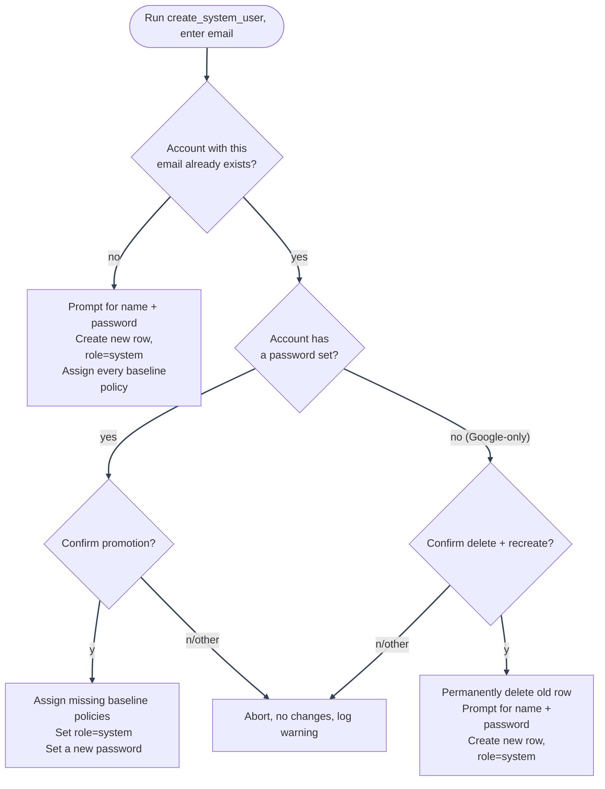

# System Superuser: Behavior and Prompts

---

## Behavior summary

| Case                                                     | What the script does                                                                                                                                                | Code path                                                                                                                    |
| -------------------------------------------------------- | ------------------------------------------------------------------------------------------------------------------------------------------------------------------- | ---------------------------------------------------------------------------------------------------------------------------- |
| Fresh email, no existing row                             | Prompts for name and password, creates the user with `role=system`, marks it verified and active, then assigns every baseline policy in `SYSTEM_USER_POLICY_NAMES`. | `user_crud.create(...)` then `_assign_system_policies(...)`                                                                  |
| Existing account with a password                         | Prompts for confirmation, assigns any missing baseline policies, sets `role=system`, and requires a new password before updating the row.                           | `_assign_system_policies(...)` then `user_crud.update(...)`                                                                  |
| Existing Google-only account (`hashed_password is NULL`) | Prompts for confirmation, revokes refresh tokens, deletes the old row, invalidates authorization caches for that email, then recreates the account from scratch.    | `refresh_token_service.revoke_all_tokens_for_user(...)`, `user_crud.delete(...)`, `authorization_cache_service.invalidate_*` |
| Decline any confirmation prompt                          | Aborts with no changes and logs a warning.                                                                                                                          | Early `return`                                                                                                               |

The access model is policy-based, not role-based: `role=system` is kept for grouping and for the OAuth2 login block, but the actual access comes from the three baseline policies listed in `SYSTEM_USER_POLICY_NAMES`.

---

## Decision flow



---

## Fresh account (the common case)

If the email you give doesn't exist yet, you'll be prompted for a name and password, and a brand-new account is created with every baseline policy assigned (see [PBAC Policy Examples](../../authorization/policy-examples.md)) and `role=system`:

```
--- System Superuser Creation ---
Enter system user email: you@example.com
Enter system user name: Your Name
Enter system user password:

System user 'you@example.com' created successfully.
```

---

## If the email already belongs to an existing account

Common if you forgot to bootstrap this first and already signed up or logged in via Google to test something. Rather than refusing outright, the script offers to promote that account instead, after an explicit confirmation, and the exact behavior depends on whether that account already has a password.

---

### Has a password already

Promotes in place:

```
--- System Superuser Creation ---
Enter system user email: you@example.com

 A user with email 'you@example.com' already exists (name: 'Your Name', current role: 'user').
 Promoting will also set this account's role to 'system': Google login (if this account
 ever used it) will stop working afterward; only a password will.
Promote this existing user to system superuser? [y/N]: y
Set a new password for this account:

 Existing user 'you@example.com' promoted to system superuser. Role set to 'system' :
 Google login will no longer work for this account; use the new password instead.
```

What actually happens, and why:

1. **Assigns every missing baseline policy**: this is the actual source of the account's system-superuser access; PBAC never grants access via `role` (see [PBAC Architecture](../../authorization/architecture/README.md)).
2. **Also sets `role` to `system`**: not strictly required for access, but keeps the account's shape consistent with one created fresh, and is what actually disables future Google login for it (`role == UserRole.system` is checked explicitly in the OAuth2 flow; see [OAuth2 / PKCE](../oauth2-pkce.md)).
3. **Requires setting a new password**, since the operator running this script may not be the one who originally set the existing one, and a system-level account shouldn't rely on a password nobody currently running this can verify.
4. **Never touched otherwise**: name, email, audit history, and anything else about the account stays exactly as it was.

---

### Google-only, no password at all

A pure Google-login account (`hashed_password` is `NULL`) can't be promoted in place: a system account can't use Google login, and this account has no other way to authenticate, so promoting it as-is would leave it permanently locked out. The script offers to delete that account and create a fresh one instead:

```
--- System Superuser Creation ---
Enter system user email: you@example.com

 A user with email 'you@example.com' already exists (name: 'Your Name'), but it has no
 password: it only ever logged in via Google.
 A system account can't use Google login, so this account needs a password to be usable at all.
Delete this Google-only account and create a fresh system user with the same email instead? [y/N]: y
Enter system user name: Your Name
Enter system user password:

 System user 'you@example.com' created successfully.
```

The delete is a genuine, permanent deletion of that user row (not a soft delete), so confirm you actually mean this specific account before typing `y`. It's still safe with respect to audit history: both audit-log tables store the acting user's email as a snapshot string rather than a foreign key (see [Database Design](../../database/design.md#why-two-audit-tables-not-one)), so deleting the user row never erases what that account did beforehand.

---

## Declining either prompt

Anything other than exactly `y` aborts with no changes made, and logs a warning server-side. Safe to run repeatedly (e.g. to double-check what it would do) without committing to anything until you actually confirm.

---

## Why this is CLI-only

Covered in [Security Decisions: Auth & Session](../../security/decisions-auth.md) and enforced structurally, not just by convention: the system role is excluded from every generic admin route and from OAuth2 login entirely, and nothing under `api/` can create, promote, or otherwise grant it. Running this script requires `docker compose exec`/shell access to the backend container: server/deploy-level trust, not something reachable by a signed-up user, which is why promoting an _existing_ account this way isn't a new privilege-escalation path the way an equivalent API endpoint would be.

---

See [System Superuser](README.md) for the bootstrap scripts and command matrix.

---
