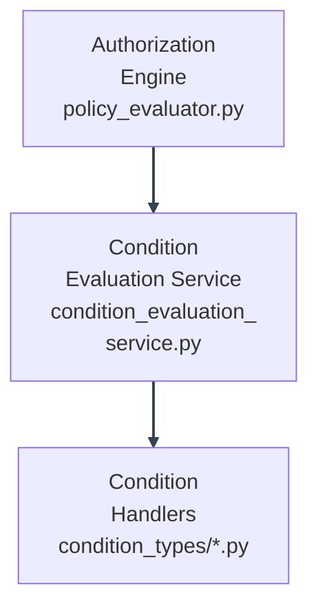

# Adding New Condition Handlers

---

The condition framework is modular by design:



---

Adding a new condition type **never** requires touching `PolicyEvaluationEngine` or `ConditionEvaluationService`: only two new/edited files, plus the validator.

---

## 1. Create the handler class

Add a new file beside the other condition implementations, for example `backend/mystic_auth/authorization/conditions/condition_types/device_trust_condition.py`. Do not put condition-specific logic in `condition_registry.py`, `condition_validator.py`, or `condition_evaluation_service.py`; those files are the framework the handlers plug into.

```python
from ..condition_handler import ConditionHandler


class DeviceTrustCondition(ConditionHandler):
    """
    "device_trust": {"min_level": "high"}: the caller's device trust
    level (context["security_context"]["trust_level"]) must meet or
    exceed the required minimum.
    """

    _LEVELS = {"low": 0, "medium": 1, "high": 2}

    def evaluate(self, condition_value, user_email, resource, context) -> bool:
        try:
            required = condition_value.get("min_level")
            security_context = (context or {}).get("security_context") or {}
            actual = security_context.get("trust_level")
            if required not in self._LEVELS or actual not in self._LEVELS:
                return False
            return self._LEVELS[actual] >= self._LEVELS[required]
        except Exception:
            return False
```

**Rules every handler must follow** (see `condition_handler.py`'s `ConditionHandler` ABC docstring):

- Implement `evaluate(self, condition_value, user_email, resource, context) -> bool`.
- **Fail safe.** Malformed condition config, missing required resource/context, or any internal error must result in `False` (deny): wrap risky logic in `try/except`, never let an exception escape past this boundary, and never let an ambiguous case default to `True`.
- Read only what you need from `resource`/`context`: don't reach into the database or make network calls. The engine calls this synchronously and expects it to be cheap.

---

## 2. Register it with the registry

Edit `backend/mystic_auth/authorization/conditions/condition_registry.py`:

```python
from .condition_types.device_trust_condition import DeviceTrustCondition

default_condition_registry.register("device_trust", DeviceTrustCondition())
```

This is the **only** place a new condition type needs to be wired in for evaluation to work. `ConditionEvaluationService` looks handlers up by key from this registry: it has no other knowledge of what condition types exist.

---

## 3. Add validation

Edit `backend/mystic_auth/authorization/conditions/condition_validator.py`: add both the key and its validator function, so a malformed `device_trust` block is rejected at `POST`/`PUT /authorization/policies` time rather than only failing safe at evaluation time:

```python
def _validate_device_trust(value) -> list[str]:
    if not isinstance(value, dict):
        return ["'device_trust' must be an object"]
    if value.get("min_level") not in ("low", "medium", "high"):
        return ["'device_trust.min_level' must be one of 'low', 'medium', 'high'"]
    return []

_VALIDATORS["device_trust"] = _validate_device_trust
```

Also add `"device_trust"` to `_SUPPORTED_KEYS` in the same file: an unrecognized key is rejected outright, so forgetting this step means every policy using your new condition gets a 422 at creation time.

---

## 4. Test the new condition handler

Three levels, mirroring how every existing condition is tested (see `tests/backend/mystic_auth/unit/authorization/conditions/test_policy_conditions_unit.py` for the pattern on simple handlers like `self_only`/`resource_attributes`/`context_attributes`, or the sibling `test_policy_conditions_temporal_unit.py`/`test_policy_conditions_network_security_unit.py` for handlers with more state, like `time`/`date_range`/`network`/`security_context`):

**Unit test the handler in isolation** (no DB, no evaluator):

```python
def test_device_trust_allows_when_level_meets_minimum():
    handler = DeviceTrustCondition()
    context = {"security_context": {"trust_level": "high"}}
    assert handler.evaluate({"min_level": "medium"}, "u@example.com", None, context) is True

def test_device_trust_fails_safe_on_missing_context():
    handler = DeviceTrustCondition()
    assert handler.evaluate({"min_level": "high"}, "u@example.com", None, None) is False
```

**Unit test the validator** (see `tests/backend/mystic_auth/unit/authorization/conditions/test_condition_validator_unit.py`'s pattern):

```python
def test_device_trust_rejects_invalid_min_level():
    with pytest.raises(ConditionValidationError):
        validate_conditions({"device_trust": {"min_level": "extreme"}})
```

**Add a schema-consistency test** (see `tests/backend/mystic_auth/unit/authorization/conditions/test_condition_schema_consistency_unit.py`) proving the validator and the handler agree on the exact same JSON shape: this is what caught the `date_range` `start`/`end` naming as the one true canonical shape during this project's own condition-schema audit.

**Optionally, a real-DB integration/security test** (see `tests/backend/mystic_auth/security/test_context_spoofing_security.py` for the pattern) proving the condition is enforced end-to-end through a real route, not just the handler in isolation.

---

## What you should never need to change

- `policy_evaluator.py`: it only matches action/resource_type and delegates the whole `conditions` block; it has no per-condition-type logic.
- `condition_evaluation_service.py`: its dispatch loop is generic; it just looks up whatever key is present.
- Any existing condition handler: they're independent of each other.

---
