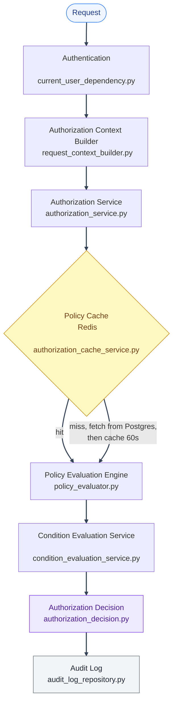

# PBAC Architecture

---

## PBAC authorization-check request flow

---

Every real (non-hypothetical) authorization decision in the app goes through this exact pipeline, once. Nothing above the Authorization Service reads a user's role, a permission-role mapping, or does its own access comparison: routes only ever declare _what action on what resource type_ they need. Before evaluation, the Authorization Service fetches the caller's active policies through a Redis cache-aside layer (`authorization/repositories/policy_assignment_repository.py`), not straight from Postgres on every call. See [Troubleshooting: Redis cache management](../troubleshooting/redis-and-logging.md#redis-cache-management) for TTL and invalidation rules.

---

## Pages

- [Component Responsibilities](component-responsibilities.md): Authentication, Authorization Context Builder, Authorization Service, Policy Evaluation Engine, Condition Evaluation Service, Authorization Decision, Audit Log.
- [Integration Points and Real-Time Push](real-time-push.md): how routes and policy mutations hook into the pipeline, and how open browser tabs learn about a permission change live.
- [Full Route List](full-route-list.md): every PBAC route and the permission it requires.
- [Frontend Policy Management UI](frontend-ui.md): the admin-facing policy/permission screens.

---
