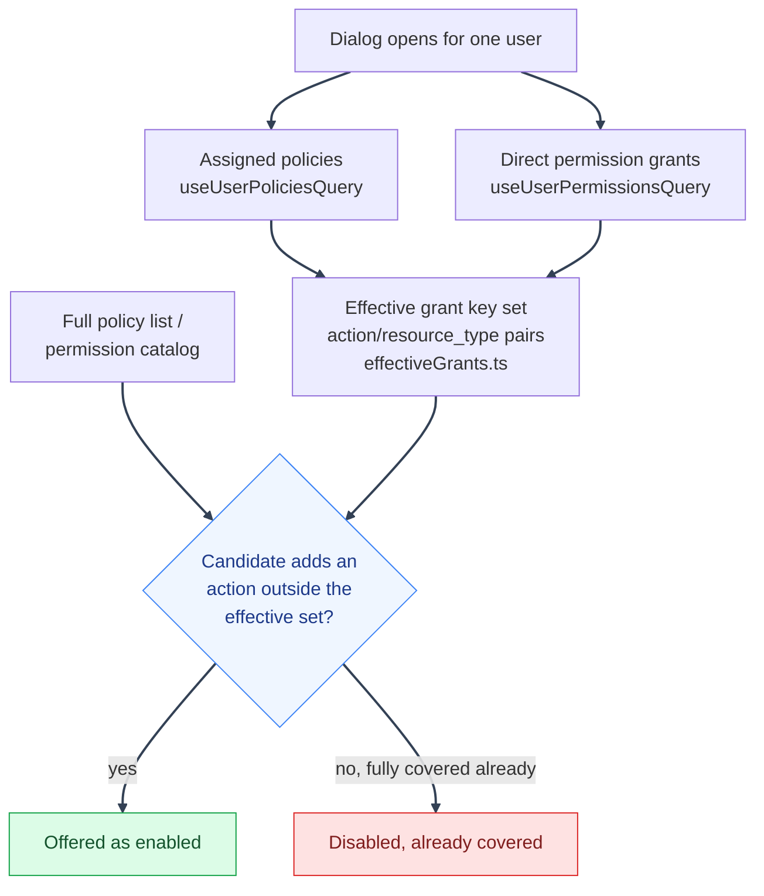

# PBAC Architecture: Frontend Policy Management UI

---

## Frontend Policy Management UI

The policy management screens live under `frontend/src/mystic_auth/policies/` and `frontend/src/mystic_auth/users/`, routed at `/policies` (gated by `policies:read`):

| File                                          | Role                                                                                                                                                                                                                                                                                                                                                                                                                                                                                                                                                                                                                                                                                                                                                                                                                                                                                                                                                                                                                                                                                                                                                                                                                                                                                                                  |
| --------------------------------------------- | --------------------------------------------------------------------------------------------------------------------------------------------------------------------------------------------------------------------------------------------------------------------------------------------------------------------------------------------------------------------------------------------------------------------------------------------------------------------------------------------------------------------------------------------------------------------------------------------------------------------------------------------------------------------------------------------------------------------------------------------------------------------------------------------------------------------------------------------------------------------------------------------------------------------------------------------------------------------------------------------------------------------------------------------------------------------------------------------------------------------------------------------------------------------------------------------------------------------------------------------------------------------------------------------------------------------- |
| `policies/PoliciesPage.tsx`                   | List/search policies, activate/deactivate, delete; every action gated by `IfCan` against the matching permission (`policies:create`/`update`/`delete`)                                                                                                                                                                                                                                                                                                                                                                                                                                                                                                                                                                                                                                                                                                                                                                                                                                                                                                                                                                                                                                                                                                                                                                |
| `policies/dialogs/PolicyFormDialog.tsx`       | Create/edit form, including the raw `conditions` JSON block described in [Condition Schema Reference](../condition-schema-reference.md)                                                                                                                                                                                                                                                                                                                                                                                                                                                                                                                                                                                                                                                                                                                                                                                                                                                                                                                                                                                                                                                                                                                                                                               |
| `policies/dialogs/PolicyDetailsDialog.tsx`    | Read-only view of a policy's actions, resource type, and conditions                                                                                                                                                                                                                                                                                                                                                                                                                                                                                                                                                                                                                                                                                                                                                                                                                                                                                                                                                                                                                                                                                                                                                                                                                                                   |
| `policies/PolicyStatsCard.tsx`                | Summary counts (active/inactive policies, total assignments) on the Policies page                                                                                                                                                                                                                                                                                                                                                                                                                                                                                                                                                                                                                                                                                                                                                                                                                                                                                                                                                                                                                                                                                                                                                                                                                                     |
| `permissions/PermissionsPage.tsx`             | Read-only, searchable/filterable/sortable list of MysticAuth's built-in action catalog, routed at `/permissions` (gated by `permissions:read`), fetched once from `GET /authorization/permissions/catalog` and paged client-side. Downstream app actions use an app-owned catalog and UI                                                                                                                                                                                                                                                                                                                                                                                                                                                                                                                                                                                                                                                                                                                                                                                                                                                                                                                                                                                                                              |
| `policies/dialogs/PolicyActionGrid.tsx`       | Grid of toggleable action cards for `PolicyFormDialog`'s `actions` field (renamed from the old `ActionsMultiSelect.tsx` dropdown), scoped to whichever `resource_type` is currently selected so a policy can't be given an action that resource_type will never actually match, and further scoped to actions the caller themselves can grant (`grantability.ts`'s `canGrantAction`)                                                                                                                                                                                                                                                                                                                                                                                                                                                                                                                                                                                                                                                                                                                                                                                                                                                                                                                                  |
| `users/dialogs/UserAccessDialog.tsx`          | One dialog replacing the old `UserPoliciesDialog.tsx`/`UserPermissionsDialog.tsx` pair, with three tabs (Details, Policies, Permissions) instead of three separate row actions each opening their own dialog. State/query/mutation wiring lives in `useUserAccessDialogState.ts`, tab-specific rendering split across `UserAccessDetailsTab.tsx`/`UserAccessPoliciesTab.tsx`/`UserAccessPermissionsTab.tsx` (composed by `UserAccessTabs.tsx`), and shared pieces (types, filter/stat/info building blocks) in `UserAccessDialogAtoms.tsx`, `UserAccessDialogParts.tsx`, `UserAccessPermissionsParts.tsx` - split into several files to keep each one under the repo's ~350-line target (see `AGENTS.md`), not a sign of separate features. Policy assign/revoke calls `POST`/`DELETE /authorization/users/{email}/policies`; permission grant/revoke calls `POST`/`DELETE /authorization/users/{email}/permissions`. Both toggle instantly with an Undo toast rather than a confirm dialog, since both directions are real, reversible API calls; only revoking one action from an otherwise-still-assigned policy (`revoke-action`, no inverse endpoint) keeps an inline confirm. The Policies/Permissions tabs both exclude a candidate that would add nothing new - see `policies/logic/effectiveGrants.ts` below |
| `policies/logic/effectiveGrants.ts`           | Shared helper for `UserAccessDialog.tsx`'s Policies/Permissions tabs: fans a user's assigned policies out across each policy's own `actions`/`resource_type`, unions that with their direct `UserPermission` grants, and exposes `policyAddsNothingNew()` to test a candidate policy against that combined set. This is a UI-only convenience filter, not an authorization decision - the actual grant-guard still runs server-side via `assert_authorized_to_grant` regardless of what the dropdown/switch offers                                                                                                                                                                                                                                                                                                                                                                                                                                                                                                                                                                                                                                                                                                                                                                                                    |
| `users/bulk/BulkActionToolbar.tsx`            | Always rendered above the Users table; its assign-policy/grant-permission/set-role/clear-selection buttons are disabled (not hidden) until 1+ users are selected via the table's checkboxes. Does not apply `effectiveGrants.ts`'s overlap filtering - a shared dropdown across multiple, possibly differently-provisioned users has no single well-defined "already has it" answer                                                                                                                                                                                                                                                                                                                                                                                                                                                                                                                                                                                                                                                                                                                                                                                                                                                                                                                                   |
| `users/bulk/BulkUserAccessDialog.tsx`         | Unified bulk access dialog for policy, permission, and role operations, one tab each (`BulkPolicyTab.tsx`/`BulkPermissionTab.tsx`/`BulkRoleTab.tsx`). It calls the existing `/authorization/bulk/...` endpoints and renders per-item results via `BulkOperationResultList.tsx`                                                                                                                                                                                                                                                                                                                                                                                                                                                                                                                                                                                                                                                                                                                                                                                                                                                                                                                                                                                                                                        |
| `api/policies_api.ts`                         | Typed client for the single-user policy routes                                                                                                                                                                                                                                                                                                                                                                                                                                                                                                                                                                                                                                                                                                                                                                                                                                                                                                                                                                                                                                                                                                                                                                                                                                                                        |
| `api/permissions_api.ts`                      | Typed client for the single-user direct-permission routes and the permission catalog (`GET /authorization/permissions/catalog`)                                                                                                                                                                                                                                                                                                                                                                                                                                                                                                                                                                                                                                                                                                                                                                                                                                                                                                                                                                                                                                                                                                                                                                                       |
| `policies/queries/bulkAssignmentMutations.ts` | Typed mutations for the bulk policy/permission/role routes                                                                                                                                                                                                                                                                                                                                                                                                                                                                                                                                                                                                                                                                                                                                                                                                                                                                                                                                                                                                                                                                                                                                                                                                                                                            |

The UI is a thin client over the routes above: it does not duplicate the grant-guard or condition logic. `assert_authorized_to_grant` (see [Component Responsibilities: Authorization Service](component-responsibilities.md#authorization-service)) still runs server-side on every create/update/assign, so the form does not need to (and does not) replicate that check.

---

### Dropdown/switch filtering in the unified access dialog

`UserAccessDialog.tsx`'s Policies and Permissions tabs both need the same answer to "what's actually new to offer this user", combining two independent grant sources (assigned policies and direct permission grants) before comparing against the full catalog:

---

A candidate that grants even one action outside the effective set stays offered (its switch enabled), even if it partially overlaps an existing grant - only a candidate that would add nothing new gets disabled. This filtering is a UI convenience only; it has no bearing on what the server ultimately allows or rejects. A second, independent filter narrows the same rows by whether the _caller_ (not the target user) already holds the action themselves, matching the server's own privilege-escalation guard (`assert_authorized_to_grant`) - see `authorization/grantability.ts`'s `canGrantAction`/`canGrantPolicy`.

---

See [PBAC Architecture](README.md) for the request flow.

---
