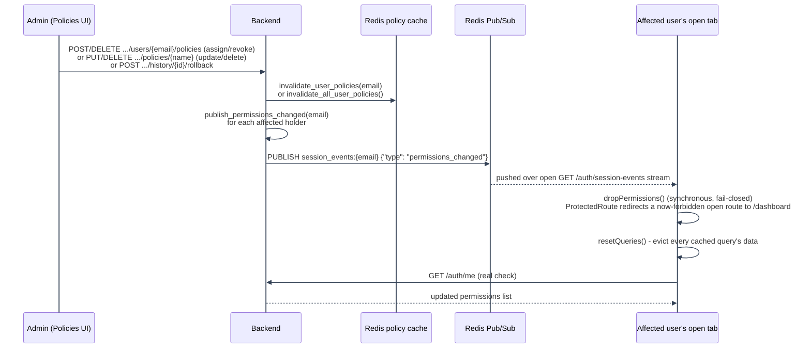

# PBAC Architecture: Integration Points and Real-Time Push

---

## Integration points

- **Every protected route** depends on `Depends(require_authorization(action, resource_type))`: see `authorization/dependencies/authorization_dependency.py`. This is the only supported way to gate a route; it builds context and calls `AuthorizationService.require` for you.
- **Policy mutations** (`create`/`update`/`delete`/`assign_policy_to_user`/`remove_policy_from_user` in `authorization/repositories/policy_repository.py`) each: (a) stage a `policy_history` row in the same transaction (see [Writing and Testing Policies](../writing-testing-policies.md)), and (b) invalidate the Redis policy cache (see [Troubleshooting](../troubleshooting/redis-and-logging.md#redis-cache-management)). `policy_repository.py` owns `Policy` CRUD itself; the user-policy assignment side (`assign_policy_to_user`, `remove_policy_from_user`, `get_active_policies_for_user`, `get_policies_for_user`, `count_assignments`) lives in the sibling `authorization/repositories/policy_assignment_repository.py` and is re-exposed on `policy_repository` as bound static methods, so `policy_repository` stays the one call surface even though the two concerns are file-split.
- **The Batch Authorization API** (`POST /authorization/batch-check`) reuses the exact same `PolicyEvaluationEngine`/`ConditionEvaluationService` calls as a single `authorize()`: it only changes how many times policies are _fetched_ (once per batch, not once per check), never how a decision is computed.

---

## Real-time push

The Redis policy cache above (`authorization/caching/authorization_cache_service.py`) keeps the _server_ correct immediately: the next request after a grant/revoke/update/delete always evaluates against the current policy set, cache or no cache. But a browser tab that already has a permission-gated page open (Policies, Rate Limit Dashboard, a `IfCan`-gated button) has no way to notice a change made from _another_ tab or by an admin elsewhere, short of its own background poll (`useCurrentUserQuery`'s 2-minute `refetchInterval`) or a manual refresh.

This reuses the same per-account SSE channel documented in [Session Management: Real-time push](../../authentication/session-management/real-time-push.md#real-time-push) (`GET /auth/session-events`, `session_events:{email}` Redis Pub/Sub) rather than adding a second stream: `user_session/session_events.publish_permissions_changed(email)` is called from every policy mutation that can change what an account is granted. Unlike the `revoked`/`created` events on the same channel, the frontend's `useSessionEventsStream.ts` handler _does_ branch on `type: "permissions_changed"` specifically, because merely invalidating the current-user query left an exploitable gap: a page like Rate Limit Dashboard uses TanStack Query's `placeholderData: keepPreviousData` for smooth pagination, which kept re-rendering its last real cached data as a placeholder on every filter/page click while waiting for the (now-403'ing) request to resolve - repeatable indefinitely on an open tab, since nothing had evicted that cache. On `permissions_changed` the handler instead:

1. Synchronously zeroes out `permissions` in the Zustand `authStore` (`dropPermissions()`), _before_ any network round-trip. `ProtectedRoute`/`IfCan`/the sidebar's nav filter all read permissions reactively from that store, so this alone fails every permission check closed immediately - no cached data, stale or fresh, can pass a check that's already failing.
2. Calls `queryClient.resetQueries()` (not `invalidateQueries`): drops every cached query's data outright, not just marks it stale, so nothing is left over to serve as a `keepPreviousData` placeholder either, and forces an immediate refetch of the real `GET /auth/me` to learn the account's actual new permission list (repopulating it if this was a grant, not a revoke).

`ProtectedRoute` (`authorization/ProtectedRoute.tsx`) also distinguishes _why_ a given render is denied: a route that was already showing (`wasEverAllowed`, tracked via a ref) redirects straight to `/dashboard` - the live-revoke case, no detour through a "you don't have permission" page that would misdescribe what just happened - while a route that was never allowed in the first place (a direct navigation/deep link to something the caller never held) still redirects to `/not-authorized` as before.

---

### Permissions-changed push flow

---

- **Assign/revoke** (`assign_policy_to_user`/`remove_policy_from_user`, `api/pbac_routes/policy_assignment_routes.py`) know the single affected `user_email` already, so each publishes to just that one channel after its own cache invalidation and audit log write.
- **Update/delete/rollback** (`policy_crud_routes.py`'s `update_policy`/`delete_policy`, `policy_history_routes.py`'s `rollback_policy`) can change what _every_ current holder of that policy is granted, all at once. Each fetches the holder list first (`policy_repository.get_holder_emails`, since a definition change, a cascade-delete, or a restore don't otherwise leave a way to know who held it), then fans out `publish_permissions_changed` to every one of those emails via `asyncio.gather` after the mutation succeeds. `update_policy` only does this when the change could actually alter access (`actions`/`resource_type`/`is_active` in the patch). A pure description/conditions edit, or reactivating via `is_active=True`, doesn't change what any holder is granted, so it skips the fan-out. `delete_policy` and `rollback_policy` always fan out: a delete always removes every holder's access, and a rollback's restored snapshot always includes `actions`/`resource_type`/`is_active` (the full definition, not a partial patch).
- **The published event is deliberately minimal** (`{"type": "permissions_changed"}`), the same "something changed, go check now" contract as the session-revoked/session-created events on this channel: never an authoritative new permission set on its own. `dropPermissions()` is a fail-closed _assumption_ ("holds nothing until proven otherwise"), not the real answer - the receiving tab's `GET /auth/me` is still what actually decides what it can do, and self-corrects the optimistic empty list a moment later.
- **Best-effort, like every publish on this channel**: a Redis hiccup here is logged and swallowed, never turning a successful policy mutation into a failed request. The 2-minute background poll on `useCurrentUserQuery` remains the fallback for a silently dropped SSE connection.

---

See [PBAC Architecture](README.md) for the request flow, or [Component Responsibilities](component-responsibilities.md) for the pipeline pieces this section refers to.

---
