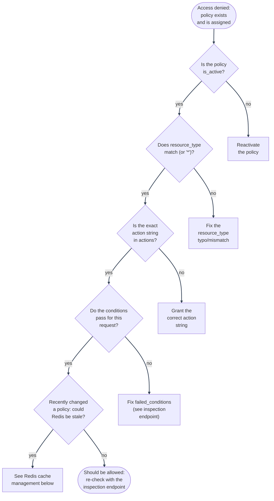

# Troubleshooting: Common Issues

---

## Common issues and solutions

---

### "Why was this user denied?" Use the audit log or the inspection endpoint

Every real `authorize()` call writes a row to `authorization_audit_log` with `allowed`, `candidate_policy_names`, `granting_policy_names`, and `failed_conditions`. Query it:

- `GET /authorization/audit-log/me`: your own history, no special permission needed.
- `GET /authorization/audit-log/users/{email}`: anyone's history (requires `policies:read`).

For a hypothetical "would this be allowed" question rather than a historical one, use `POST /authorization/users/{email}/authorization-check`. It runs the identical decision logic and returns `denial_reason` (`no_assigned_policies` / `no_matching_policy` / `condition_failed`) plus which policies were candidates vs. which actually granted it.

---

### A policy exists and is assigned, but access is still denied

Check, in order:

1. **Is the policy active?** `is_active=false` policies are filtered out before the evaluator ever sees them.
2. **Does `resource_type` actually match** (or is it `"*"`)? A typo here (`"user"` vs `"users"`) silently produces zero candidates.
3. **Is the exact action string present** in `actions`? `"users:update_own"` and `"users:update_any"` are different actions on purpose.
4. **Do the conditions actually pass for this specific request?** Use the inspection endpoint with the real `resource`/`context` you expect: `candidate_policies` non-empty but `authorized: false` means a policy matched but a condition rejected it; check `failed_conditions` (batch-check) or compare `candidate_policies` vs `granting_policies` (single-check inspection).
5. **Redis cache serving a stale policy list?** See [Redis Cache Management](redis-and-logging.md#redis-cache-management).

---

---

### Invalid policy `conditions` rejected with 422

The response body lists every problem found, not just the first; see the [Condition Schema Reference](../condition-schema-reference.md) for each type's exact required shape. Common mistakes: `date_range` using `start_date`/`end_date` instead of `start`/`end`; `time.timezone` not being a real IANA name (`"EST"` isn't one, use `"America/New_York"`); `network.allowed_ips` containing a bare hostname instead of an IP/CIDR.

---

### A caller with `policies:create`/`update`/`assign` gets 403 "Cannot grant action ... you do not hold it yourself"

This is the privilege-escalation guard working as intended (see [Architecture](../architecture/component-responsibilities.md#authorization-service)): holding the ability to _manage_ policies doesn't let you hand out actions you don't already have. The caller needs to already hold every sensitive action (from `Permission`'s vocabulary) that the policy grants, which typically means they need `system_superuser` too, not just a `policies:*` action.

---

### The UI shows a capability (button, page, sidebar link) that then 403s when used

`GET /auth/me`'s `permissions` field (`current_user_handler.py`) only
includes an action if it's actually usable under the policy granting it:
`policy.resource_type in (action's own resource-type prefix, "*")`, mirroring
the real check in `policy_evaluator.py`. If you edit a policy and add an
action from a _different_ resource type than that policy's own
`resource_type` (e.g. adding `"policies:read"` to a policy whose
`resource_type` is `"users"`), the action is filtered out of `/auth/me`
entirely, so `IfCan`/`ProtectedRoute` correctly hide the UI for it, and no
403-after-the-fact confusion happens.

This guard exists precisely because a real incident hit it before the guard
was added: `policies:read`, `rate_limits:read`, `security_audit:read`,
`users:purge`, `users:reactivate`, etc. were pasted onto the built-in
`user_administration` policy (`resource_type: "users"`), instead of onto a
policy scoped to each action's own resource type. At the time,
`/auth/me` flattened every policy's `actions` into one set with no
`resource_type` filtering, so those actions showed up as "granted" and lit
up the Policies/Rate Limits/Security Audit UI, but every real request
still 403'd, because `policy_evaluator.py` correctly enforces
`resource_type` matching. If you see this symptom again after further code
changes (UI renders a control, but the request behind it 403s), the
filtering logic in `current_user_handler.py` is the first place to check.
It may have regressed, or a new call site may be constructing its own
permission set without going through it.

**The actual fix for the account, not the display bug**: don't add actions
from other resource types to an existing single-resource-type policy at all
(the display bug above just made this survivable to test before it was
fixed). Give the extra actions their own policy scoped to their own
`resource_type` (e.g. a `resource_type: "policies"` policy for
`policies:read/create/update/delete/assign/revoke`), and assign that
alongside the original. `system_superuser`'s `resource_type: "*"` is the one
built-in exception, deliberately spanning multiple resource types; see
[Writing and Testing Policies](../writing-testing-policies.md) before reaching
for `"*"` on a new policy instead of scoping it properly.

---

### A caller with `policies:delete`/`update`/`revoke` gets 403 "Cannot grant action ... you do not hold it yourself"

Same guard as above (`assert_authorized_to_grant`), applied symmetrically:
`update_policy`, `delete_policy`, and `remove_policy_from_user` (revoke) all
require the caller to already hold **every action the target policy
currently grants**, not just for the grant-side operations
(create/assign). Without this, holding bare `policies:delete`/`update`/
`revoke` (without holding what the policy actually grants) would let a
caller strip, narrow, or repurpose an equally- or more-privileged peer's
access (including revoking `system_superuser` off someone else) with no
escalation check at all. If you hold `policies:delete` but not, say,
`rate_limits:read`/`rate_limits:reset`, you cannot delete a policy that
grants those, even though you can delete other policies scoped to actions
you do hold.

---

### 403 on baseline policy delete/rename, or 409 on revoking the last `system_superuser`

Also intentional (see [Writing and Testing Policies](../writing-testing-policies.md#protected-baseline-policies)): these guard against permanently locking the system out of its own authorization management.

---

See [Troubleshooting](README.md) for the other pages.

---
