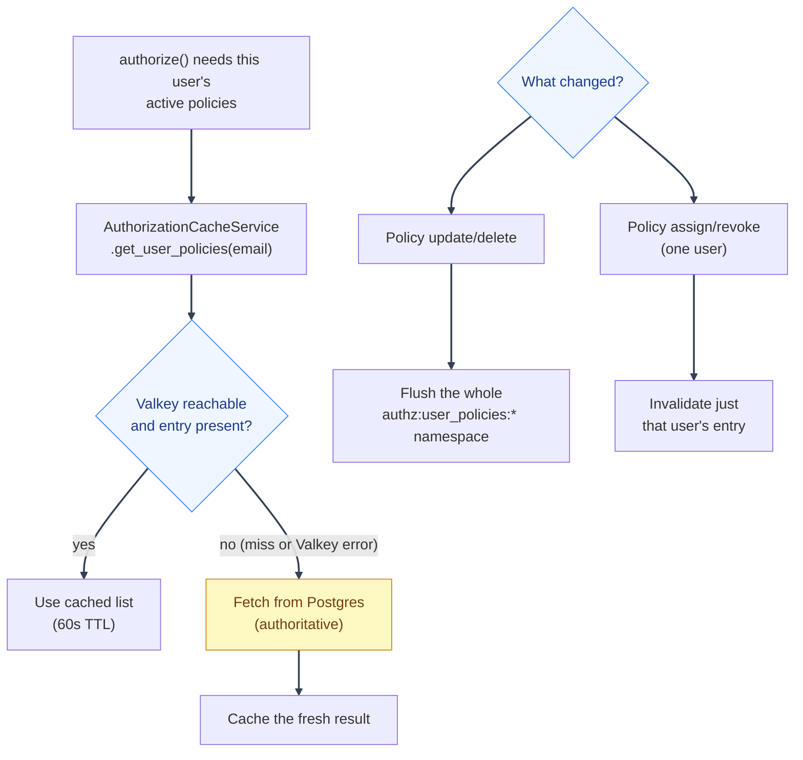

# Troubleshooting: Logging and Valkey Cache

---

## Logging and debugging

- All authorization-relevant logging goes through `backend/mystic_auth/logging/logging_config.py`'s `get_logger(__name__)`: structured, module-scoped loggers.
- `AuthorizationService._log_decision`'s own failures (a broken audit write) are caught and logged as a `warning`, never re-raised: an audit logging failure must never break the actual authorization decision it's describing. If you suspect audit entries are silently failing to write, check application logs for `"Failed to write authorization audit log entry"`.
- `AuthorizationCacheService` similarly logs (and swallows) every Valkey failure with a specific prefix per operation (`"Authorization cache read failed"`, `"...write failed"`, `"...invalidation failed"`, `"...namespace flush failed"`): grep for these to confirm whether a perceived staleness issue is actually a cache failure being silently absorbed.
- The backend container's own request logs (`docker compose logs backend`) show every HTTP request/response; for a specific authorization decision, correlate by timestamp against the audit log's `created_at`.

---

## Valkey cache management

`authorization/caching/authorization_cache_service.py` is the **only** place authorization code talks to Valkey. It caches exactly one thing: a user's active, assigned policy list (`authz:user_policies:{email}`, 60s TTL). It deliberately does **not** cache policy-lookup-by-name or final evaluation decisions: see the module's own docstring for the correctness reasons (a cached, session-detached `Policy` object fed into an update/delete would break SQLAlchemy's identity map; caching a final decision would risk serving a stale answer for genuinely time/context-sensitive conditions).



A Valkey error is one specific case of "no entry present" above, not a separate path: it falls straight through to the same Postgres fetch, so a fully unreachable Valkey degrades performance (every check re-fetches from Postgres) rather than correctness or availability.

**Invalidation happens automatically:**

- Policy `update`/`delete` flushes the _entire_ `authz:user_policies:*`
  namespace. A policy definition change can affect every holder, and there is
  no cheap reverse index.
- Policy assign/revoke via the management API invalidates only that user's cache
  entry.

**If you suspect stale cached permissions:**

```bash
docker compose exec valkey valkey-cli KEYS "authz:user_policies:*"
docker compose exec valkey valkey-cli DEL "authz:user_policies:someone@example.com"
docker compose exec valkey valkey-cli FLUSHDB   # nuclear option: clears everything in this logical DB
```

**This is server-side correctness only.** A browser tab that already has a permission-gated page open doesn't re-request anything just because the cache above got invalidated. It needs its own signal to go check. See [Architecture: Real-time push](../architecture/real-time-push.md#real-time-push) for the SSE nudge that closes that gap; if a tab still shows stale permissions for more than a few seconds after a grant/revoke/update/delete, check that flow (and the browser's Network tab for a live `GET /auth/session-events` connection) before assuming it's this Valkey cache.

**Fail-closed behavior:** every cache method catches all Valkey errors and returns a cache-miss sentinel rather than raising. "Fail closed" here means _the cache is never trusted over the database_: any Valkey error transparently falls through to the authoritative DB query, not "deny every authorization request when Valkey is down." A fully unreachable Valkey degrades performance (every check re-fetches from Postgres), never correctness or availability.

**Verifying it end-to-end** (useful after any change to the caching layer):

```bash
scripts/mystic_auth/docker/dev/backend-exec.sh python -c "
import asyncio
from backend.mystic_auth.authorization.caching.authorization_cache_service import authorization_cache_service
from backend.mystic_auth.authorization.models.policy_model import Policy

async def main():
    p = Policy(name='x', actions=['a'], resource_type='r', conditions=None, is_active=True)
    await authorization_cache_service.set_user_policies('test@example.com', [p])
    print(await authorization_cache_service.get_user_policies('test@example.com'))
    await authorization_cache_service.invalidate_user_policies('test@example.com')
    print(await authorization_cache_service.get_user_policies('test@example.com'))

asyncio.run(main())
"
```

---

See [Troubleshooting](README.md) for the other pages.

---
