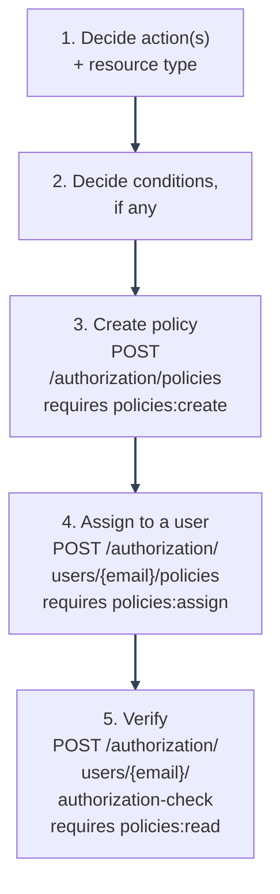

# Writing and Testing Policies

---

## Policy creation workflow



---

1. **Decide the action(s) and resource type.** Use an existing `Permission` value if this is about users/policies themselves ([Adding New Permissions](adding-permissions.md)); otherwise any action string works for a downstream application's own resources.
2. **Decide conditions, if any.** See the [Condition Schema Reference](condition-schema-reference.md): omit `conditions` entirely for an unconditional grant.
3. **Create it** via `POST /authorization/policies` (requires `policies:create`, and you must already hold every action you're granting: see [Architecture](architecture/component-responsibilities.md#authorization-service)):

   ```bash
   curl -X POST https://your-app/authorization/policies \
     -H "Content-Type: application/json" \
     --cookie "access_token=..." \
     -d '{
       "name": "report_viewers",
       "actions": ["reports:view"],
       "resource_type": "reports"
     }'
   ```

4. **Assign it** to users via `POST /authorization/users/{email}/policies` (requires `policies:assign`, same self-holding requirement):

   ```bash
   curl -X POST https://your-app/authorization/users/someone@example.com/policies \
     -H "Content-Type: application/json" \
     --cookie "access_token=..." \
     -d '{"policy_name": "report_viewers"}'
   ```

5. **Verify** with the inspection endpoint (`POST /authorization/users/{email}/authorization-check`, requires `policies:read`): runs the exact same decision logic a real request would, but returns the full breakdown (candidate/granting policies) instead of just a bool:

   ```bash
   curl -X POST https://your-app/authorization/users/someone@example.com/authorization-check \
     -H "Content-Type: application/json" \
     --cookie "access_token=..." \
     -d '{"action": "reports:view", "resource_type": "reports"}'
   ```

---

### Editing a policy

`PUT /authorization/policies/{name}` (requires `policies:update`): only the fields you send are changed. Every edit is versioned: see [Policy history and rollback](#policy-history-and-rollback) below. If you change `actions`, you must already hold every action in the _new_ list, not just the ones being added.

---

### Protected baseline policies

`self_service`, `user_administration`, and `system_superuser` can never be deleted or renamed via the management API, regardless of who's calling: every default account assignment (signup, OAuth2, `create_system_user.py`) looks them up by these exact names. Their other fields (description, actions, conditions) can still be edited.

---

### Giving every user a second default policy

`self_service` is assigned unconditionally at signup, before the account is even verified. If your app wants every user to _also_ get one of its own policies by default, once verified, set `DEFAULT_APP_POLICIES` (`.env`, comma-separated policy names) rather than editing `signup_service.py`/`oauth2_service.py`/`user_verification_service.py` directly: those three call a shared, downstream-configurable hook (`authorization/policies/default_policies.py::assign_app_default_policies`) the moment an account transitions to verified (email-link verification, or OAuth2, which verifies on the spot). Empty (the default) is a no-op: self_service only, same as before this setting existed. The policies it names must already exist (create them the normal way: `POST /authorization/policies` or your own Alembic migration) or the assignment is skipped with a logged error, not a failure of the signup/login request that triggered it.

---

### Policy history and rollback

Every create/update/delete stages an immutable row in `policy_history` in the same transaction as the mutation:

- `GET /authorization/policies/{name}/history`: every recorded change to this policy, newest first. Works even after the policy itself has been deleted (history is keyed by name, not a live foreign key).
- `GET /authorization/policies/{name}/history/compare?from_id=X&to_id=Y`: field-by-field diff between two versions.
- `POST /authorization/policies/{name}/history/{history_id}/rollback` (requires `policies:update`): restores that version's definition. This creates a **new** `"rolled_back"`-labeled history entry; it never overwrites or deletes the entry being rolled back to. Goes through the exact same guards as a direct `PUT`: a malformed `conditions` block in the restored definition is rejected, a baseline policy can't be rolled back into a renamed/deactivated state, and: since a historical revision can hold actions the policy no longer grants today: the caller must already hold every action the _restored_ definition would grant, not just the policy's current ones.

---

## Local testing approach

**Fastest feedback: unit tests with mocked policies** (no DB needed): see `tests/backend/mystic_auth/unit/authorization/evaluators/test_policy_evaluator_unit.py` and `evaluators/test_authorization_decision_unit.py`. Build a `Policy(...)` instance directly (it's a plain SQLAlchemy model, freely instantiable without a session) and call `PolicyEvaluationEngine.evaluate_detailed` directly:

```python
from backend.mystic_auth.authorization.models.policy_model import Policy
from backend.mystic_auth.authorization.evaluators.policy_evaluator import PolicyEvaluationEngine

def test_my_new_policy_shape_grants_the_right_action():
    policy = Policy(
        name="report_viewers", actions=["reports:view"], resource_type="reports",
        conditions=None, is_active=True,
    )
    decision = PolicyEvaluationEngine.evaluate_detailed(
        [policy], "reports:view", "reports", "someone@example.com"
    )
    assert decision.allowed is True
```

**Against a real database** (via `scripts/docker/dev/backend-exec.sh pytest tests/backend/mystic_auth/integration/`, see [Troubleshooting](troubleshooting/README.md): or from the host once `docker compose -f docker/compose/docker-compose.dev.yml up -d postgres redis`): create a real user, assign the real policy, log in, and hit a real protected route:

```python
@pytest.mark.asyncio
async def test_assigning_report_viewers_actually_grants_access(client, created_emails):
    email = unique_email()
    await create_verified_user(client, created_emails, email, [SELF_SERVICE_POLICY_NAME])
    # ... create + assign the policy directly via policy_repository, or via the API ...
    await client.post("/auth/login", json={"email": email, "password": PASSWORD})
    resp = await client.get("/reports/")
    assert resp.status_code == 200
```

See `tests/backend/mystic_auth/integration/authorization_test_accounts.py` for the full fixture pattern (`create_verified_user`, `create_system_user`, `create_user_with_custom_policy_actions`) and `tests/backend/mystic_auth/security/conftest.py` for the shared reusable version of the same helpers.

---

## Unit test examples for policies

**Unconditional grant:**

```python
def test_unconditional_policy_always_allows_the_action():
    policy = Policy(name="p", actions=["x:read"], resource_type="x", conditions=None, is_active=True)
    assert PolicyEvaluationEngine.evaluate([policy], "x:read", "x", "u@example.com") is True
```

**Ownership-conditioned grant:**

```python
def test_self_only_denies_a_different_owner():
    policy = Policy(name="p", actions=["x:read"], resource_type="x", conditions={"self_only": True}, is_active=True)
    allowed = PolicyEvaluationEngine.evaluate(
        [policy], "x:read", "x", "u@example.com", resource={"email": "someone-else@example.com"}
    )
    assert allowed is False
```

**Multiple policies, one grants and one fails** (the exact scenario `AuthorizationDecision` exists to explain: see `authorization/test_authorization_decision_unit.py`):

```python
def test_one_matching_policy_is_enough_even_if_another_rejects():
    granting = Policy(name="a", actions=["x:read"], resource_type="x", conditions=None, is_active=True)
    failing = Policy(name="b", actions=["x:read"], resource_type="x", conditions={"self_only": True}, is_active=True)
    decision = PolicyEvaluationEngine.evaluate_detailed(
        [granting, failing], "x:read", "x", "u@example.com", resource={"email": "someone-else@example.com"}
    )
    assert decision.allowed is True
    assert decision.matched_policies == ["a"]
    assert decision.rejected_policies == ["b"]
```

**Inactive policy never grants access**, regardless of its `actions`:

```python
def test_inactive_policy_is_never_a_candidate():
    policy = Policy(name="p", actions=["x:read"], resource_type="x", conditions=None, is_active=False)
    # get_active_policies_for_user already filters is_active=True before the
    # engine ever sees a policy, so pass an empty list to simulate that:
    assert PolicyEvaluationEngine.evaluate([], "x:read", "x", "u@example.com") is False
```

---
