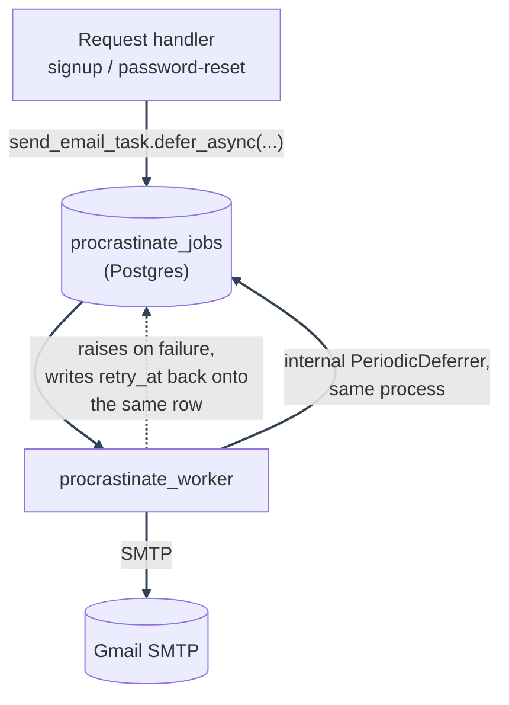

# Background Email Delivery

---

_New to a term here? See the [Infrastructure Glossary](../glossary/infrastructure.md)._

## Purpose

Offloads slow, failure-prone SMTP work from the request/response cycle, so signup, verification, and password-reset requests return without waiting on a mail server round trip. Also runs the daily scheduled hard-purge of soft-deleted accounts past their grace period (see [Account Deletion](../authentication/account-deletion/README.md)).

Replaced [Taskiq](https://taskiq-python.github.io/) (Redis Streams) with [Procrastinate](https://procrastinate.readthedocs.io/) (Postgres-native) in full: see [Security Decisions: Taskiq replaced with Procrastinate](../security/decisions-infra.md#taskiq-replaced-with-procrastinate) for why.

---

## Architecture

Request handlers enqueue mail by calling `backend/mystic_auth/procrastinate_tasks/email_tasks.py::send_email_task.defer_async(...)`. Procrastinate inserts the job as a row in the `procrastinate_jobs` table (in the same Postgres database everything else here already uses), and the `procrastinate_worker` container's worker process picks it up.

`backend/mystic_auth/procrastinate_tasks/procrastinate_app.py` defines the `procrastinate.App` and its connector, split into its own module so the `App` instance exists before any `@app.task`/`@app.periodic` decorator runs (both task modules import `app` from here, avoiding a circular import between them):

```python
connector = PsycopgConnector(
    conninfo=settings.procrastinate_database_url,
    min_size=1,
    max_size=10,
)

app = App(
    connector=connector,
    import_paths=[
        "mystic_auth.procrastinate_tasks.email_tasks",
        "mystic_auth.procrastinate_tasks.account_purge_tasks",
    ],
)
```

`settings.procrastinate_database_url` (`core/settings.py`) translates `DATABASE_URL`'s SQLAlchemy `postgresql+asyncpg://` dialect prefix into the bare `postgresql://` DSN Procrastinate's `PsycopgConnector` expects. The connector opens its own psycopg connection pool, entirely separate from the SQLAlchemy engine `database.py` builds: two independent pools onto the same database, not a shared one.

The FastAPI process itself needs this connector open too, since request handlers call `.defer_async(...)` directly: `backend/app/main.py`'s lifespan opens it (`await procrastinate_app.open_async()`) before serving traffic and closes it on shutdown, the same pattern as the Redis client and the SQLAlchemy engine.

```python
@app.task(retry=EMAIL_RETRY)
async def send_email_task(to_email: str, subject: str, body: str, is_html: bool = True) -> bool:
    ...
```

---



---

Unlike taskiq's `RedisStreamBroker` + separate `TaskiqScheduler` process, there's a single container role here: `procrastinate_worker` runs `procrastinate --app=mystic_auth.procrastinate_tasks.procrastinate_app.app worker`, which both executes jobs _and_ runs the periodic-task deferrer (`@app.periodic`-registered tasks) as an internal asyncio task of the same worker process. No second scheduler container exists, and none is needed: see [Security Decisions: Taskiq replaced with Procrastinate](../security/decisions-infra.md#taskiq-replaced-with-procrastinate) for why that used to be a single point of failure and structurally can't be one now.

---

## Tasks

| Task                                                     | Enqueued from                                                                                                                                        | Purpose                                                                                                                                |
| -------------------------------------------------------- | ---------------------------------------------------------------------------------------------------------------------------------------------------- | -------------------------------------------------------------------------------------------------------------------------------------- |
| `send_email_task(to_email, subject, body, is_html=True)` | `auth/verify_account/account_verification_service.py`, `auth/password_logic/password_reset_service.py`, `user_lifecycle/account_deletion_service.py` | Sends email from the Procrastinate worker via the configured SMTP sender (`aiosmtplib`)                                                |
| `purge_expired_soft_deleted_accounts(timestamp)`         | `@app.periodic(cron="0 3 * * *")`, deferred automatically by the worker's internal `PeriodicDeferrer`                                                | Daily hard-purge of accounts past their soft-delete grace period; see [Account Deletion](../authentication/account-deletion/README.md) |

`send_email_task` itself doesn't talk to SMTP directly: it delegates to `emails/email_sender.py::email_sender` (an `EmailSender` protocol with one concrete `SMTPEmailSender` implementation). This is not a plugin system: swapping providers (e.g. SES, SendGrid, Postmark) means writing one new class and pointing `email_sender` at it, without touching the Procrastinate task or its callers.

Both email call sites build the HTML body via `emails/email_template_service.py::render_transactional_email` (a shared template with the app name/support address baked in from settings), then enqueue with `send_email_task.defer_async(...)`:

```python
await send_email_task.defer_async(
    to_email=user.email,
    subject="Verify your account",
    body=render_transactional_email(...),
)
```

`.defer_async()` returns as soon as the job row is inserted, so the signup or password-reset request handler does not wait for SMTP delivery.

`send_email_task` logs `Sending email to {to_email}` right before handing off to `email_sender.send`, then `Email sent successfully to {to_email}` once it succeeds, both at INFO level, before returning `True`. It uses `logging_config.py::get_worker_logger()` rather than the usual `get_logger()`, so both lines are terminal-visible (`docker compose logs procrastinate_worker`) instead of file-only. Background tasks have no HTTP access-log line marking when they start or finish, so these lifecycle logs make live sends visible while still writing to `logs/access.log`.

Procrastinate's own job-lifecycle logging (distinct from the app's `send_email_task` lines above) would otherwise log each job's full call arguments at INFO - `Starting job ...(body='<the rendered email HTML>', ...)` - and `send_email_task`'s `body` argument is exactly where a raw verification/password-reset/account-deletion token lives, since it's already embedded in the rendered HTML before the job is enqueued. `procrastinate_tasks/procrastinate_app.py` raises the `procrastinate` logger to `WARNING` at import time specifically to stop that, so a token never lands in plaintext in `docker compose logs`. Failure visibility isn't lost: Procrastinate still logs a failed job at `ERROR` (above `WARNING`), and `send_email_task`'s own `except` block separately logs the traceback either way. This doesn't touch the `procrastinate_jobs` table itself - a job's args are still written there in plaintext for the row's lifetime, same as any Postgres-backed job queue; that's accepted as inherent to the architecture (DB access is already a full compromise) rather than something to route around.

`purge_expired_soft_deleted_accounts` is registered via `@app.periodic(cron="0 3 * * *")` stacked over `@app.task`; Procrastinate's periodic-task API requires the decorated function to accept the scheduled cron tick (epoch seconds) as its first positional argument (`timestamp: int`), unused here since the actual cutoff is computed from the current time, not the tick time.

---

## Configuration

| Setting                   | Purpose                                                                                                                                           |
| ------------------------- | ------------------------------------------------------------------------------------------------------------------------------------------------- |
| `DATABASE_URL`            | Same Postgres database as everything else; `settings.procrastinate_database_url` derives the bare `postgresql://` DSN Procrastinate needs from it |
| `FROM_EMAIL`              | SMTP "From" address, also the account authenticating to the SMTP server                                                                           |
| `GMAIL_APP_PASSWORD`      | App password for the `FROM_EMAIL` account (Gmail requires a per-app password for SMTP with 2FA enabled)                                           |
| `SUPPORT_EMAIL`           | Optional; used as the email's `Reply-To`, falls back to `FROM_EMAIL` if unset                                                                     |
| `SMTP_HOST` / `SMTP_PORT` | Optional; default to `smtp.gmail.com`/`587`. Override to point `SMTPEmailSender` at a different SMTP provider                                     |
| `APP_NAME`                | Required; product name used in the email template's branding                                                                                      |

---

## Failure handling, retries, and the dead-letter queue

`send_email_task` is configured with `EMAIL_RETRY`, a `procrastinate_tasks/procrastinate_app.py::ExponentialBackoffWithJitter` (`BaseRetryStrategy` subclass): up to 3 attempts total, waiting `min(5 * 2**attempts, 60)` seconds plus a random `[0, 3)` second jitter offset between each. On failure, `send_email_task` logs the full traceback and **raises** (rather than swallowing the exception): this is what lets Procrastinate's retry machinery see the failure and schedule a retry with backoff, up to 3 attempts total. A transient SMTP failure (a momentary Gmail outage, a network blip) now gets retried automatically, with backoff, instead of hammering an already-struggling SMTP server or silently dropping the email. The jitter keeps many simultaneously-failing emails (e.g. a full SMTP outage) from all retrying on the exact same tick.

A permanent failure (e.g. bad SMTP credentials) still exhausts all 3 attempts. Unlike taskiq, this isn't the end of the trail: the failed job's row in `procrastinate_jobs` is updated to `status='failed'` and stays there (Procrastinate never deletes a job unless explicitly told to), so it's directly queryable via SQL:

```sql
SELECT id, task_name, args, attempts, scheduled_at
FROM procrastinate_jobs
WHERE status = 'failed';
```

That's the dead-letter queue this template has: no separate infrastructure, no admin UI, just a queryable table. An operator (or a monitoring query against this same Postgres instance) can watch it directly; nothing pages anyone automatically today, which is left as a deployment-specific follow-up, same as before.

**Why no separate scheduler process is needed anymore**: taskiq's `SmartRetryMiddleware` wrote each retry's due-time to a Redis-backed `schedule_source`, and only a separate `TaskiqScheduler` process polled that store back out and re-enqueued due retries: if that process was down, the first attempt's failure still logged, but the scheduled retry silently never fired. Procrastinate has no equivalent split: a retry's `scheduled_at` is written directly onto the same `procrastinate_jobs` row, and the worker's own job-fetch query (`WHERE status = 'todo' AND scheduled_at <= now()`) picks it up the moment it's due, in the same process that runs everything else. There's nothing to poll and nothing separate to be down.

---

## Testing

`tests/backend/mystic_auth/unit/procrastinate_tasks/test_email_tasks_unit.py` exercises `send_email_task` directly (the success path, the failure-raises-for-retry path) and `EMAIL_RETRY` directly (the exponential-backoff-plus-jitter formula, the 3-attempt cap). `tests/backend/mystic_auth/unit/procrastinate_tasks/test_account_purge_tasks_unit.py` covers the periodic task's cron registration and its CRUD/service wiring with mocked collaborators; `tests/backend/mystic_auth/integration/user/test_account_purge_task_integration.py` covers the same job end-to-end against real Postgres. The call sites (`account_verification_service.py`, `password_reset_service.py`, `account_deletion_service.py`) are separately tested with `send_email_task.defer_async` mocked/patched. See [Testing Overview](../testing/overview.md).

`tests/backend/conftest.py`'s `_procrastinate_app_lifecycle` fixture opens and closes `procrastinate_app`'s connector fresh around every test, the same per-event-loop reasoning as the Postgres/Redis pool fixtures beside it: pytest-asyncio hands each test its own event loop, and a psycopg connection pool opened in one test's loop isn't safe to reuse from another's. That same file also points tests at a dedicated `mystic_auth_test` database rather than the real one a running dev stack's own `procrastinate_worker` container reads from - see [Testing Overview: Dedicated test database](../testing/overview.md#dedicated-test-database) for why.

---

## Troubleshooting

- **Worker not picking up tasks**: confirm `procrastinate_worker` can reach the same Postgres instance the `backend` container uses (`docker compose logs procrastinate_worker`). `./scripts/docker/dev/dev-up.sh`, `.\scripts\docker\dev\dev-up.ps1`, and `scripts\docker\dev\dev-up.cmd` include `procrastinate_worker` in their live log tail.
- **A job never retries / seems stuck**: query `procrastinate_jobs` directly for its `status` and `scheduled_at`; unlike taskiq there's no separate scheduler process to check the health of.
- **A permanently-failed email**: query `procrastinate_jobs WHERE status = 'failed'` (see above) rather than searching logs for it.
- **Emails not arriving**: check `GMAIL_APP_PASSWORD` is a valid App Password (not the account password) and that "Less secure app access" / App Passwords are enabled on the sending Google account; check the dev-up log tail or `docker compose logs procrastinate_worker` for the logged traceback (`send_email_task` logs every failure with `logger.error`).
- **`procrastinate_worker` unhealthy**: its healthcheck runs `procrastinate --app=mystic_auth.procrastinate_tasks.procrastinate_app.app healthchecks`, which confirms the DB connection works and the `procrastinate_jobs` table exists (i.e. the schema migration has been applied); a failure there usually means the `alembic` migration hasn't run yet or `DATABASE_URL` is misconfigured.

---
