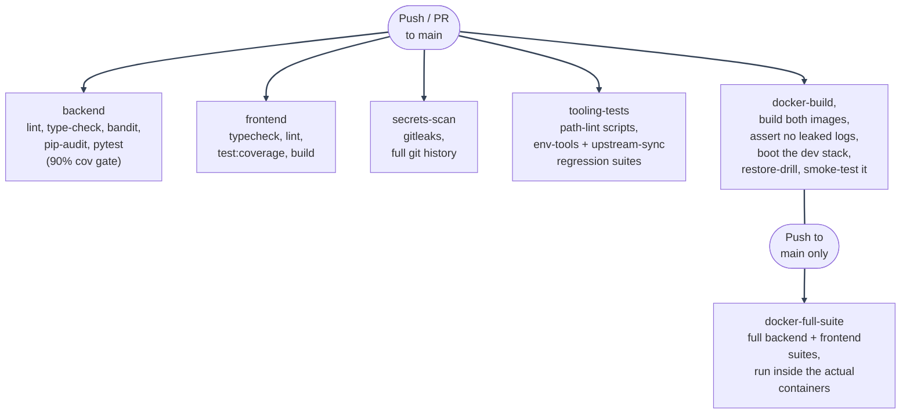

# CI/CD Overview

---

_New to a term here? See the [Infrastructure Glossary](../glossary/infrastructure.md)._

## Workflow

`.github/workflows/ci.yml` triggers on every push and pull request targeting
`main`. It declares top-level `permissions: contents: read` because none of the
jobs push commits, comment on PRs, or need write access. A compromised action
dependency in this workflow can only read the checkout.

There are six independent jobs. The first five run on every push and PR. The
sixth runs only on a push to `main`.

---



---

### `backend`: Backend (unit + integration)

- Spins up Postgres 15 and Redis 7 as GitHub Actions service containers. Compose
  remains the source of truth for local development, but service containers are
  a lower-overhead CI equivalent for the backend job.
- Provides all required settings as job-level environment variables with
  clearly fake CI-only values because CI has no checked-in `env/mystic_auth/.env`. `APP_NAME`
  is set to `MysticAuth` only because `Settings` requires a value. It is a test
  placeholder, not branding that a downstream project must keep in sync.
- Installs `backend/requirements.txt` and `backend/requirements-dev.txt`, then
  runs `pip-audit -r backend/requirements.txt`.
- Runs `ruff check`, `mypy`, and `bandit -c pyproject.toml` as separate steps so
  the failing tool is obvious in the Actions UI.
- Runs `alembic upgrade head`, then `alembic check`. The check fails if models
  drift from what the migrations create.
- Runs backend unit, integration, and security suites. The integration and
  security steps use `--cov-append`, so the final 90% gate checks cumulative
  coverage across all three suites. `pytest.ini` intentionally does not set
  `--cov-fail-under` because that would break partial local runs. See
  [Testing Overview](../testing/overview.md).
- Runs `pytest tests/backend/mystic_auth/performance` as a non-blocking step
  because timing thresholds can be noisy on shared GitHub-hosted runners.

---

### `frontend`: Frontend (typecheck + lint + test + build)

- Node is pinned to `22.22.0` because React Router 8 requires Node
  `>=22.22.0`.
- Runs `npm ci --legacy-peer-deps`, `npm audit --audit-level=high`,
  `npm run typecheck`, `npm run lint`, `npm run test:coverage`, and
  `npm run build` as separate steps. `test:coverage` is used instead of plain
  `test` so `vitest.config.ts` coverage thresholds are enforced.

---

### `secrets-scan`: Secrets scan (gitleaks)

- Checks out full git history with `fetch-depth: 0` and runs
  [gitleaks](https://github.com/gitleaks/gitleaks). This catches secrets that
  were committed and later removed from the working tree.

---

### `tooling-tests`: Tooling regression tests (env-tools, upstream-sync, script/split paths)

- Runs `tests/scripts/mystic_auth/lint/check-script-paths.sh` and
  `check-split-paths.sh`: no live stack needed, just static path resolution
  against the checked-out tree. Added after a stale path in `quickstart.sh`
  broke the README's own first command; together they've since caught 30+
  further stale-path instances the same way.
- Runs the env-tools regression suite
  (`tests/scripts/mystic_auth/env-tools/test-env-tooling.sh`) and the
  upstream-sync regression suite
  (`tests/scripts/mystic_auth/upstream-sync/test-sync-upstream.sh`), both
  against a throwaway copy of the relevant files under a temp directory, never
  this repo's own real env files.

---

### `docker-build`: Docker image build verification

- Builds `docker/mystic_auth/dockerfiles/backend.Dockerfile` and `docker/mystic_auth/dockerfiles/frontend.Dockerfile --target production` to confirm both images still build cleanly.
- Validates all five modes' Compose file pairs (`docker/mystic_auth/compose/` + `docker/app/compose/`) parse: `docker-compose.dev.yml`, `docker-compose.local-prod-cloudflare.yml`, `docker-compose.local-prod-ngrok.yml`, `docker-compose.local-prod-tailscale.yml`, and `docker-compose.prod.yml`.
- Runs the built backend image and asserts `/app/logs` exists but is **empty**: a regression guard for a real bug found during a pre-release image-contents audit (local access-log files, with real request data, were previously getting baked into the image via a `.dockerignore` gap: see [Security Decisions](../security/decisions-infra.md#dockerignore-previously-let-local-files-leak-into-built-images)). The directory itself is expected to exist (the app creates it on import); this only checks that no host-side log content rode along inside it.
- Boots the real dev stack with `docker compose -f docker/mystic_auth/compose/docker-compose.dev.yml -f docker/app/compose/docker-compose.dev.yml --env-file env/mystic_auth/.env --env-file env/app/.env up -d --build postgres redis
alembic backend frontend procrastinate_worker`, waits for `/health/ready` and the frontend dev
  server, and checks response bodies. This verifies the images and Compose
  wiring actually serve traffic.
- Runs `tests/scripts/mystic_auth/db/test-restore-drill.sh` against the booted
  stack: dumps the real database, restores it into a disposable scratch
  database, and checks the schema and a real table came back intact, proving
  the backup path is actually restorable, not just that a dump file exists.
- Runs the full Playwright browser E2E suite (`npm run test:browser`,
  `EMAIL_ENABLED=false`) against the booted dev stack, including the
  accessibility scan. Does not run the backend's own pytest suite here,
  because that is handled by `docker-full-suite`. Does not run the opt-in
  live-deployment smoke test (`tests/frontend/mystic_auth/e2e/live/`), since
  that needs a real separate deployment and its own env vars to target.
- Blanks `BUGSINK_SUPERUSER_EMAIL` in the job's temporary `env/mystic_auth/.env` copy before
  booting because `bugsink` and `bugsink-seed` are not started in this job. This
  avoids waiting for a DSN file that will never be written.
- Prints `docker compose logs --no-color` on failure so container startup
  failures have useful context in the Actions UI.
- Does not push images or deploy. That is an explicit template scope boundary,
  not an oversight.

---

### `docker-full-suite`: Full test suite via Docker (main only)

- Gated to `if: github.event_name == 'push' && github.ref == 'refs/heads/main'`.
  It does not run on pull requests.
- Boots the backend stack with the same `BUGSINK_SUPERUSER_EMAIL` override as
  `docker-build`, then runs the same unit, integration, and security tiers
  inside the running backend container. `--user root` is required because
  coverage output writes to `/repo`, the whole-repo bind mount. Native Linux
  does not let the container's non-root `app` user write there. See
  [Docker Overview: running a one-off command inside a container](../docker/dev-workflow.md#running-a-one-off-command-inside-a-container).
- Boots the frontend, then runs its full test suite inside that container the same way.
- Same on-failure `docker compose logs` step as `docker-build`.
- This repeats tests already run natively. The value is running them through the
  deployable image, real container filesystem, installed dependencies, and
  Compose networking. It is `main`-only to avoid doubling PR CI time for the
  same source code.

---

## What's covered

- Backend unit/integration/security suites, against real Postgres/Redis, gated by a 90% cumulative-coverage threshold; performance tests run too, non-blocking.
- Backend lint (ruff), type-checking (mypy), and security scanning (bandit): all configured in `backend/pyproject.toml`.
- A model/migration drift check (`alembic check`): fails if a SQLAlchemy model's columns or indexes don't match what the checked-in migrations actually produce.
- Full frontend type-check, lint, test (with coverage thresholds enforced), and production build.
- Full Playwright browser E2E suite against the real booted dev stack, including a WCAG 2.1 AA accessibility scan (`@axe-core/playwright`) across every major page.
- A backup restore drill: dumps the real database, restores it into a disposable scratch database, and checks the schema and a real table came back intact, not just that a dump file exists.
- Path-lint scripts (stale `scripts/`/`local-scripts/` path references, stale pre-split `docker`/`env`/`scripts` references) and the env-tools/upstream-sync regression suites, all against throwaway copies, never this repo's own real files.
- Both Docker images still build, and (on every PR) the actual dev compose stack boots and serves traffic.
- On every push to `main`: the entire backend + frontend test suites, re-run a second time inside the real containers rather than a bare runner.
- Dependency vulnerability scanning on every push/PR: `pip-audit` (backend, blocking) and `npm audit --audit-level=high` (frontend, blocking). There is no scheduled/automated dependency-update bot in this repo; dependency bumps are a manual, deliberate action (see the header comment in `backend/requirements.txt`), not something that opens PRs on its own.
- Secret scanning across full git history (`gitleaks`), independent of the backend/frontend jobs.

---

## What's not covered (tracked, not silently missing)

See [Concerns](../concerns/README.md) for the full entries:

- No image push to a registry and no deployment stage: deploying is a manual, documented process (see [Deployment Guide](../deployment/guide.md)), not automated.

This is deliberately left as a documented gap rather than added: extending `ci.yml` with a deploy stage is a workflow change with its own blast radius (new required checks, new secrets, a specific hosting target to assume), and unnecessary cloud-specific tooling doesn't belong in a template repository with no assumed production target.

---

## Local equivalents

Everything CI runs can be run locally:

```bash
# Backend static analysis (from repo root; dev tools installed via requirements-dev.txt)
# ruff's import-sorting/per-file-ignore rules are path-relative to its own
# working directory, not to --config's location, so this one still needs a
# `cd`: kept a single self-contained line so it doesn't change your shell's
# directory afterward.
(cd backend && ruff check app mystic_auth alembic ../tests/backend)
mypy --config-file backend/pyproject.toml backend/app backend/mystic_auth
bandit -r backend/app backend/mystic_auth -c backend/pyproject.toml
alembic -c backend/alembic.ini check

# Backend tests (from repo root, against local or Dockerized Postgres/Redis)
python -m pytest tests/backend/app tests/backend/mystic_auth/unit tests/backend/mystic_auth/integration tests/backend/mystic_auth/security -q
python -m pytest tests/backend/mystic_auth/performance -q

# Frontend (from repo root)
npm run typecheck --prefix frontend && npm run lint --prefix frontend && npm run test:coverage --prefix frontend && npm run build --prefix frontend

# Secrets scan (from repo root; requires gitleaks installed, or run via Docker)
gitleaks detect --source . -v

# Tooling regression tests (from repo root; no live stack needed)
tests/scripts/mystic_auth/lint/check-script-paths.sh
tests/scripts/mystic_auth/lint/check-split-paths.sh
tests/scripts/mystic_auth/env-tools/test-env-tooling.sh
tests/scripts/mystic_auth/upstream-sync/test-sync-upstream.sh

# Docker image builds (from repo root)
docker build --target runtime -f docker/mystic_auth/dockerfiles/backend.Dockerfile -t backend:local .
docker build --target production -f docker/mystic_auth/dockerfiles/frontend.Dockerfile -t frontend:local .

# Note on the commands below: every `docker compose` invocation needs both
# -f files (docker/mystic_auth/compose/... + docker/app/compose/...) and
# both --env-file flags (env/mystic_auth/... + env/app/...), exactly as
# ci.yml itself does - abbreviated to the mystic_auth ones alone here would
# silently skip any app/ overrides a fork has added.

# Boot + smoke-test the dev stack, the same thing docker-build does on every PR
cp env/mystic_auth/.env.example env/mystic_auth/.env
cp env/app/.env.example env/app/.env
sed -i 's/^BUGSINK_SUPERUSER_EMAIL=.*/BUGSINK_SUPERUSER_EMAIL=/' env/mystic_auth/.env   # skip the wasted Bugsink-DSN wait: bugsink isn't started below
docker compose -f docker/mystic_auth/compose/docker-compose.dev.yml -f docker/app/compose/docker-compose.dev.yml --env-file env/mystic_auth/.env --env-file env/app/.env up -d --build postgres redis alembic backend frontend procrastinate_worker
curl -sf http://localhost:8000/health/ready   # wait/retry until it returns {"status":"ok"}
curl -sf http://localhost:5173                # wait/retry until it responds

# Restore drill, the same thing docker-build runs against that booted stack
tests/scripts/mystic_auth/db/test-restore-drill.sh

# Full Playwright browser E2E suite (including the accessibility scan),
# the same thing docker-build runs against that booted stack
EMAIL_ENABLED=false npm run test:browser --prefix frontend

docker compose -f docker/mystic_auth/compose/docker-compose.dev.yml -f docker/app/compose/docker-compose.dev.yml --env-file env/mystic_auth/.env --env-file env/app/.env down -v && rm env/mystic_auth/.env env/app/.env

# Full suite through the actual containers, the same thing docker-full-suite
# does on every push to main
cp env/mystic_auth/.env.example env/mystic_auth/.env
cp env/app/.env.example env/app/.env
sed -i 's/^BUGSINK_SUPERUSER_EMAIL=.*/BUGSINK_SUPERUSER_EMAIL=/' env/mystic_auth/.env
# BACKEND_BUILD_TARGET=test builds docker/mystic_auth/dockerfiles/backend.Dockerfile's `test` stage
# (runtime image + pytest), so pytest is available inside the container below
# without the runtime image everyone else deploys ever shipping test tooling.
BACKEND_BUILD_TARGET=test docker compose -f docker/mystic_auth/compose/docker-compose.dev.yml -f docker/app/compose/docker-compose.dev.yml --env-file env/mystic_auth/.env --env-file env/app/.env up -d --build postgres redis alembic backend procrastinate_worker
# --user root: needed on native Linux, or pytest-cov's coverage output
# (written to /repo, the whole-repo bind mount) crashes with a permission
# error: see docs/mystic_auth/docker/overview.md's "running a one-off
# command inside a container" section
docker compose -f docker/mystic_auth/compose/docker-compose.dev.yml -f docker/app/compose/docker-compose.dev.yml --env-file env/mystic_auth/.env --env-file env/app/.env exec -T --user root backend bash -c "
  cd /repo &&
  python -m pytest tests/backend/app tests/backend/mystic_auth/unit -q &&
  python -m pytest tests/backend/mystic_auth/integration -q --cov-append &&
  python -m pytest tests/backend/mystic_auth/security -q --cov-append --cov-fail-under=90
"
docker compose -f docker/mystic_auth/compose/docker-compose.dev.yml -f docker/app/compose/docker-compose.dev.yml --env-file env/mystic_auth/.env --env-file env/app/.env up -d --build frontend
docker compose -f docker/mystic_auth/compose/docker-compose.dev.yml -f docker/app/compose/docker-compose.dev.yml --env-file env/mystic_auth/.env --env-file env/app/.env exec -T frontend sh -c "npm run test -- --run"
docker compose -f docker/mystic_auth/compose/docker-compose.dev.yml -f docker/app/compose/docker-compose.dev.yml --env-file env/mystic_auth/.env --env-file env/app/.env down -v && rm env/mystic_auth/.env env/app/.env
```

---
