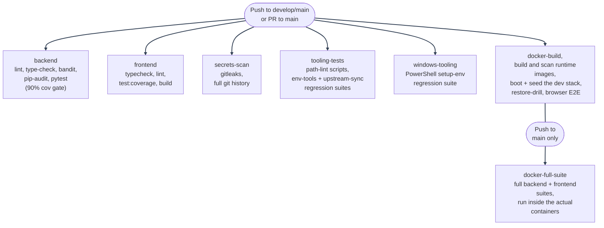

# CI/CD Overview

---

_New to a term here? See the [Infrastructure Glossary](../glossary/infrastructure.md)._

## Workflow

`.github/workflows/ci.yml` triggers on pushes to `develop` or `main`, and on
pull requests targeting `main`. It declares top-level `permissions: contents: read` because none of the
jobs push commits, comment on PRs, or need write access. A compromised action
dependency in this workflow can only read the checkout.

There are seven independent jobs. The first six run on every push and PR. The
seventh runs only on a push to `main`.

For local parity, run the Bash/Linux-equivalent jobs from the repository's
normal development shell, run the `windows-tooling` command from native
Windows PowerShell, and run `docker-full-suite` against a disposable Compose
project. WSL2 can run the Linux and Docker checks, but it is not a substitute
for the Windows runner when validating PowerShell behavior. If a host lacks
the Windows runner, browser dependencies, production credentials, or another
GitHub-hosted capability, record that exact limitation instead of calling the
entire workflow passed.

Ownership-specific CI commands live under `ci/mystic_auth/` and `ci/app/`.
The workflow remains shared because GitHub Actions does not import arbitrary
YAML from a root `ci/` directory. The scripts split native backend, frontend,
tooling, and backup commands; Docker, Compose, browser, and container-suite
checks remain in the workflow because they exercise the assembled application.

---


```mermaid
%%{init: {"themeVariables": {"lineColor": "#334155"}} }%%
flowchart TD
    Trigger(["Push to develop/main\n or PR to main"])
    TriggerMain(["Push to\n main only"])
    Trigger --> Backend["backend\n lint, type-check, bandit,\n pip-audit, pytest\n (90% cov gate)"]
    Trigger --> Frontend["frontend\n typecheck, lint,\n test:coverage, build"]
    Trigger --> Secrets["secrets-scan\n gitleaks,\n full git history"]
    Trigger --> Tooling["tooling-tests\n path-lint scripts,\n env-tools + upstream-sync\n regression suites"]
    Trigger --> Windows["windows-tooling\n PowerShell setup-env\n regression suite"]
    Trigger --> DockerBuild["docker-build,\n build and scan runtime images,\n boot + seed the dev stack,\n restore-drill, browser E2E"]
    DockerBuild ~~~ TriggerMain
    TriggerMain --> DockerFullSuite["docker-full-suite\n full backend + frontend suites,\n run inside the actual containers"]
    linkStyle default stroke:#334155,stroke-width:2px
```

---

### `backend`: Backend (unit + integration)

- Spins up Postgres 15 and Valkey 9.1.2-alpine as GitHub Actions service containers. Compose
  remains the source of truth for local development, but service containers are
  a lower-overhead CI equivalent for the backend job.
- Provides all required settings as job-level environment variables with
  clearly fake CI-only values because CI has no checked-in `env/mystic_auth/.env.dev`. `APP_NAME`
  is set to `MysticAuth` only because `Settings` requires a value. It is a test
  placeholder, not branding that a downstream project must keep in sync.
- Installs `backend/requirements.txt` and `backend/requirements-dev.txt`, then
  runs `pip-audit -r backend/requirements.txt`.
- Runs MysticAuth and app `ruff`, `mypy`, and `bandit -c pyproject.toml` checks
  as separate steps through `ci/mystic_auth/backend.sh` and
  `ci/app/backend.sh`, so the failing ownership area is obvious in the
  Actions UI.
- Runs `alembic upgrade head`, then `alembic check`. The check fails if models
  drift from what the migrations create.
- Runs app unit tests, then MysticAuth unit, integration, and security suites.
  The integration and security steps use `--cov-append`, so the final 90% gate
  checks cumulative coverage across all four suites. `pytest.ini` intentionally
  does not set `--cov-fail-under` because that would break partial local runs. See
  [Testing Overview](../testing/overview.md).
- The MysticAuth integration step is the blocking owner for audit-log behavior,
  including protected-action entries such as `users:list_all`; failures are
  reported separately from app-owned backend unit failures.
- Runs `pytest tests/backend/mystic_auth/performance` as a non-blocking step
  because timing thresholds can be noisy on shared GitHub-hosted runners.

---

### `frontend`: Frontend (typecheck + lint + test + build)

- Node is pinned to `22.22.0` because React Router 8 requires Node
  `>=22.22.0`.
- Runs `npm ci --legacy-peer-deps`, `npm audit --audit-level=high`,
  `npm run typecheck`, `npm run lint`, `npm run test:coverage`, and
  `npm run build` as separate steps. `test:coverage` is used instead of plain
  `test` so `vitest.config.ts` coverage thresholds are enforced.

---

### `secrets-scan`: Secrets scan (gitleaks)

- Checks out full git history with `fetch-depth: 0` and runs
  [gitleaks](https://github.com/gitleaks/gitleaks). This catches secrets that
  were committed and later removed from the working tree.

---

### `tooling-tests`: Tooling regression tests (paths, env, sync, Compose hardening)

- Runs `ci/mystic_auth/tooling.sh`, which invokes the template tooling checks,
  including `check-script-paths.sh` and `check-split-paths.sh`: no live stack
  needed, just static path resolution against the checked-out tree. The path
  checker also validates `ci/` references. Added after a stale path in `quickstart.sh`
  broke the README's own first command; together they've since caught 30+
  further stale-path instances the same way.
- Runs `check-image-digests.sh` through the MysticAuth tooling entrypoint:
  asserts
  every `@sha256:...`-pinned image in `docker/{mystic_auth,app}/compose/*.yml`
  is a syntactically valid 64-character digest. Added after a 2026-10-05
  security audit found a one-character-short digest on the `geoipupdate`
  image, copy-pasted into all four production-shaped compose files, that
  failed `docker pull` outright on a clean host (`docker compose config`
  does not validate digest length, only that the field parses as a string).
- Runs `check-log-rotation.sh`, `check-ci-action-pinning.sh`, and
  `check-readonly-rootfs.sh` to enforce bounded Compose logs, immutable CI
  action references, and read-only root filesystems for production-shaped
  services. These are static checks; they do not replace a live container
  smoke test.
- Runs the env-tools regression suite
  (`tests/scripts/mystic_auth/env-tools/test-env-tooling.sh`), the
  upstream-sync regression suite
  (`tests/scripts/mystic_auth/upstream-sync/test-sync-upstream.sh`), and the
  backup-freshness regression suite
  (`tests/scripts/mystic_auth/db/test-backup-freshness.sh`), all against a
  throwaway copy of the relevant files under a temp directory, never this
  repo's own real env files.

---

### `docker-build`: Docker image build verification

- Builds the backend runtime, frontend production, and `db-backup` images. The
  backup image is a separate dependency surface built from
  `docker/mystic_auth/dockerfiles/db-backup.Dockerfile`; it is not covered by
  the backend image build even though it runs database tooling.
- Scans all three built images with Trivy for unfixed critical/high
  vulnerabilities, then generates SPDX JSON SBOMs from those exact images.
  The artifacts include the image runtime contents and are uploaded for 90
  days with a manifest containing the commit and local image IDs they
  describe. The frontend report is intentionally nginx-only: Node/npm build
  dependencies are not present in the shipped image. The step validates that
  all three SBOMs are non-empty before upload. It does not
  claim image signing or provenance attestation; those require a registry
  publish/signing workflow and remain outside this template's deployment scope.
- Validates all five modes' Compose file pairs (`docker/mystic_auth/compose/` + `docker/app/compose/`) parse: `docker-compose.dev.yml`, `docker-compose.local-prod-cloudflare.yml`, `docker-compose.local-prod-ngrok.yml`, `docker-compose.local-prod-tailscale.yml`, and `docker-compose.prod.yml`.
- Runs the built backend image and asserts `/app/logs` exists but is **empty**: a regression guard for a real bug found during a pre-release image-contents audit (local access-log files, with real request data, were previously getting baked into the image via a `.dockerignore` gap: see [Security Decisions](../security/decisions-infra.md#dockerignore-previously-let-local-files-leak-into-built-images)). The directory itself is expected to exist (the app creates it on import); this only checks that no host-side log content rode along inside it.
- Boots the real dev stack with `docker compose -f docker/mystic_auth/compose/docker-compose.dev.yml -f docker/app/compose/docker-compose.dev.yml --env-file env/mystic_auth/.env.dev --env-file env/app/.env.dev up -d --build postgres valkey
alembic backend frontend procrastinate_worker`, waits for `/health/ready` and the frontend dev
  server, and checks response bodies. This verifies the images and Compose
  wiring actually serve traffic.
- Seeds the disposable PBAC permission-matrix accounts with
  `local-scripts/mystic_auth/seed-user-permission-matrix.py` through the backend
  container's `/repo` bind mount before running browser E2E. The matrix test
  exercises real database grants; the stack's database volume is destroyed at
  the end of the job.
- Runs `tests/scripts/mystic_auth/db/test-restore-drill.sh` against the booted
  stack: dumps the real database, restores it into a disposable scratch
  database, and checks the schema and a real table came back intact, proving
  the backup path is actually restorable, not just that a dump file exists.
- Runs the Playwright browser E2E suites (`ci/mystic_auth/frontend-e2e.sh` and
  `ci/app/frontend-e2e.sh`, with `EMAIL_ENABLED=false`) against the booted dev
  stack, including the
  accessibility scan. The workflow runs the MysticAuth-owned tests through
  `ci/mystic_auth/frontend-e2e.sh` and app-owned tests through
  `ci/app/frontend-e2e.sh`, so a template auth, permission, audit-log, or
  accessibility regression is a clearly blocking MysticAuth failure. Mocked
  UI and authorization suites run in all four browser projects. The exhaustive
  live permission matrix runs in Chromium desktop, and responsiveness timing
  runs in Chromium desktop and mobile, so real backend traffic is not
  multiplied across engines. Does not run the backend's own pytest suite here,
  because that is handled by `docker-full-suite`. Does not run the opt-in
  live-deployment smoke test (`tests/frontend/mystic_auth/e2e/live/`), since
  that needs a real separate deployment and its own env vars to target.
- Raises `MAX_REQUESTS_PER_WINDOW` only in the disposable CI env copy, from the
  production default of 100 to 1000, because the real-account matrix makes
  more than 100 authenticated requests from one runner IP. Playwright runs
  four browser projects with two workers and two CI retries; project-level
  coverage is intentionally split in `frontend/playwright.config.ts`. These
  are determinism controls, not relaxed application assertions.
- Blanks `BUGSINK_SUPERUSER_EMAIL` in the job's temporary `env/mystic_auth/.env.dev` copy before
  booting because `bugsink` and `bugsink-seed` are not started in this job. This
  avoids waiting for a DSN file that will never be written.
- Prints `docker compose logs --no-color` on failure so container startup
  failures have useful context in the Actions UI.
- Does not push images or deploy. That is an explicit template scope boundary,
  not an oversight.

---

### `docker-full-suite`: Full test suite via Docker (main only)

- Gated to `if: github.event_name == 'push' && github.ref == 'refs/heads/main'`.
  It does not run on pull requests.
- Boots the backend stack with the same `BUGSINK_SUPERUSER_EMAIL` override as
  `docker-build`, then runs the same unit, integration, and security tiers
  inside the running backend container. `--user root` is required because
  coverage output writes to `/repo`, the whole-repo bind mount. Native Linux
  does not let the container's non-root `app` user write there. See
  [Docker Overview: running a one-off command inside a container](../docker/dev-workflow.md#running-a-one-off-command-inside-a-container).
- Boots the frontend, then runs its full test suite inside that container the same way.
- Same on-failure `docker compose logs` step as `docker-build`.
- This repeats tests already run natively. The value is running them through the
  deployable image, real container filesystem, installed dependencies, and
  Compose networking. It is `main`-only to avoid doubling PR CI time for the
  same source code.

---

## What's covered

- Backend unit/integration/security suites, against real Postgres/Valkey, gated by a 90% cumulative-coverage threshold; performance tests run too, non-blocking.
- Backend lint (ruff), type-checking (mypy), and security scanning (bandit): all configured in `backend/pyproject.toml`.
- A model/migration drift check (`alembic check`): fails if a SQLAlchemy model's columns or indexes don't match what the checked-in migrations actually produce.
- Full frontend type-check, lint, test (with coverage thresholds enforced), and production build.
- Full Playwright browser E2E suite against the real booted dev stack, including a WCAG 2.1 AA accessibility scan (`@axe-core/playwright`) across every major page.
- A backup restore drill: dumps the real database, restores it into a disposable scratch database, and checks the schema and a real table came back intact, not just that a dump file exists.
- A deterministic backup-freshness regression suite covering missing, stale, empty, and fresh backup artifacts.
- Path-lint scripts (stale `scripts/`/`local-scripts/` path references, stale pre-split `docker`/`env`/`scripts` references) and the env-tools/upstream-sync regression suites, all against throwaway copies, never this repo's own real files.
- All three runtime images build and pass the CI vulnerability scan, and (on every PR) the actual dev compose stack boots and serves traffic.
- Every built runtime image has a validated SPDX JSON SBOM retained as a CI artifact, tied to the commit and local image ID used to generate it.
- On every push to `main`: the entire backend + frontend test suites, re-run a second time inside the real containers rather than a bare runner. Pushes to `develop` run the native validation jobs without this duplicate container pass.
- Dependency vulnerability scanning on every push/PR: `pip-audit` (backend, blocking) and `npm audit --audit-level=high` (frontend, blocking). There is no scheduled/automated dependency-update bot in this repo; dependency bumps are a manual, deliberate action (see the header comment in `backend/requirements.txt`), not something that opens PRs on its own.
- Secret scanning across full git history (`gitleaks`), independent of the backend/frontend jobs.

---

## What's not covered (tracked, not silently missing)

See [Concerns](../concerns/README.md) for the full entries:

- No image push to a registry and no deployment stage: deploying is a manual, documented process (see [Deployment Guide](../deployment/guide.md)), not automated.

This is deliberately left as a documented gap rather than added: extending `ci.yml` with a deploy stage is a workflow change with its own blast radius (new required checks, new secrets, a specific hosting target to assume), and unnecessary cloud-specific tooling doesn't belong in a template repository with no assumed production target.

---

## Local equivalents

Everything CI runs can be run locally:

```bash
# Backend static analysis (from repo root; dev tools installed via requirements-dev.txt)
ci/mystic_auth/backend.sh lint
ci/app/backend.sh lint
ci/mystic_auth/backend.sh typecheck
ci/app/backend.sh typecheck
ci/mystic_auth/backend.sh security
ci/app/backend.sh security
alembic -c backend/alembic.ini check

# Backend tests (from repo root, against local or Dockerized Postgres/Valkey)
ci/app/backend.sh unit
ci/mystic_auth/backend.sh unit
ci/mystic_auth/backend.sh integration
ci/mystic_auth/backend.sh security-tests
ci/mystic_auth/backend.sh performance

# Frontend (from repo root)
ci/app/frontend.sh typecheck
ci/app/frontend.sh lint
ci/app/frontend.sh test-coverage
ci/app/frontend.sh build

# Secrets scan (from repo root; requires gitleaks installed, or run via Docker)
gitleaks detect --source . -v

# Tooling regression tests (from repo root; no live stack needed)
ci/mystic_auth/tooling.sh script-paths
ci/mystic_auth/tooling.sh split-paths
ci/mystic_auth/tooling.sh image-digests
ci/mystic_auth/tooling.sh env-tools
ci/mystic_auth/tooling.sh upstream-sync
ci/mystic_auth/tooling.sh backup-freshness

# Docker image builds (from repo root)
docker build --target runtime -f docker/mystic_auth/dockerfiles/backend.Dockerfile -t backend:local .
docker build --target production -f docker/mystic_auth/dockerfiles/frontend.Dockerfile -t frontend:local .

# Note on the commands below: every `docker compose` invocation needs both
# -f files (docker/mystic_auth/compose/... + docker/app/compose/...) and
# both --env-file flags (env/mystic_auth/... + env/app/...), exactly as
# ci.yml itself does - abbreviated to the mystic_auth ones alone here would
# silently skip any app/ overrides a fork has added.

# Boot + smoke-test the dev stack, the same thing docker-build does on every PR
cp env/mystic_auth/.env.dev.example env/mystic_auth/.env.dev
cp env/app/.env.dev.example env/app/.env.dev
sed -i 's/^BUGSINK_SUPERUSER_EMAIL=.*/BUGSINK_SUPERUSER_EMAIL=/' env/mystic_auth/.env.dev   # skip the wasted Bugsink-DSN wait: bugsink isn't started below
sed -i 's/^MAX_REQUESTS_PER_WINDOW=.*/MAX_REQUESTS_PER_WINDOW=1000/' env/mystic_auth/.env.dev   # disposable CI headroom; production remains at 100
docker compose -f docker/mystic_auth/compose/docker-compose.dev.yml -f docker/app/compose/docker-compose.dev.yml --env-file env/mystic_auth/.env.dev --env-file env/app/.env.dev up -d --build postgres valkey alembic backend frontend procrastinate_worker
curl -sf http://localhost:8000/health/ready   # wait/retry until it returns {"status":"ok"}
curl -sf http://localhost:5173                # wait/retry until it responds

# Seed the real-account permission matrix used by the browser E2E suite.
docker compose -f docker/mystic_auth/compose/docker-compose.dev.yml -f docker/app/compose/docker-compose.dev.yml --env-file env/mystic_auth/.env.dev --env-file env/app/.env.dev exec -T -w /repo backend python local-scripts/mystic_auth/seed-user-permission-matrix.py

# Restore drill, the same thing docker-build runs against that booted stack
ci/mystic_auth/tooling.sh restore-drill

# Full Playwright browser E2E suites (including the accessibility scan),
# the same thing docker-build runs against that booted stack
CI=true PLAYWRIGHT_WORKERS=2 EMAIL_ENABLED=false ci/mystic_auth/frontend-e2e.sh
CI=true PLAYWRIGHT_WORKERS=2 EMAIL_ENABLED=false ci/app/frontend-e2e.sh

docker compose -f docker/mystic_auth/compose/docker-compose.dev.yml -f docker/app/compose/docker-compose.dev.yml --env-file env/mystic_auth/.env.dev --env-file env/app/.env.dev down -v && rm env/mystic_auth/.env.dev env/app/.env.dev

# Full suite through the actual containers, the same thing docker-full-suite
# does on every push to main
cp env/mystic_auth/.env.dev.example env/mystic_auth/.env.dev
cp env/app/.env.dev.example env/app/.env.dev
sed -i 's/^BUGSINK_SUPERUSER_EMAIL=.*/BUGSINK_SUPERUSER_EMAIL=/' env/mystic_auth/.env.dev
# BACKEND_BUILD_TARGET=test builds docker/mystic_auth/dockerfiles/backend.Dockerfile's `test` stage
# (runtime image + pytest), so pytest is available inside the container below
# without the runtime image everyone else deploys ever shipping test tooling.
BACKEND_BUILD_TARGET=test docker compose -f docker/mystic_auth/compose/docker-compose.dev.yml -f docker/app/compose/docker-compose.dev.yml --env-file env/mystic_auth/.env.dev --env-file env/app/.env.dev up -d --build postgres valkey alembic backend procrastinate_worker
# --user root: needed on native Linux, or pytest-cov's coverage output
# (written to /repo, the whole-repo bind mount) crashes with a permission
# error: see docs/mystic_auth/docker/overview.md's "running a one-off
# command inside a container" section
docker compose -f docker/mystic_auth/compose/docker-compose.dev.yml -f docker/app/compose/docker-compose.dev.yml --env-file env/mystic_auth/.env.dev --env-file env/app/.env.dev exec -T --user root backend bash -c "
  cd /repo &&
  python -m pytest tests/backend/app tests/backend/mystic_auth/unit -q &&
  python -m pytest tests/backend/mystic_auth/integration -q --cov-append &&
  python -m pytest tests/backend/mystic_auth/security -q --cov-append --cov-fail-under=90
"
docker compose -f docker/mystic_auth/compose/docker-compose.dev.yml -f docker/app/compose/docker-compose.dev.yml --env-file env/mystic_auth/.env.dev --env-file env/app/.env.dev up -d --build frontend
docker compose -f docker/mystic_auth/compose/docker-compose.dev.yml -f docker/app/compose/docker-compose.dev.yml --env-file env/mystic_auth/.env.dev --env-file env/app/.env.dev exec -T frontend sh -c "npm run test -- --run"
docker compose -f docker/mystic_auth/compose/docker-compose.dev.yml -f docker/app/compose/docker-compose.dev.yml --env-file env/mystic_auth/.env.dev --env-file env/app/.env.dev down -v && rm env/mystic_auth/.env.dev env/app/.env.dev
```

---
