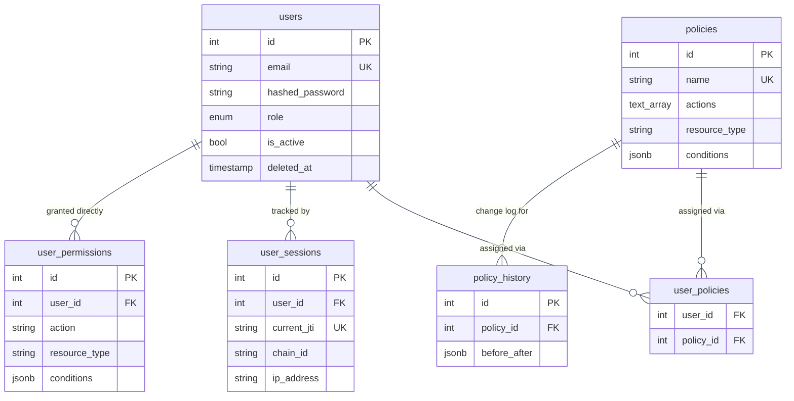
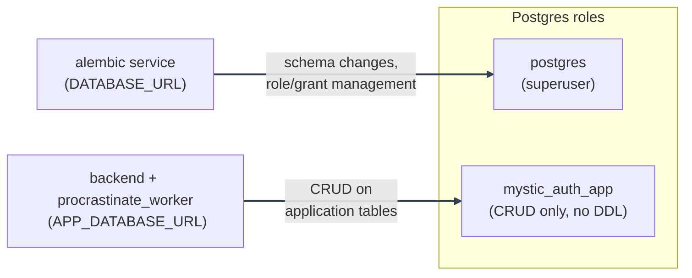

# Database Design

---

_New to a term here? See the [Infrastructure Glossary](../glossary/infrastructure.md)._

PostgreSQL, accessed via async SQLAlchemy (`backend/mystic_auth/database/`). Schema managed entirely through Alembic migrations (`backend/alembic/versions/`); there is no `create_all()` in application startup.

Relationships and key columns only - see each table's own section below for the full column list; keeping this diagram to PK/FK/UK markers (no descriptive comments) is deliberate, so wide entity boxes don't force the whole diagram to render tiny in a fixed-width doc viewer.

---

## Entity-relationship diagram

---

`authorization_audit_log` and `security_audit_log` are deliberately left off this diagram entirely, not just undrawn relationship lines: both key off `user_email` as a snapshot string, not a foreign key to `users.id`, so the audit trail survives even after the user row is purged. See [Why two audit tables, not one](#why-two-audit-tables-not-one) and each table's own section below for their full column lists.

---

## Tables

---

### `users`

The single, unified identity table: password and OAuth2 (Google) accounts share it, and there is no separate "oauth_accounts" table. See `backend/mystic_auth/user/user_model.py`.

| Column                      | Type                                     | Notes                                                                                                                                                                                                                                                                    |
| --------------------------- | ---------------------------------------- | ------------------------------------------------------------------------------------------------------------------------------------------------------------------------------------------------------------------------------------------------------------------------ |
| `id`                        | int, PK                                  |                                                                                                                                                                                                                                                                          |
| `name`                      | string                                   |                                                                                                                                                                                                                                                                          |
| `email`                     | string, **unique**, indexed              | The DB-level unique constraint is what actually prevents a duplicate account under a signup/OAuth2-login race; see [Security Decisions](../security/decisions-auth.md#the-signupoauth2-email-race).                                                                      |
| `hashed_password`           | string, nullable                         | Argon2 hash. **Null for OAuth2-only accounts**: there is no password to check, and `login_service.py` handles a null hash safely (compares against a dummy hash rather than short-circuiting, for timing-attack resistance; see [Login](../authentication/login.md)).    |
| `role`                      | enum (`user`/`admin`/`system`), nullable | **Display/grouping metadata only; never consulted for an access decision.** See [Security Decisions](../security/decisions-auth.md#role-is-never-used-to-decide-access). Nullable because the system must support a roleless account authorized purely through policies. |
| `is_verified`               | bool                                     | Email ownership confirmed (via the verification flow, or implicitly via Google's `email_verified`).                                                                                                                                                                      |
| `is_active`                 | bool                                     | **The single flag every auth check point gates on** (`login_service.py`, `oauth2_service.py`, `current_user_handler.py`). Also what soft delete reuses; see Account Lifecycle below.                                                                                     |
| `deleted_at`                | timestamp, nullable                      | Soft-delete marker. `NULL` = never deleted. Set by soft delete, cleared by reactivation.                                                                                                                                                                                 |
| `created_at` / `updated_at` | timestamp                                | Server-side, automatic.                                                                                                                                                                                                                                                  |

---

### `policies`

The primary authorization unit; see [../authorization/architecture/README.md](../authorization/architecture/README.md) for how these are evaluated. `id`, `name` (unique), `description`, `actions` (`text[]`), `resource_type`, `conditions` (`jsonb`, nullable), `is_active`, `created_at`/`updated_at`, `created_by`.

---

### `user_policies`

Many-to-many join between `users` and `policies`: **the only thing that actually grants access**, never `users.role`. `user_id` and `policy_id` both `ON DELETE CASCADE`: a hard-deleted (purged) user's policy assignments disappear automatically with the row; a soft-deleted user's assignments are **not** touched (the row still exists). See Account Lifecycle below.

---

### `policy_history`

Append-only change log for `policies`: every create/update/delete/rollback writes a row capturing the before/after state. See [../authorization/writing-testing-policies.md](../authorization/writing-testing-policies.md). Not a foreign-key target from anywhere; purely a forward-append audit trail.

---

### `user_permissions`

A direct, per-user grant of a single `(action, resource_type)` pair, bypassing `Policy` entirely; see [Adding New Permissions: Direct grants vs. policies](../authorization/adding-permissions.md#direct-grants-vs-policies) for when this table is the right tool instead of a named policy. `user_id` is `ON DELETE CASCADE`, same as `user_policies`. `conditions` (`jsonb`, nullable) uses the same condition schema as a policy's `conditions` block. `(user_id, action, resource_type)` is unique, so re-granting an already-held action updates its `conditions` in place instead of creating a duplicate row. `is_active`, `assigned_at`, `assigned_by` mirror the equivalent `policies`/`user_policies` bookkeeping. See `backend/mystic_auth/authorization/models/user_permission_model.py`.

---

### `authorization_audit_log`

One row per `authorize()`/`authorize_with_decision()`/`authorize_batch()` call: every real access decision, allow or deny. `user_email` is a **plain string column, not a foreign key** to `users.id`. This is deliberate: the audit trail must remain intact and queryable even after a user row is purged (hard-deleted). See [../authorization/architecture/README.md](../authorization/architecture/component-responsibilities.md#audit-log) for the full column list.

---

### `security_audit_log`

Separate audit vocabulary from the table above: login/logout/signup/OAuth2/password-reset/lockout/refresh-token-reuse events, plus the account lifecycle events (`account_deleted`/`account_purged`/`account_reactivated`, see below). Also `user_email` as a nullable **snapshot string**, not a foreign key, for the identical reason: this table must survive a purge. See `backend/mystic_auth/audit_log/audit_log_model.py`.

---

### `user_sessions`

One row per login session, backing the "Manage Sessions" dashboard card. `current_jti` tracks whichever refresh-token `jti` currently represents the session (updated in place on each rotation, since refresh tokens are single-use and rotate their `jti` on every `/auth/refresh` call); `chain_id` is that session's stable identity across every rotation (unchanged, unlike `current_jti`) and what a targeted revoke actually bumps in Redis (`jwt_service.bump_chain_version`); `id` stays the stable identifier surfaced to and revoked by the client. `city`/`country` are nullable, best-effort geolocation columns, resolved from the login IP at session create/rotate time against a local MaxMind GeoLite2-City database (`user_session/session_geolocation.py`, `GEOIP_DB_PATH` setting) and shown as the dashboard's Location column; a lookup fails open (never blocks login) when the database file is absent or the address can't be resolved, so both columns can be `NULL` even on a real session, same as `ip_address` itself. `user_id` **is** a real foreign key here (`ON DELETE CASCADE`), unlike the two audit tables above: a session has no meaning once its owning user is gone. Deliberately best-effort and independent of the actual Redis-backed version counters that govern real token validity: this table only mirrors that state for display and for choosing which chain to revoke, so a row here going missing or stale never affects login/refresh correctness. See `backend/mystic_auth/user_session/session_model.py` and [Session Management](../authentication/session-management/README.md).

---

## Why two audit tables, not one

`authorization_audit_log` answers "was this specific action on this specific resource allowed, and by which policy": a PBAC evaluation record. `security_audit_log` answers "what happened to this account": a broader identity/session timeline (including things that have no policy evaluation at all, like a failed login attempt against a nonexistent email). They're queried by different audiences for different questions and were kept as two focused tables rather than one table with an ever-growing set of nullable, event-type-specific columns.

---

## Account lifecycle

See [Account Deletion and Purge](../authentication/account-deletion/README.md) for the full flow end to
end, including the OAuth-only-account email-confirmation path and sequence diagrams. Summary below.

Three operations, two permissions, deliberately separate:

| Operation                      | Endpoint                                               | Permission                            | Reversible?                      |
| ------------------------------ | ------------------------------------------------------ | ------------------------------------- | -------------------------------- |
| Soft delete (admin)            | `DELETE /users/{email}`                                | `users:delete_any`                    | Yes, via reactivate              |
| Soft delete (self-service)     | `DELETE /users/me`                                     | `users:update_own` + current password | Yes, via reactivate (admin-only) |
| Reactivate                     | `PATCH /users/{email}/reactivate`                      | `users:reactivate`                    | N/A                              |
| Purge (hard delete, manual)    | `DELETE /users/{email}/purge`                          | `users:purge`                         | **No**                           |
| Purge (hard delete, automatic) | daily `procrastinate_tasks/account_purge_tasks.py` job | N/A (system-initiated)                | **No**                           |

---

**Soft delete** (`user_lifecycle_crud.py::soft_delete`) sets `is_active=False` + `deleted_at=now()`. It deliberately reuses the _same_ `is_active` flag every login/session check already gates on, rather than adding a second "is this user deleted" check to every one of those call sites. The row, its `user_policies` assignments, and all audit history are untouched, so reactivation restores exactly the access the account had before, with nothing to re-grant. The route also explicitly calls `refresh_token_service.revoke_all_tokens_for_user()`, because `POST /auth/refresh/` itself never checks the database (see [Authentication Flows](../authentication/overview.md#refresh-token-rotation)); without this, a still-valid refresh token could keep minting fresh (if practically useless, since `current_user_handler` re-checks `is_active` on every request) access tokens until it expired on its own.

---

**Purge** (`DELETE /users/{email}/purge`, or the daily automatic job below) permanently removes the row. `user_policies` rows cascade-delete automatically (`ON DELETE CASCADE`); `authorization_audit_log`/`security_audit_log` rows are untouched (string snapshot, not FK, see above), so the historical record of what the account did survives even though the account itself is gone. The manual route is gated by `users:purge`, a distinct and more sensitive permission from `users:delete_any`, granted only by the seeded `system_superuser` policy, never `user_administration`. An admin who can delete accounts day-to-day cannot irreversibly destroy one. Both the manual route and the automatic job call the same `purge_user_account()` (`backend/mystic_auth/user_lifecycle/user_purge_service.py`) so the revoke → audit → delete sequence can never drift between the two call sites.

---

Both soft-delete and purge write a security audit event _before or as part of_ the operation. For purge specifically, the audit write happens **before** the row is deleted, since the event itself is what makes the irreversible action reviewable afterward.

---

The system account (`role=UserRole.system`) is excluded from all lifecycle operations, including self-service delete, via the same target-account guard already used for its other admin-route protections (see `backend/mystic_auth/api/user_routes/user_lifecycle_routes.py`, `user_self_service_routes.py`, and `user_management_update_routes.py`). The admin delete and purge routes also reject the caller's own account: the frontend disables those actions against your own row, but the backend enforces it independently, since a sole admin deleting or purging themselves through the _admin_ route would be an unrecoverable lockout. Self-service delete has no such guard, since acting on your own account is the entire point of `DELETE /users/me`; it instead requires re-submitting the current password (verified via the same `password_service.verify_password` call the self-service password-change flow uses) so a hijacked session cookie alone isn't enough to delete the account.

---

**Self-service delete** (`DELETE /users/me`, `user_self_service_routes.py::delete_my_account`) is soft-delete only: it never purges synchronously. It writes `account_deleted_self` (distinct from admin-initiated `account_deleted`) so the audit log distinguishes the two at a glance. A soft-deleted account (self- or admin-initiated) isn't kept forever: the automatic purge job (`procrastinate_tasks/account_purge_tasks.py`, registered via `@app.periodic(cron="0 3 * * *")` and deferred automatically by the Procrastinate worker's own internal periodic-task deferrer, no separate scheduler process involved) queries `user_lifecycle_crud.py::get_deleted_before(cutoff)` for every account whose `deleted_at` predates `now - settings.ACCOUNT_PURGE_GRACE_DAYS` (default 30 days) and purges each one. This is what gives self-service deletion an actual recovery window (the account can only be restored by an admin's `PATCH /users/{email}/reactivate` during the grace period) instead of either purging immediately (no recovery at all) or accumulating soft-deleted rows forever.

---

## Migrations

Every schema change is an Alembic migration under `backend/alembic/versions/`, applied via the dedicated one-shot `alembic` service (`alembic upgrade head`). In the production-style Compose files, `backend` and `procrastinate_worker` wait for it to complete before starting (`depends_on: ... condition: service_completed_successfully`); the dev `docker-compose.dev.yml` runs the `alembic` service alongside the others without gating startup on it. Data-only migrations (e.g. granting a new permission to a seeded policy, backfilling a default role) follow the same process as schema migrations; see [../authorization/adding-permissions.md](../authorization/adding-permissions.md) for the exact pattern.

---

## Database roles

Two Postgres roles, not one, since migration `b1e6a9f3c7d2_add_least_privilege_app_role.py`:

---

- **`DATABASE_URL`** (the `postgres` superuser) is what `alembic upgrade head` runs as. Migrations need to create/alter tables and, for this one migration, create and grant the other role - that requires superuser or equivalent, so this role stays superuser rather than being narrowed.
- **`APP_DATABASE_URL`** (`mystic_auth_app`) is what the request-serving backend and the Procrastinate worker's task bodies connect as (`database/connection.py`: `settings.APP_DATABASE_URL or settings.DATABASE_URL`). It can read/write every application table but cannot run DDL, create roles, or touch other databases on the same Postgres server. Optional and backward-compatible: an unset `APP_DATABASE_URL` falls back to `DATABASE_URL` everywhere, so existing deployments are unaffected until they opt in.

This is deliberately _not_ Row-Level Security. The app is single-tenant (no `tenant_id`/`org_id` anywhere) and every authorization decision - including admin overrides - is already fully enforced in Python by the PBAC engine (see [../authorization/architecture/README.md](../authorization/architecture/README.md)) against already-fetched rows, not via SQL predicates. Re-deriving that logic as per-row Postgres policies would duplicate business logic in two places and risk drift, and without a real per-row ownership column to filter on, a row policy would just degenerate into `USING (true)` - no different from a plain table grant, but with the added footgun that a _future_ table added without remembering to enable RLS on it is silently wide open rather than protected. What the role split buys instead: a compromised dependency, a bad ad hoc script, or a leaked runtime credential reusing the app's live DB connection can still read/write application data (that's unavoidable - the app needs that access to function), but can no longer drop/alter the schema, create a new role, or read another role's credentials. See [Security Decisions: Infrastructure](../security/decisions-infra.md#least-privilege-app-db-role-instead-of-running-as-postgres-superuser) for the full writeup, including what this does and does not protect against.

---
