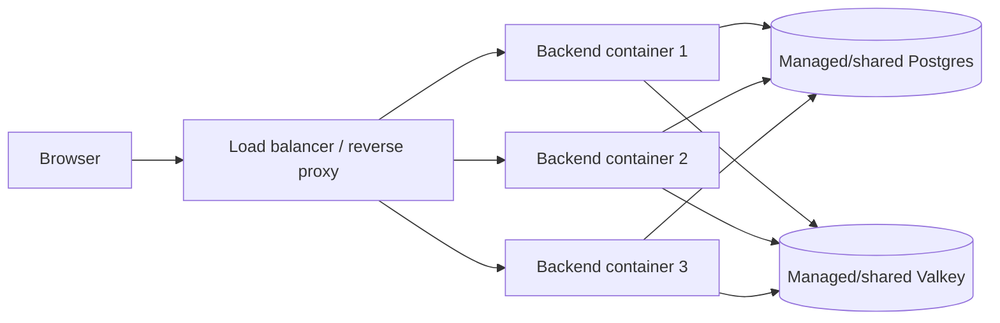

# Environment and Runtime Configuration

---

_New to a term here? See the [Infrastructure Glossary](../glossary/infrastructure.md)._

Deployment modes use separate environment files so dev, local-prod tunnel variants, and prod can hold real values at the same time without overwriting one another.

---

## 1. Choosing the right env template

---

| Mode                  | Copy this file                                                                     | To this file                                         | Use with                                                                                               | Best for                               |
| --------------------- | ---------------------------------------------------------------------------------- | ---------------------------------------------------- | ------------------------------------------------------------------------------------------------------ | -------------------------------------- |
| Dev                   | `env/mystic_auth/.env.dev.example` plus `env/app/.env.dev.example`                 | `env/mystic_auth/.env.dev` plus `env/app/.env.dev`   | `docker/mystic_auth/compose/docker-compose.dev.yml` plus `docker/app/compose/docker-compose.dev.yml`   | Local development with hot reload      |
| Local-prod Cloudflare | `env/mystic_auth/.env.local-prod-cloudflare.example` plus the matching app example | matching `env/mystic_auth/` and `env/app/` files     | matching `docker/mystic_auth/` and `docker/app/` Compose files                                         | Your machine through Cloudflare Tunnel |
| Local-prod ngrok      | `env/mystic_auth/.env.local-prod-ngrok.example` plus the matching app example      | matching `env/mystic_auth/` and `env/app/` files     | matching `docker/mystic_auth/` and `docker/app/` Compose files                                         | Your machine through ngrok             |
| Local-prod Tailscale  | `env/mystic_auth/.env.local-prod-tailscale.example` plus the matching app example  | matching `env/mystic_auth/` and `env/app/` files     | matching `docker/mystic_auth/` and `docker/app/` Compose files                                         | Your machine through Tailscale Funnel  |
| Prod                  | `env/mystic_auth/.env.prod.example` plus `env/app/.env.prod.example`               | `env/mystic_auth/.env.prod` plus `env/app/.env.prod` | `docker/mystic_auth/compose/docker-compose.prod.yml` plus `docker/app/compose/docker-compose.prod.yml` | Public server with Caddy TLS           |

---

## 2. Copy and run examples

---

```bash
# Dev
cp env/mystic_auth/.env.dev.example env/mystic_auth/.env.dev
cp env/app/.env.dev.example env/app/.env.dev
docker compose -f docker/mystic_auth/compose/docker-compose.dev.yml -f docker/app/compose/docker-compose.dev.yml --env-file env/mystic_auth/.env.dev --env-file env/app/.env.dev up

# Local-prod, ngrok example
cp env/mystic_auth/.env.local-prod-ngrok.example env/mystic_auth/.env.local-prod-ngrok
cp env/app/.env.local-prod-ngrok.example env/app/.env.local-prod-ngrok
docker compose -f docker/mystic_auth/compose/docker-compose.local-prod-ngrok.yml -f docker/app/compose/docker-compose.local-prod-ngrok.yml --env-file env/mystic_auth/.env.local-prod-ngrok --env-file env/app/.env.local-prod-ngrok up -d --build

# Prod
cp env/mystic_auth/.env.prod.example env/mystic_auth/.env.prod
cp env/app/.env.prod.example env/app/.env.prod
docker compose -f docker/mystic_auth/compose/docker-compose.prod.yml -f docker/app/compose/docker-compose.prod.yml --env-file env/mystic_auth/.env.prod --env-file env/app/.env.prod up -d --build
```

The app-side examples are intentionally empty. Keep template-defined values
in the `mystic_auth` runtime file and add product-specific values in the
matching `env/app/` file; do not edit tracked examples or tracked upstream
Compose files.

---

## 3. Compose env-file rule

---

The `--env-file` flag matters for local-prod and prod. Compose only auto-loads a file literally named `env/mystic_auth/.env.dev` for `${VAR}` substitution in Compose YAML. Each service's `env_file:` entry points at the correct dedicated file, but frontend build args and other Compose-level substitutions still need `--env-file`.

Use the helper scripts when possible because they always pass the matching env file:

1. `scripts/mystic_auth/docker/dev/dev-up.*`
2. `scripts/mystic_auth/docker/local-prod-cloudflare/local-prod-cloudflare-up.*`
3. `scripts/mystic_auth/docker/local-prod-ngrok/local-prod-ngrok-up.*`
4. `scripts/mystic_auth/docker/local-prod-tailscale/local-prod-tailscale-up.*`
5. `scripts/mystic_auth/docker/prod/prod-up.*`

---

## 4. Runtime vs build-time settings

---

| Setting group                  | Read time                                              | Examples                                                                                                                                                    |
| ------------------------------ | ------------------------------------------------------ | ----------------------------------------------------------------------------------------------------------------------------------------------------------- |
| Backend runtime settings       | Container or process startup                           | `DATABASE_URL`, `APP_DATABASE_URL`, `SECRET_KEY`, `GOOGLE_REDIRECT_URI`, SMTP settings, rate-limit settings, `DB_POOL_SIZE`/`DB_MAX_OVERFLOW`, `SENTRY_DSN` |
| Compose-only scaling setting   | Compose command evaluation, not read by the app itself | `UVICORN_WORKERS`                                                                                                                                           |
| Frontend build settings        | Image build time                                       | `VITE_API_BASE_URL`, `VITE_APP_NAME`, `VITE_BRAND_COLOR`, `VITE_SUPPORT_EMAIL`, `VITE_SENTRY_DSN`, `VITE_SENTRY_ENVIRONMENT`                                |
| Compose interpolation settings | Compose command evaluation                             | Tunnel tokens, public domains, frontend build args, image names, exposed ports                                                                              |

Production-shaped frontend values are baked into the static bundle by `docker/mystic_auth/dockerfiles/frontend.Dockerfile`. After changing any `VITE_*` input, rebuild the frontend image with `--build`.

---

## 5. Required production review

---

`scripts/mystic_auth/env-tools/check-env/check-env.sh <file>` (`.ps1`/`.cmd`) automates the part
of this review a script can check: it fails if `ENVIRONMENT=production` but
a secret still equals the shipped placeholder, or the required backup key/upload
command is blank or the upload command does not reference `$DUMP_FILE`; it warns
on remaining `<your_...>` placeholders or a host port already bound by
something else.
Run it before `up`, then review the rest of this list by hand:

Review these settings before sharing a production-shaped deployment:

1. Set `ENVIRONMENT=production` to disable `/docs`, `/redoc`, and `/openapi.json`.
2. Generate real values for `SECRET_KEY`, `GOOGLE_CLIENT_SECRET`, `GMAIL_APP_PASSWORD`, `POSTGRES_PASSWORD`, `APP_DB_PASSWORD`, and `BUGSINK_SECRET_KEY`.
3. Configure at least one user verification path: SMTP email for password signup or Google OAuth2 login.
4. Set `FRONTEND_BASE_URL` and `BACKEND_BASE_URL` to the public origin for the selected deployment.
5. Set `GOOGLE_REDIRECT_URI` to the exact registered callback URL.
6. Set `JWT_ISSUER` and `JWT_AUDIENCE`, normally to the backend origin for this deployment.
7. Set `TRUSTED_PROXY_IPS` to the reverse-proxy hop that should be trusted for `X-Forwarded-For`. For the bundled prod/local-prod-* Compose files this is derived automatically from `FRONTEND_STATIC_IP`/the tunnel's `*_STATIC_IP` var - see [Routing: Trusted proxy IPs](routing.md#2-trusted-proxy-ips) - so review those vars instead of `TRUSTED_PROXY_IPS` directly.
8. Leave `VITE_API_BASE_URL` empty for the bundled same-origin nginx proxy, or set it only when the frontend is deployed separately.
9. Set the app-owned `DEFAULT_APP_POLICIES` in the matching `env/app/.env.<mode>` file only when downstream app policies should be assigned to every verified user. Do not add it to `env/mystic_auth`.
10. Configure `SENTRY_DSN` and `VITE_SENTRY_DSN` only when error monitoring is enabled.
11. Configure `GEOIP_DB_PATH` and `GEOIPUPDATE_*` only when enabling the `geoip` Compose profile.
12. Keep `USER_EXPORT_MAX_ROWS` sized for the largest safe CSV export your deployment can handle.
13. `UVICORN_WORKERS` auto-sizes on boot and needs no default value; only set it to override the auto-picked count, and size `DB_POOL_SIZE`/`DB_MAX_OVERFLOW` to match if you do - see [§7 below](#7-scaling-and-load-capacity).

---

## 6. Optional: Running the backend without Docker

---

Useful for iterating on the backend with a debugger attached, or a faster
reload loop than the Dockerized `dev` target gives you. Postgres and Valkey
still run in Docker either way; only the FastAPI process itself moves to
the host.

1. From the repo root, create a virtualenv and install both dependency files: `pip install -r backend/requirements.txt -r backend/requirements-dev.txt`.
2. Run `scripts/mystic_auth/docker/dev/backend-host-run.sh` (`.ps1`/`.cmd`). It starts only Postgres and Valkey, reads `POSTGRES_HOST_PORT`/`VALKEY_HOST_PORT`, derives the host-reachable URLs in memory, runs migrations, and starts Uvicorn with `--reload`. Pass extra Uvicorn arguments after the script path when needed.

`Settings` (`backend/mystic_auth/core/settings.py`) reads `env/mystic_auth/.env.dev` and `env/app/.env.dev` directly when a variable isn't already in the process environment. The host-run helper supplies only the rewritten connection URLs and leaves the env files unchanged, so a single host-port edit works for both Docker and host-run workflows.

Running the whole suite this way? `tests/backend/conftest.py` does the same `postgres`/`valkey` -> `localhost` derivation automatically from `env/mystic_auth/.env.dev` when `DATABASE_URL`/`VALKEY_URL` aren't already set, so `pytest` from the repo root needs no extra URL setup once the data services are running. See [Testing Overview](../testing/overview.md).

---

## 7. Scaling and load capacity

---

`UVICORN_WORKERS` (prod-shaped deployments only; `dev` uses `--reload`, which
forces a single process) sets how many uvicorn worker processes the
`backend` service runs, each with its own DB connection pool sized by
`DB_POOL_SIZE`/`DB_MAX_OVERFLOW`. Keep
`UVICORN_WORKERS * (DB_POOL_SIZE + DB_MAX_OVERFLOW)` under Postgres's own
`max_connections` (100 by default), leaving headroom for
`alembic`/`procrastinate_worker`/`db_backup`'s own connections.

**Left unset (the shipped default), it auto-sizes on every boot** to
`min(host CPU cores, 4)` - every prod-shaped Compose file (`prod`,
`local-prod-cloudflare`, `local-prod-ngrok`, `local-prod-tailscale`) runs
this same `nproc`-based calculation in its `backend` service's startup
command and logs which value it picked (`docker logs <backend container>`
shows `[backend] UVICORN_WORKERS not set - auto-sizing to N worker(s)`).
The cap at 4 is deliberate, not a host-size guess: with the default
`DB_POOL_SIZE=5`/`DB_MAX_OVERFLOW=10`, 4 workers tops out at 60 of
Postgres's default 100 `max_connections`, leaving headroom regardless of
how many cores the host actually has. Set `UVICORN_WORKERS` explicitly to
override in either direction - fewer on a host you're sharing with other
services, more on a box with real spare capacity (raise
`DB_POOL_SIZE`/`DB_MAX_OVERFLOW` to match if you do, per the formula
above).

Measured against a real local-prod-ngrok stack with `wrk` (4 threads, 200
persistent connections, 15s, `GET /health/ready`). At the time of this
measurement, this repo's own `scripts/mystic_auth/load-test/load_test.py`
was a single-process Python client that pegged one CPU core and became the
actual bottleneck before the server did, masking the difference workers
make, so `wrk` was used instead for this specific comparison. That script
has since been fixed to split work across multiple OS processes (see its
own `--workers` flag, default one per CPU core) and no longer has this
problem - either tool now gives a trustworthy number:

| Config                                                        | Throughput | Timeouts (of ~5,000 req) | Notes                                                           |
| ------------------------------------------------------------- | ---------- | ------------------------ | --------------------------------------------------------------- |
| `UVICORN_WORKERS=1`                                           | 299 req/s  | 175                      | Single event loop; Argon2 and JSON work all serialize behind it |
| `UVICORN_WORKERS=4` (shipped default, this host has 12 cores) | 375 req/s  | 31                       | ~25% higher throughput, ~82% fewer timeouts, same host          |

The gain here is real but modest compared to a dedicated benchmarking
host, because Postgres, Valkey, and every other stack service were
competing for the same machine's cores during the test - representative
of a small self-hosted box, not a provisioned multi-machine deployment.
Re-run the comparison yourself against your own target hardware before
trusting either number, using [`wrk`](https://github.com/wg/wrk) (packaged
for most distros - `apt install wrk` on Debian/Ubuntu, `brew install wrk`
on macOS - so you're running a package-manager-verified build, not an
unaudited third-party Docker image):

```bash
wrk -t4 -c200 -d15s http://localhost:<BACKEND_HOST_PORT>/health/ready
```

`POST /auth/login` is the outlier: capped around 15-20 req/s regardless of
worker count, since Argon2 password verification is deliberately
CPU-expensive per request (see `backend/mystic_auth/auth/password_logic/password_service.py`) -
more workers help concurrency, not this per-request cost.

---

## 8. Running multiple backend containers

---

The Compose files in this repository are a one-host deployment shape. When
one host is the capacity ceiling, run multiple identical backend containers
behind a load balancer and move the data services to shared infrastructure:



1. Provision one managed or separately shared Postgres instance and one
   managed or separately shared Valkey instance. Set every replica's
   `APP_DATABASE_URL`/`DATABASE_URL` and `VALKEY_URL` to those shared endpoints.
   Do not point replicas at the `postgres` and `valkey` service names from the
   single-host Compose files. Separate data containers would split state.
2. Size the total database connection budget across all replicas and workers:
   `replicas * UVICORN_WORKERS * (DB_POOL_SIZE + DB_MAX_OVERFLOW)`, plus
   connections for the migration runner, `procrastinate_worker`, and backups.
   Keep that total below the shared Postgres limit with operational headroom.
3. Run `cd backend && alembic upgrade head` exactly once per deployment, from a
   release job or one explicitly selected migration task. Route traffic to new
   replicas only after it succeeds. Do not let every replica run migrations
   during startup.
4. Use the same `SECRET_KEY`, `JWT_ISSUER`, `JWT_AUDIENCE`, cookie settings,
   and application configuration on every replica. Access and refresh tokens
   are in cookies and are verified by each replica, so sticky sessions are not
   required. OAuth state, token-version invalidation, rate limits, and
   session-event publication use Valkey and must not fall back to memory.

The live `/auth/session-events` connection is held by the process that
accepted it. A reconnect can land on another replica, so clients must handle
reconnects; a backend process is not durable session state. Process-local
logging/context state and the SQLAlchemy pool are not user session state.
Postgres and Valkey are the shared sources of truth.

An nginx instance or managed load balancer can use the existing readiness
endpoint as its backend health check. This nginx-style upstream illustrates
the routing decision:

```nginx
upstream mystic_auth_backend {
    server backend-1.internal:8000 max_fails=3 fail_timeout=10s;
    server backend-2.internal:8000 max_fails=3 fail_timeout=10s;
    server backend-3.internal:8000 max_fails=3 fail_timeout=10s;
}

server {
    listen 443 ssl;

    location / {
        proxy_pass http://mystic_auth_backend;
        proxy_set_header Host $host;
        proxy_set_header X-Forwarded-For $proxy_add_x_forwarded_for;
        proxy_set_header X-Forwarded-Proto $scheme;
    }

    # Active check: GET /health/ready, expect HTTP 200.
    # It returns 503 when Postgres or Valkey is unavailable.
}
```

Use `/health` only as a liveness check. Use `/health/ready` for traffic
eligibility because it checks both shared dependencies. Preserve the trusted
proxy configuration described in [Routing: Trusted proxy IPs](routing.md#2-trusted-proxy-ips)
when the load balancer adds `X-Forwarded-For`.

## 9. Related docs

---

1. [Configuration Reference](../environment/README.md)
2. [Deployment Guide](guide.md)
3. [Local-Prod Deployment](local-prod/README.md)
4. [Error Monitoring](../error-monitoring/overview.md)
5. [Session Geolocation](../geolocation/overview.md)

---
