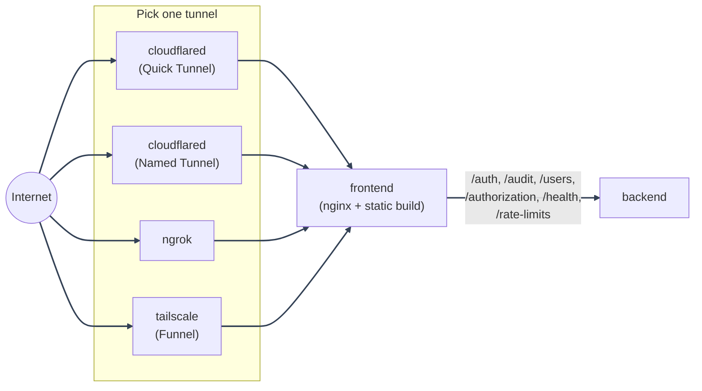

# Local-Prod Deployment

---

Self-hosted production image/runtime shape from your own machine or home
server. The code is baked into images, reload is off, bind mounts are gone,
and a free tunnel exposes the app to the internet without your own public
IP, router port forwarding, or Caddy.

Not sure this is the mode you want? See the
[dev vs. local-prod vs. prod comparison](../guide.md#1-deployment-modes) in the
Deployment Guide.

---

## Which tunnel do I want?

There are four ways to expose your local-prod stack to the internet. Each
option has its own tutorial page. Each tutorial starts from the repository
files, then covers the provider dashboard work, environment values, Compose
command, public URL, Google OAuth2 callback, optional GeoIP profile, and
troubleshooting.

|                | Cloudflare Quick Tunnel                                            | Cloudflare Named Tunnel                    | ngrok                                                    | Tailscale Funnel                                                 |
| -------------- | ------------------------------------------------------------------ | ------------------------------------------ | -------------------------------------------------------- | ---------------------------------------------------------------- |
| Account needed | No                                                                 | Free, + your own domain                    | Free, + static domain                                    | Free                                                             |
| Setup time     | Under a minute                                                     | 5-15 minutes, plus domain DNS if new       | 5-10 minutes                                             | 5-15 minutes, plus certificate/DNS registration                  |
| URL stability  | Random, changes every restart                                      | Stable                                     | Stable                                                   | Stable                                                           |
| Compose file   | `docker-compose.local-prod-cloudflare.yml`                         | Same, command swapped                      | `docker-compose.local-prod-ngrok.yml`                    | `docker-compose.local-prod-tailscale.yml`                        |
| Env file       | `env/.env.local-prod-cloudflare`                                   | `env/.env.local-prod-cloudflare`           | `env/.env.local-prod-ngrok`                              | `env/.env.local-prod-tailscale`                                  |
| Helper script  | `scripts/docker/local-prod-cloudflare/local-prod-cloudflare-up.sh` | Same                                       | `scripts/docker/local-prod-ngrok/local-prod-ngrok-up.sh` | `scripts/docker/local-prod-tailscale/local-prod-tailscale-up.sh` |
| Walkthrough    | [Quick Tunnel](cloudflare-quick-tunnel.md)                         | [Named Tunnel](cloudflare-named-tunnel.md) | [ngrok Tunnel](ngrok-tunnel.md)                          | [Tailscale Funnel](tailscale-funnel.md)                          |

- **Cloudflare Quick Tunnel**: zero account, zero domain, up in under a
  minute. The public URL is random and changes every time you restart the
  stack. Good for a quick test.
- **Cloudflare Named Tunnel**: needs a domain on a free Cloudflare account.
  A bit more setup, but the URL is stable, so you configure Google login
  once and never touch it again.
- **ngrok**: needs a free ngrok account and its free static domain. No
  zero-setup mode like Cloudflare's Quick Tunnel, but the URL is stable
  from the first boot.
- **Tailscale Funnel**: needs a free Tailscale account and an auth key.
  Also stable from the first boot, and doubles as a private network to the
  rest of the stack (Bugsink, direct container ports) for devices on your
  tailnet, tunnel or no tunnel.

All four produce the same app behind the same image/runtime shape: only the
tunnel service, its Compose file, and its env template differ. Nothing
about `backend`, `frontend`, `postgres`, `redis`, `procrastinate_worker`,
`alembic`, or `bugsink` changes between them.

Not sure local-prod itself is the mode you want (vs. dev or prod)? See the
[dev vs. local-prod vs. prod comparison](../guide.md#1-deployment-modes) in the
Deployment Guide.

---

## Local-prod file map

| File                                                              | Purpose                                                                                                                                                        |
| ----------------------------------------------------------------- | -------------------------------------------------------------------------------------------------------------------------------------------------------------- |
| `docker/compose/docker-compose.local-prod-cloudflare.yml`         | Production-shaped stack exposed by Cloudflare Quick Tunnel by default. The same file can run Cloudflare Named Tunnel after changing the `cloudflared` command. |
| `docker/compose/docker-compose.local-prod-ngrok.yml`              | Production-shaped stack exposed by the `ngrok` service and `NGROK_DOMAIN`.                                                                                     |
| `docker/compose/docker-compose.local-prod-tailscale.yml`          | Production-shaped stack exposed by the `tailscale` service and `docker/tailscale-serve-config.json`.                                                           |
| `env/.env.local-prod-cloudflare.example`                          | Cloudflare local-prod environment template.                                                                                                                    |
| `env/.env.local-prod-ngrok.example`                               | ngrok local-prod environment template.                                                                                                                         |
| `env/.env.local-prod-tailscale.example`                           | Tailscale local-prod environment template.                                                                                                                     |
| `scripts/docker/local-prod-cloudflare/local-prod-cloudflare-up.*` | Shell, PowerShell, and Command Prompt helpers that always pass the Cloudflare env file.                                                                        |
| `scripts/docker/local-prod-ngrok/local-prod-ngrok-up.*`           | Shell, PowerShell, and Command Prompt helpers that always pass the ngrok env file.                                                                             |
| `scripts/docker/local-prod-tailscale/local-prod-tailscale-up.*`   | Shell, PowerShell, and Command Prompt helpers that always pass the Tailscale env file.                                                                         |
| `local-scripts/local-prod-*/create-system-user.*`                 | Non-interactive system-superuser bootstrap helpers for each local-prod tunnel variant.                                                                         |

---

## Environment variables

Each tunnel option has its own dedicated env template, matching its own
Compose file, so all three (plus dev and prod) can have real values filled
in at once without one overwriting another:

| Tunnel     | Copy this file                           | To this file                     |
| ---------- | ---------------------------------------- | -------------------------------- |
| Cloudflare | `env/.env.local-prod-cloudflare.example` | `env/.env.local-prod-cloudflare` |
| ngrok      | `env/.env.local-prod-ngrok.example`      | `env/.env.local-prod-ngrok`      |
| Tailscale  | `env/.env.local-prod-tailscale.example`  | `env/.env.local-prod-tailscale`  |

Each is preconfigured for same-origin API routing and that Compose file's
own fixed frontend nginx proxy IP. Rotate the secrets in the copied file
before real use. Review `FRONTEND_BASE_URL`, `BACKEND_BASE_URL`,
`GOOGLE_REDIRECT_URI`, SMTP, rate-limit, Redis, and error-monitoring values
before sharing the service.

Build-time values must be final before you run `--build`:

- `VITE_API_BASE_URL`: keep empty for the bundled nginx same-origin proxy.
- `VITE_APP_NAME`: public app name shown in the browser (aliased from
  `APP_NAME` by the compose file - set `APP_NAME`, not this).
- `VITE_BRAND_COLOR`: default brand color (aliased from `BRAND_COLOR` - set
  `BRAND_COLOR`, not this). See [Appearance: Default brand color](../../appearance/overview.md#default-brand-color).
- `VITE_SUPPORT_EMAIL`: contact address on the Terms of Service / Privacy
  Policy pages and, once set, a "Help & Support" link in the sidebar
  (aliased from `SUPPORT_EMAIL` - set `SUPPORT_EMAIL`, not this).
- `VITE_SENTRY_DSN`: public browser DSN if frontend error reporting is enabled.
- `VITE_SENTRY_ENVIRONMENT`: frontend environment tag.

---

Runtime values can be changed with a container restart:

- `SECRET_KEY`, `DATABASE_URL`, `POSTGRES_*`, `REDIS_URL`, and
  `REDIS_PASSWORD`
- `FRONTEND_BASE_URL`, `BACKEND_BASE_URL`, `GOOGLE_REDIRECT_URI`
- SMTP settings, rate-limit settings, and backend `SENTRY_DSN`

`VITE_API_BASE_URL`, `VITE_APP_NAME`, `VITE_SUPPORT_EMAIL`, `VITE_SENTRY_DSN`,
and `VITE_SENTRY_ENVIRONMENT` are baked in at image build time, not read at
container runtime. Set them (or their aliased `APP_NAME`/`SUPPORT_EMAIL`
source vars) in your chosen tunnel's env file before `--build`, not after.
Always run Compose with `--env-file` pointed at that same file (or the
matching `scripts/docker/local-prod-*/local-prod-*-up.sh` / `.ps1` / `.cmd`
helper, which does this for you) - without it, `${VAR}` build-arg
substitution silently falls back to whatever's in `env/.env` instead. See
[Deployment Guide: required production environment variables](../environment.md#5-required-production-review)
for the full explanation of each.

Session geolocation (`GEOIP_DB_PATH`/`GEOIPUPDATE_*`) is covered as an
optional step in each tunnel's own walkthrough, since it needs an extra
flag on the "start the stack" command in each.

---

## What's different from dev / prod

See [Docker Overview: dev vs. production compose](../../docker/compose-modes.md#dev-vs-production-compose)
for the full table. In short: no bind mounts, no reload, `unless-stopped`
restart policy, `alembic` gates `backend`/`procrastinate_worker` startup,
and TLS terminates at the tunnel provider's edge rather than in a container
you run.

Use `docker-compose.prod.yml` instead (see [Prod Deployment](../prod.md)) if
you'd rather the host itself own the public IP and terminate TLS via Caddy,
for example on your own server.

---

## Running more than one tunnel variant at once

Each of the three Compose files sets its own `name:` (`COMPOSE_PROJECT_NAME`),
network subnet (`DOCKER_SUBNET`: `172.28.0.0/24` Cloudflare, `172.30.0.0/24`
ngrok, `172.31.0.0/24` Tailscale by default), and host port range
(`*_HOST_PORT`: backend/frontend 8001/8080 Cloudflare, 8101/8180 ngrok,
8201/8280 Tailscale by default), so all three - plus dev and prod - can run
on the same Docker host at once with zero container, network, volume, or
port collision. Useful for comparing tunnel options side by side, or just
because a stray container from one variant is still up while you start
another. These are all env vars with no built-in fallback, set in each
`env/.env*.example` - see
[Docker: Compose Modes](../../docker/compose-modes.md#two-forks-of-this-template-collide-with-each-other-too)
for why.

---
