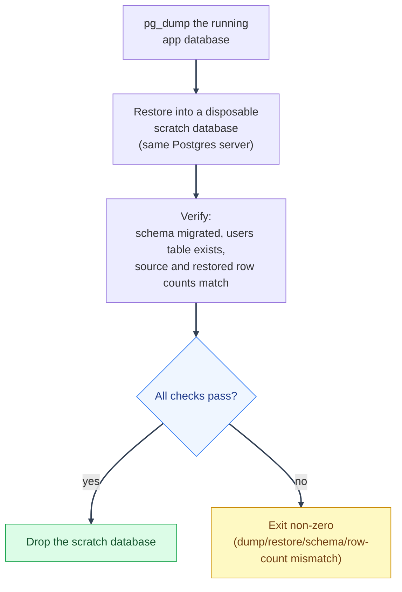

# Migrations and Backups

---

_New to a term here? See the [Infrastructure Glossary](../glossary/infrastructure.md)._

Deployment operations for Alembic migrations, database dumps, restore commands, and backup limitations.

---

## 1. Database migrations

---

The `alembic` service runs `alembic upgrade head` once and exits. In production-shaped Compose files, `backend` and `procrastinate_worker` wait for it with `condition: service_completed_successfully`, so request traffic does not start against an unmigrated schema.

Before applying a migration in production:

1. Review the migration file under `backend/alembic/versions/`.
2. Pay special attention to dropped columns, altered types, data migrations, role changes, and destructive SQL.
3. Confirm the migration has a downgrade only when rollback is actually safe.
4. Run the test suite or at least the migration check in a production-like database copy.

Migrations run with `DATABASE_URL`, normally the Postgres superuser. Runtime app traffic and Procrastinate task bodies prefer `APP_DATABASE_URL`, the least-privilege role created by migration. See [Security Decisions: Least-privilege app DB role](../security/decisions-infra.md#least-privilege-app-db-role-instead-of-running-as-postgres-superuser).

---

## 2. Backup scripts

---

`scripts/mystic_auth/db/db_backup.sh` and `scripts/mystic_auth/db/db_restore.sh` wrap Docker Compose, `pg_dump`, and `psql`. Production-shaped Compose files use a custom Postgres client image with `rclone` and `curl` installed. The intended off-host target is Backblaze B2, using rclone's native B2 backend.

Run `scripts/mystic_auth/db/check_backup_freshness.sh` from an external
monitoring scheduler to verify that every required database has a recent,
non-empty dump. It defaults to twice `BACKUP_INTERVAL_HOURS` and checks
`POSTGRES_DB` plus `bugsink`; set `BACKUP_MAX_AGE_HOURS` or pass the directory
and maximum age explicitly when the deployment needs a different policy:

```bash
BACKUP_MAX_AGE_HOURS=30 scripts/mystic_auth/db/check_backup_freshness.sh /backups
```

The check does not claim that an off-host object exists or that a dump can be
restored. Use the restore drill for restoreability and monitor the B2 bucket
itself for off-host freshness.

```bash
# Dump the dev database and Bugsink database, if enabled
scripts/mystic_auth/db/db_backup.sh

# Dump a production-shaped stack
scripts/mystic_auth/db/db_backup.sh docker-compose.local-prod-ngrok.yml

# Restore a dump, with confirmation
scripts/mystic_auth/db/db_restore.sh backups/mystic_auth-20260717-120000.sql

# Restore without confirmation
scripts/mystic_auth/db/db_restore.sh -y backups/mystic_auth-20260717-120000.sql
```

### Backblaze B2 off-host copies

---

Create a B2 bucket in the Backblaze dashboard with these choices:

1. Give it a globally unique name, such as `mystic-auth-backups-<owner>`.
2. Keep **Files in Bucket** set to **Private**.
3. Enable **Default Encryption**.
4. Enable **Object Lock** for a real backup bucket, then configure a 14-day
   Governance-mode default retention. Object Lock is irreversible, so leave it
   disabled only for a temporary test bucket.

Backblaze's current signup offers 10 GB of free storage without requiring a
billing method. Usage above the free allowance can still incur charges, so
configure B2 caps and alerts.

Create an application key with these choices:

1. The key name is just a label, for example `mystic-auth-backups`.
2. Restrict **Allow access to Bucket(s)** to this backup bucket.
3. Select **Read and Write**.
4. Leave **Allow List All Bucket Names**, **File name prefix**, and **Duration**
   empty.
5. Copy the generated **keyID** and **applicationKey**. The key name is not a
   credential.

Keep the application key in the deployment secret store, not in git. In the
environment file used by the production-shaped Compose file, map **keyID** to
`RCLONE_CONFIG_B2_ACCOUNT` and **applicationKey** to
`RCLONE_CONFIG_B2_KEY`:

```dotenv
B2_BUCKET=mystic-auth-production-backups
RCLONE_CONFIG_B2_ACCOUNT=<keyID>
RCLONE_CONFIG_B2_KEY=<applicationKey>
BACKUP_UPLOAD_COMMAND=rclone copyto "$${DUMP_FILE}" "b2:mystic-auth-production-backups/$$(basename "$${DUMP_FILE}")"
```

The doubled dollar signs are required in a Compose environment file so
Compose passes the variable references through to the backup container. Use
the real bucket name in both `B2_BUCKET` and the `b2:<bucket-name>/...` part of
the command. Do not copy these credentials into an `.example` file.

The scheduled `db_backup` image contains `rclone`; the manual backup command
uses the same hook and therefore needs `rclone` installed on the host. Every
dump is checked with `pg_restore --list` before this command runs. Dump,
verification, and upload failures are reported through the same Sentry
protocol DSN used by the backend. The scheduled service reads the generated
Bugsink DSN from its shared Compose volume. For a manual host-side backup,
export `BACKUP_SENTRY_DSN` if the host cannot read that volume.

After configuring the bucket, verify both directions:

```bash
make restore-drill
scripts/mystic_auth/db/db_backup.sh docker-compose.prod.yml
rclone lsjson "b2:${B2_BUCKET}"
pg_restore --list <(rclone cat "b2:${B2_BUCKET}/<dump-name>.dump")
```

The restore drill in the repository checks a local dump. A deployment
acceptance check must also download one named B2 object and restore that copy
into a disposable database, then compare its schema and row counts. Periodic
full dumps do not provide point-in-time recovery; use WAL archiving or managed
Postgres if the backup interval is too large for the required RPO.

The restore target is inferred from the dump filename. A `bugsink-*.sql` file restores into the `bugsink` database.

---

## 3. Restore drill

---

A backup nobody has tried to restore is a hope, not a guarantee.
`scripts/mystic_auth/db/db_restore_drill.sh` proves the whole path actually
works: it dumps the running app database, restores that dump into a
disposable scratch database on the same Postgres server (never touching the
real one), runs a smoke check against it (the schema migrated and the
`users` table exists), then drops the scratch database.



The real database is never touched by any step above - the drill's whole point is proving
restorability without risking the thing it's protecting.

```bash
# Prove the dev stack's own database is restorable
scripts/mystic_auth/db/db_restore_drill.sh

# Same, against a production-shaped stack
scripts/mystic_auth/db/db_restore_drill.sh docker-compose.local-prod-ngrok.yml
```

Exits non-zero on any failure (dump, restore, or a missing/empty schema in
the result), so a broken backup path fails loudly here instead of only
being discovered mid-incident. `tests/scripts/mystic_auth/db/test-restore-drill.sh`
runs this as a regression test in CI's `docker-build` job, against the dev
stack's own database, on every push.

This is how a real bug was found and fixed while building this drill:
`pg_dump --format=custom --file=-` silently wrote a 0-byte dump on this
image's `pg_dump` build instead of writing to stdout, and `db_backup.sh`
used exactly that pattern. Both scripts now omit `--file` and rely on
stdout redirection instead, which works portably regardless of that
behavior. See the fixed line's own comment in either script for the detail.

---

## 4. Scheduled backup sidecar

---

`docker-compose.prod.yml` and every `docker-compose.local-prod-*.yml` variant run a `db_backup` service by default.

| Setting                 | Purpose                                                                                                                                                                  |
| ----------------------- | ------------------------------------------------------------------------------------------------------------------------------------------------------------------------ |
| `BACKUP_INTERVAL_HOURS` | Hours between scheduled dumps.                                                                                                                                           |
| `BACKUP_RETENTION_DAYS` | Local retention window for old dump files.                                                                                                                               |
| `BACKUP_UPLOAD_COMMAND` | Shell command run after each verified dump, with `DUMP_FILE` exported to it, to ship the dump off-host. Configure it for B2 before treating the deployment as protected. |
| `./backups`             | Host directory where dumps are written.                                                                                                                                  |

This is a periodic `pg_dump` loop. It is a baseline, not a production-grade backup system. `scripts/mystic_auth/db/db_backup.sh` (manual/on-demand backups) honors the same `BACKUP_UPLOAD_COMMAND` for parity.

The scheduled backup image includes `rclone` and uses the B2 environment
variables above. A host running the manual script needs `rclone` installed
locally.

---

## 5. Backup limitations

---

Known limitations:

1. Dumps live on the same host by default, unless `BACKUP_UPLOAD_COMMAND` is set.
2. There is no point-in-time recovery - periodic full dumps only, so worst-case data loss is up to `BACKUP_INTERVAL_HOURS` of writes.
3. Failure events are sent to Bugsink when its generated DSN is available, but an operator should still monitor backup freshness and B2 bucket contents.

Each dump is already verified with `pg_restore --list` immediately after writing, so a corrupt dump is caught before it's trusted, not after a restore is attempted. Beyond that structural check, run [the restore drill](#3-restore-drill) periodically against production data to confirm the whole pipeline, not just the dump file, works end to end.

---

## 6. Off-host copy without a cloud account

---

If there is no cloud account and no second server, use encrypted removable media as the minimum off-host path.

```bash
# One-time repository setup on mounted removable media
restic -r /mnt/usb-backup/mystic-auth init

# After each backup
restic -r /mnt/usb-backup/mystic-auth backup ./backups
restic -r /mnt/usb-backup/mystic-auth forget --keep-daily 14 --keep-weekly 8 --prune
```

Store the Restic password somewhere separate from the drive, such as a password manager. Disconnect the drive and keep it away from the host when possible.

When a second machine is available, use the same repository model over SFTP:

```bash
restic -r sftp:USER@REMOTE_HOST:/backups/mystic-auth init
restic -r sftp:USER@REMOTE_HOST:/backups/mystic-auth backup ./backups
```

Also keep a recoverable copy of the relevant env file, such as `env/mystic_auth/.env.prod` or `env/mystic_auth/.env.local-prod-ngrok`. A database dump without `SECRET_KEY`, database passwords, and provider secrets is not enough to recover the application.

---
