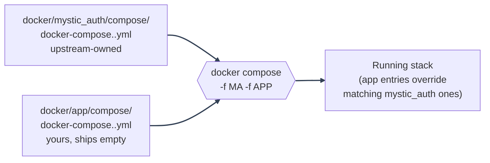

# Docker: Compose Modes

---

_New to a term here? See the [Infrastructure Glossary](../glossary/infrastructure.md)._

## Dev vs. production compose

|                                     | `docker-compose.dev.yml`                                                                                            | `docker-compose.local-prod-{cloudflare,ngrok,tailscale}.yml`                                                                                                                                                      | `docker-compose.prod.yml`                                                      |
| ----------------------------------- | ------------------------------------------------------------------------------------------------------------------- | ----------------------------------------------------------------------------------------------------------------------------------------------------------------------------------------------------------------- | ------------------------------------------------------------------------------ |
| Purpose                             | Local development                                                                                                   | Self-hosted production image shape behind a free tunnel                                                                                                                                                           | Self-hosted deployment on your own server with Caddy-managed TLS               |
| Frontend                            | Vite dev server, HMR, bind-mounted source                                                                           | nginx serving the baked-in static build                                                                                                                                                                           | nginx serving the baked-in static build, reached through Caddy                 |
| Backend/worker                      | `--reload`, bind-mounted `./backend:/app`                                                                           | No reload, code baked into the image                                                                                                                                                                              | No reload, code baked into the image                                           |
| Restart policy                      | `restart: always` for Postgres/Redis only                                                                           | `unless-stopped` on every long-running service                                                                                                                                                                    | `unless-stopped` on every long-running service                                 |
| Ports exposed                       | 5433 (Postgres), 6380 (Redis), 8000 (backend), 5173 (frontend), 8010 (Bugsink), all on localhost-friendly dev ports | backend/frontend/Bugsink published for local debugging, offset per tunnel variant (8001/8080/8011 cloudflare, 8101/8180/8111 ngrok, 8201/8280/8211 tailscale) so any of them can run alongside dev and each other | Only 80/443 on Caddy. Postgres, Redis, backend, and frontend are internal-only |
| TLS                                 | None                                                                                                                | Terminates at the tunnel provider's edge                                                                                                                                                                          | Caddy with automatic Let's Encrypt certificates                                |
| `backend` startup gate              | Postgres and Redis healthy                                                                                          | Postgres and Redis healthy, plus `alembic: service_completed_successfully`                                                                                                                                        | Postgres and Redis healthy, plus `alembic: service_completed_successfully`     |
| `procrastinate_worker` startup gate | Postgres healthy                                                                                                    | Postgres healthy, plus `alembic: service_completed_successfully`                                                                                                                                                  | Postgres healthy, plus `alembic: service_completed_successfully`               |

Each mode's file lives at `docker/mystic_auth/compose/docker-compose.<mode>.yml`,
with an empty `docker/app/compose/docker-compose.<mode>.yml` override next to
it for your own additions - see [Two files per mode](#two-files-per-mode-mystic_auth--app)
below.

- Use one of the `docker-compose.local-prod-*.yml` variants when you want to self-host the production image/runtime shape from a machine that does not own a public IP, with a free tunnel (Cloudflare, ngrok, or Tailscale Funnel - see [Local-Prod: which tunnel do I want?](../deployment/local-prod/README.md#which-tunnel-do-i-want)) owning the public URL and TLS.
- Use `docker-compose.prod.yml` when the host itself should expose only Caddy on 80/443.

See [Deployment Guide](../deployment/guide.md).

---

## Two files per mode: mystic_auth + app

Every mode has two Compose files, following the same `mystic_auth`/`app`
split used everywhere else in this template (see
[the tiering table](../template-usage/ownership-split.md)):

- `docker/mystic_auth/compose/docker-compose.<mode>.yml` - upstream-owned,
  the template's own service definitions. A sync merge always applies
  cleanly here.
- `docker/app/compose/docker-compose.<mode>.yml` - yours, ships as an empty
  override (`services: {}`). Add your own service, an extra volume mount,
  or an extra `env_file` entry here; upstream never edits this file again.

Compose merges both when you pass both `-f` flags, in order, so an
app-declared value overrides the matching mystic_auth one:

```bash
docker compose \
  -f docker/mystic_auth/compose/docker-compose.dev.yml \
  -f docker/app/compose/docker-compose.dev.yml \
  --env-file env/mystic_auth/.env \
  --env-file env/app/.env \
  up -d
```

Every script in this template (`dev-up.sh`, `prod-up.sh`,
`local-prod-*-up.sh`, `quickstart.sh`, `backend-exec.sh`, `db_backup.sh`,
`db_restore.sh`) already passes both pairs, so day-to-day use never needs
this spelled out by hand - it matters when you're scripting your own
`docker compose` invocation, or wondering why a fork's own service isn't in
`docker compose ps`.



The same split applies to env files: `env/mystic_auth/.env<mode-suffix>`
(upstream-owned) and `env/app/.env<mode-suffix>` (yours). See
[Environment Configuration](../environment/README.md#the-mystic_auth--app-split)
for the env-file side of this.

---

## Each compose file is its own Compose project

All five files declare a top-level `name:` (`mystic-auth-dev`,
`mystic-auth-local-prod-cloudflare`, `mystic-auth-local-prod-ngrok`,
`mystic-auth-local-prod-tailscale`, `mystic-auth-prod`).

- Without it, Compose derives the project name from the directory (`mystic-auth` for every file here, since they all live in the same directory), which means every container, network, and **named volume** (`postgres_data`, `backend_logs`, ...) from any of the five files collides on the exact same name.
- Two of these stacks running "side by side" then aren't actually isolated: they silently share one Postgres volume, so a command that looks scoped to one stack (`docker compose -f docker/mystic_auth/compose/docker-compose.dev.yml down -v`, or even just recreating a volume to fix a stale password) can wipe what's actually a different stack's real data.
- That's a real incident, not a hypothetical: an early local-prod test environment's database (test users, custom PBAC policies) was lost exactly this way, mid-session, before this fix.

With each file's `name:` set, `docker compose -f docker/mystic_auth/compose/docker-compose.dev.yml up -d`
and `docker compose -f docker/mystic_auth/compose/docker-compose.local-prod-ngrok.yml --env-file env/mystic_auth/.env.local-prod-ngrok up -d --build` can run
at the same time on one machine with zero collision - separate containers
(`mystic-auth-dev-postgres-1` vs. `mystic-auth-local-prod-ngrok-postgres-1`),
separate networks, separate volumes.

If you have a pre-existing stack from before this restructure (containers plainly named
`mystic-auth-postgres-1` or `mystic-auth-local-prod-postgres-1`, no tunnel suffix in the name),
it's running under an old project name and is now orphaned from every compose file's default
target - `docker compose -p <old-project-name> -f <old-path>.yml down` (explicitly naming the
old project) stops it; its data volumes (`<old-project-name>_postgres_data`, ...) survive that
and can be inspected or removed manually once you've confirmed you don't need them.

---

## Two forks of this template collide with each other too

The isolation above only covers the five compose files _within one checkout_. It does not cover
two separate downstream projects that each independently started from mystic-auth via "Use this
template":

- Both inherit the exact same literal `name:` defaults above, the exact same host ports (`5433`, `6380`, `8000`, `5173`, `8010` for dev; `8001`/`8080`, `8101`/`8180`, `8201`/`8280` for the local-prod tunnel variants), and the exact same Docker network subnets (`172.27-31.0.0/24`, one per file).
- If both forks ever run on the same machine, they collide on all three fronts exactly like the same-checkout case described above - one fork's `docker compose` commands, or its containers on the host network, can silently target the other fork's stack.
- This isn't hypothetical: it happened during this fix's own verification, between two real forks on one machine.

Every `name:`, host port, and network subnet/static-IP in `docker/mystic_auth/compose/*.yml`
reads from an env var with no fallback (`${COMPOSE_PROJECT_NAME}`, `${POSTGRES_HOST_PORT}`,
`${DOCKER_SUBNET}`, `${FRONTEND_STATIC_IP}`, etc.), set in the matching
`env/mystic_auth/.env*.example` to the same literal value the compose file used to hardcode.

- A fork that needs to coexist with another on one machine changes `COMPOSE_PROJECT_NAME`, the relevant `*_HOST_PORT` vars, and `DOCKER_SUBNET`/the `*_STATIC_IP` vars in its own `env/mystic_auth/.env*` file - see the top of each `env/mystic_auth/.env*.example`.
- The production/local-prod variants also derive `TRUSTED_PROXY_IPS` (a security-relevant anti-spoofing setting - see [get_client_ip()](https://github.com/Nachiket-2024/mystic-auth/blob/main/backend/mystic_auth/auth/security/client_ip.py)) straight from those same static-IP vars in the compose file itself, rather than setting it independently in the env file, so the two can never drift out of sync.
- This is also called out in [overview.md](overview.md)'s fork checklist.

None of this is specific to mystic-auth: a bound host port or an overlapping
Docker bridge subnet is a generic Docker-level conflict. Any other
container or Compose project already using one of these host ports or
subnets triggers the exact same "port is already allocated" or
subnet-overlap failure, and needs the same fix - change the colliding
value in your `env/mystic_auth/.env*` file.

---

See [Docker Overview](overview.md) for the full service list, or
[Dockerfiles](dockerfiles.md) for image build details.

---
