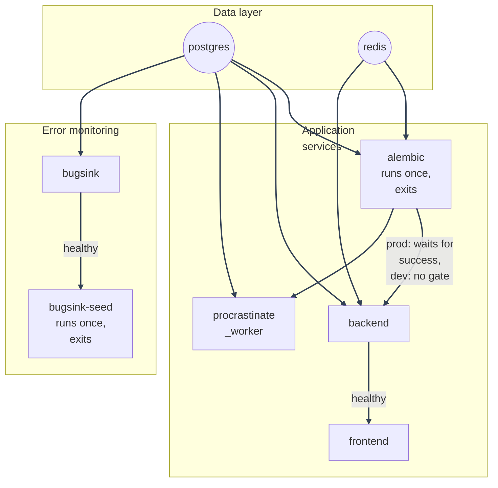

# Docker Overview

---

This stack runs as several Docker Compose services. This page lists them
and links to the detail pages for images, compose modes, healthchecks, and
day-to-day workflow.

## Services

| Service                               | Image / build                                                                                | Purpose                                                                                                                                                                                                                                                                                                                                    |
| ------------------------------------- | -------------------------------------------------------------------------------------------- | ------------------------------------------------------------------------------------------------------------------------------------------------------------------------------------------------------------------------------------------------------------------------------------------------------------------------------------------ |
| `postgres`                            | `postgres:15`                                                                                | Primary database, plus the Procrastinate job queue (`procrastinate_jobs`)                                                                                                                                                                                                                                                                  |
| `redis`                               | `redis:7`                                                                                    | Cache, rate limits, lockout counters, account/chain version counters, single-use refresh-token claims                                                                                                                                                                                                                                      |
| `backend`                             | `docker/dockerfiles/backend.Dockerfile`                                                      | FastAPI app (uvicorn)                                                                                                                                                                                                                                                                                                                      |
| `frontend`                            | `docker/dockerfiles/frontend.Dockerfile` (`dev` target locally, `production` target in prod) | React SPA: Vite dev server locally, nginx-served static build in prod                                                                                                                                                                                                                                                                      |
| `procrastinate_worker`                | `docker/dockerfiles/backend.Dockerfile` (same image as `backend`, different `command:`)      | Consumes the email-sending task queue and runs the daily scheduled account-purge job (its own internal periodic-task deferrer, no separate scheduler process): see [Background Workers](../background-workers/procrastinate.md)                                                                                                            |
| `alembic`                             | `docker/dockerfiles/backend.Dockerfile` (same image, one-shot)                               | Runs `alembic upgrade head` then exits. In prod, `backend` and `procrastinate_worker` wait on its success                                                                                                                                                                                                                                  |
| `bugsink`                             | `bugsink/bugsink:2` (pulled, not built)                                                      | Self-hosted error monitoring that starts by default with the stack. See [Error Monitoring](../error-monitoring/overview.md)                                                                                                                                                                                                                |
| `bugsink-seed`                        | `bugsink/bugsink:2` (same image, one-shot)                                                   | Runs once `bugsink` is healthy. It creates the "MysticAuth" team/project idempotently and writes seeded DSNs into the `bugsink_dsn` volume. Locally, both backend and frontend DSN forms are written and read at startup. In prod, only the backend form is written because `frontend`'s `VITE_SENTRY_DSN` is baked in at image build time |
| `cloudflared` / `ngrok` / `tailscale` | Pulled, not built                                                                            | The public tunnel, one per `docker-compose.local-prod-*.yml` variant. Proxies `frontend:80` to a public URL and terminates TLS at the provider's edge. See [Local-Prod Deployment](../deployment/local-prod/README.md#which-tunnel-do-i-want)                                                                                              |
| `geoipupdate`                         | `ghcr.io/maxmind/geoipupdate:latest` (pulled, not built)                                     | Optional, off by default (`geoip` Compose profile): keeps `backend`'s GeoLite2-City `.mmdb` file current. See [Session Geolocation](../geolocation/overview.md)                                                                                                                                                                            |
| `db_backup`                           | `postgres:15` (same image as `postgres`, different `command:`)                               | On by default in every production-style Compose file: dumps both databases to `./backups` on a loop. See [Deployment Guide: Backups](../deployment/migrations-and-backups.md)                                                                                                                                                              |

---

`backend`, `procrastinate_worker`, and `alembic` all build from
the same `docker/dockerfiles/backend.Dockerfile` image with different `command:`
overrides. This keeps dependency versions and application code identical
across all three roles.

The `postgres` service mounts `docker/postgres-init/` to
`/docker-entrypoint-initdb.d/`. On a fresh volume, it creates the separate
`bugsink` database, so Bugsink does not need a second Postgres container.

---

## Startup order

---

## More on this topic

- [Dockerfiles](dockerfiles.md): the backend and frontend image build stages, `nginx.frontend.conf`, `.dockerignore`, and why `frontend` sets `pull_policy: build`.
- [Compose Modes](compose-modes.md): dev vs. production compose differences, and why each compose file declares its own Compose project name.
- [Healthchecks](healthchecks.md): the per-service healthcheck table.
- [Dev Workflow](dev-workflow.md): the dev-up helper scripts, running one-off commands inside a container, and why `/app/logs` is a named volume.
- [Docker Validation History](validation-history.md): live verification notes.

---
