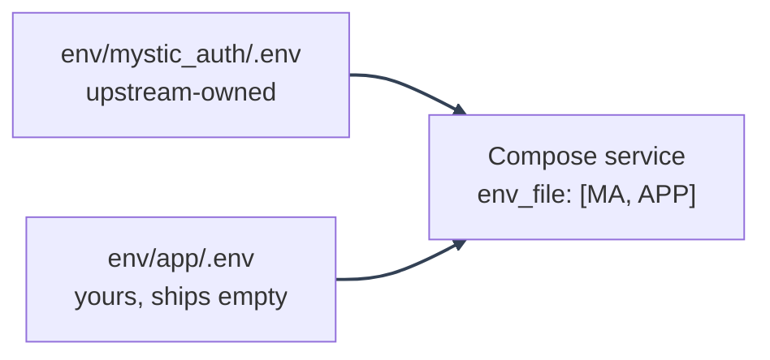

# Environment Configuration

---

_New to a term here? See the [Infrastructure Glossary](../glossary/infrastructure.md)._

Every environment variable this repository currently ships in `env/*.example`, grouped by the code
that reads it and split across four pages so each stays a readable size. Use it with the
deployment walkthroughs:

1. Dev: copy `env/mystic_auth/.env.example` to `env/mystic_auth/.env`.
1. Local-prod Cloudflare: copy `env/mystic_auth/.env.local-prod-cloudflare.example` to
   `env/mystic_auth/.env.local-prod-cloudflare`.
1. Local-prod ngrok: copy `env/mystic_auth/.env.local-prod-ngrok.example` to
   `env/mystic_auth/.env.local-prod-ngrok`.
1. Local-prod Tailscale: copy `env/mystic_auth/.env.local-prod-tailscale.example` to
   `env/mystic_auth/.env.local-prod-tailscale`.
1. Prod: copy `env/mystic_auth/.env.prod.example` to `env/mystic_auth/.env.prod`.

`scripts/mystic_auth/env-tools/` has a full set of scripts for all of this: bootstrapping every file at once with fresh generated secrets, keeping a file honest over time, and syncing values from an old file without ever reading its secrets. See [Environment Tooling](tooling.md) for what each one does.

`backend/app/main.py` loads `env/mystic_auth/.env` before importing `app.sdk` in dev. In
local-prod and prod, Compose passes the mode-specific env file into each
service through `env_file:` and also needs `--env-file` for `${VAR}` build
argument substitution.

---

## The `mystic_auth` / `app` split

Every `env/*.example` file above actually comes in a pair, following the
same `mystic_auth`/`app` split used everywhere else in this template (see
[the tiering table](../template-usage/ownership-split.md)):

- `env/mystic_auth/.env<mode-suffix>` - upstream-owned, every field this
  template itself defines. A sync merge always applies cleanly here.
- `env/app/.env<mode-suffix>` - yours, ships empty. Add your own fork's
  extra variables here; upstream never edits this file again.

Both files feed the same running stack: each Compose service lists both in
`env_file:` (mystic_auth's, then app's, so an app-declared value wins on
overlap), and every `docker compose` invocation in this template's own
scripts passes both as `--env-file` too, for `${VAR}` build-argument
substitution. `setup-env.sh` bootstraps both from their `.example` files in
one pass; `check-env.sh` and `set-env-field.sh` check/touch both by default.
See [Docker: Compose Modes](../docker/compose-modes.md#two-files-per-mode-mystic_auth--app)
for the Compose side of this.

---

## Pages

- [Backend Settings](backend.md): fields read by `backend/mystic_auth/core/settings.py`.
- [Frontend Build Settings](frontend.md): `VITE_*` values baked into the static bundle at build time.
- [Compose-Only Settings](compose.md): values read by Docker Compose, entrypoints, or helper scripts, not by the app itself.
- [Environment Tooling](tooling.md): the `scripts/mystic_auth/env-tools/` scripts that set up, maintain, and sync these files for you.

---

## Edge Cases

1. `SECRET_KEY` shorter than 32 characters stops backend startup at settings
   import time.
1. `FRONTEND_ADDITIONAL_BASE_URLS` affects CORS only. It never changes email
   links or OAuth redirects.
1. `TRUSTED_PROXY_IPS` must name the immediate proxy that connects to the
   backend, not the public client IP. If the peer is not trusted, forged
   `X-Forwarded-For` is ignored.
1. Frontend `VITE_*` variables in production-style modes are build-time values.
   Restarting the container is not enough after changing them.
1. `APP_DATABASE_URL` can be blank. When set, the app and Procrastinate task
   bodies use it for CRUD work, while Alembic still uses `DATABASE_URL` for DDL.
1. `GEOIP_DB_PATH` alone does not download a database. Docker downloads the
   MaxMind file only when `geoipupdate` is enabled with `--profile geoip`.
1. `EMAIL_ENABLED=false` lets flows enqueue and render email content without
   contacting SMTP, but users still need the resulting token/link through logs
   or tests to finish verification or reset flows.
1. `TRUSTED_PROXY_IPS` defaults to empty, so it doesn't need to be present in
   the env file at all. Only the `backend` service needs a real value (the
   prod/local-prod-* Compose files derive and inject it there); `alembic` and
   `procrastinate_worker` read the same env file directly, never use this
   setting, and fall back to the default instead of failing to start.
1. `REDIS_PASSWORD` alone does nothing: `redis-py` authenticates through the
   connection URL, not a separate password kwarg, so `REDIS_URL` must also be
   rewritten by hand to embed it (`redis://:<REDIS_PASSWORD>@redis:6379/0`).
   Setting one without the other either leaves Redis unauthenticated or breaks
   every service's connection. See
   [Redis authentication](../security/hardening-infra.md#redis-authentication).
1. `tests/backend/mystic_auth/unit/core/test_env_examples_parity_unit.py`
   checks every required `Settings` field against each backend-consuming
   `env/mystic_auth/.env*.example` file, so a field that's required but missing from a
   shipped example (or the reverse: given a default it no longer needs)
   fails CI instead of surfacing later as a runtime crash for whoever
   deploys that mode first.
1. A `<file>.bak` left behind by the sync workflow (see
   [Environment Tooling](tooling.md#what-happens-to-the-bak-files-afterward))
   is never deleted automatically. `check-env/check-env.sh` warns if it
   finds one, but the actual deletion is always a manual, human-confirmed
   step.

---
