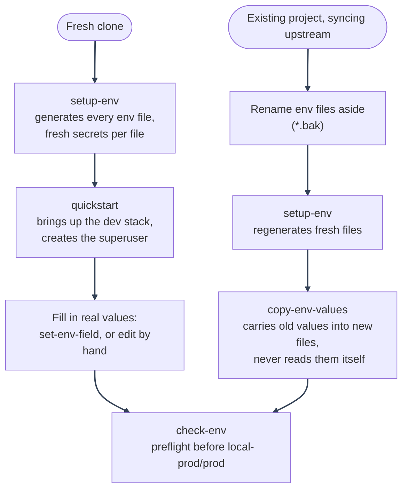

# Environment Tooling

---

_New to a term here? See the [Infrastructure Glossary](../glossary/infrastructure.md)._

Scripts under `scripts/mystic_auth/env-tools/` for setting up, maintaining, and syncing env files, so the manual `cp`/`openssl rand`/five-file-hand-edit workflow described in [Environment Configuration](README.md) is optional rather than the only way. Each one ships as `.sh` (Git Bash/WSL/Linux/macOS), `.ps1` (PowerShell), and `.cmd` (Command Prompt).

---

---

## 1. First-time setup

1. **`setup-env/setup-env.sh`**: bootstraps every `env/mystic_auth/.env*` file (plus `frontend/.env`) from its `.example` in one run.
   - Skips any file that already exists - safe to re-run.
   - Generates a distinct random secret per password field, per file (a leaked dev secret never compromises prod).
   - Keeps `DATABASE_URL`/`APP_DATABASE_URL` in sync with the freshly generated password.
   - Prompts once for an app name and brand color, applies both everywhere.
   - Deliberately leaves `REDIS_PASSWORD` blank - see [Redis authentication](../security/hardening-infra.md#redis-authentication) for why that one needs a manual step.
2. **`quickstart/quickstart.sh`**: the fastest path for a brand-new clone. Runs `setup-env` only if `env/mystic_auth/.env` is missing, brings the dev stack up (reusing `dev-up`'s own readiness wait via a `DEV_UP_TAIL=0` toggle), offers to create the system superuser inline, then tails logs. See [Template Usage: Quickstart](../template-usage/quickstart.md).

---

## 2. Keeping an existing file honest

1. **`set-env-field/set-env-field.sh`**: sets one or more fields to one value across every env file that already declares each key - for a value meant to be the same everywhere (`SUPPORT_EMAIL`, `GOOGLE_CLIENT_ID`, an operational policy like `ACCESS_TOKEN_EXPIRE_MINUTES`), instead of editing five files by hand.
   - **File-based (easiest)**: copy `shared-values.env.example` to `shared-values.env` (gitignored), fill in what you want with a normal text editor, run the script with no arguments.
   - **Direct**: `set-env-field.sh GOOGLE_CLIENT_ID=... FROM_EMAIL=...` for scripting or an AI agent prompt.
   - Skips a file missing a given key rather than adding it. Prints a numbered table (`Field` / `Updated: Yes|No`), never the values themselves.
2. **`check-env/check-env.sh`**: preflight check for a real env file, run before starting local-prod or prod.
   - Fails if `ENVIRONMENT=production` but a secret still equals its shipped placeholder.
   - Warns on a remaining `<your_...>` placeholder or a host port already bound by something else.
   - Never writes anything.
3. **`rotate-secrets/rotate-secrets.sh`**: regenerates `SECRET_KEY` and/or `BUGSINK_SECRET_KEY` in place - the only two secrets safe to change by editing the file alone.
   - Deliberately excludes `POSTGRES_PASSWORD`, `APP_DB_PASSWORD`, `BUGSINK_SUPERUSER_PASSWORD`, and `REDIS_PASSWORD`: those are backed by a live service's own state (a running Postgres only applies `POSTGRES_PASSWORD` on first volume init), so editing the file alone would break the connection instead of rotating anything. Changing those safely means updating the live service first (`ALTER ROLE ...`, Bugsink's own admin tools).

---

## 3. Syncing from an old file without reading its secrets

**`copy-env-values/copy-env-values.sh OLD NEW`**: copies every field from an old env file into a new one, skipping the handful `setup-env` just generated fresh (secrets, and the DB URLs that embed them).

- Prints a numbered table (`Field` / `Copied: Yes|No`) - only field _names_, never values - so a real secret never has to pass through an AI coding agent's own tool output.
- A field marked "No" existed in the old file but not the new one: upstream may have dropped or renamed it, worth reviewing by hand.
- This is the building block behind [Syncing with an AI Coding Agent](../template-usage/syncing-upstream/agent-prompt.md)'s rename-aside/regenerate/copy-back workflow.

### What happens to the `.bak` files afterward

Nothing here deletes them automatically - that's deliberate, not an oversight. The workflow is: rename `env/mystic_auth/.env` to `env/mystic_auth/.env.bak` (never delete), let `setup-env` regenerate `env/mystic_auth/.env` fresh, then `copy-env-values` reads `env/mystic_auth/.env.bak` and writes into `env/mystic_auth/.env`. Once you've confirmed the result is correct, **you delete the `.bak` files yourself** - see [Syncing with an AI Coding Agent](../template-usage/syncing-upstream/agent-prompt.md).

Until you do, a `.bak` file is a second plaintext copy of everything that was in the old file, secrets included. It won't get committed (`.gitignore` covers `env/mystic_auth/.env.*` and `frontend/.env.bak`), but it does sit on disk indefinitely if you forget the cleanup step. `check-env/check-env.sh` warns if it finds one next to the file it's checking, as a nudge - see [Environment Configuration: Edge Cases](README.md#edge-cases).

---

## 4. Regression tests

**`tests/scripts/mystic_auth/env-tools/test-env-tooling.sh`**: regression suite for all five scripts above, run against a throwaway copy of `env/` under a temp dir - never touches this repo's own real env files. Run it after touching any of them, the same way [`tests/scripts/mystic_auth/upstream-sync/test-sync-upstream.sh`](../template-usage/syncing-upstream/README.md) guards the sync script.

---

See [Environment Configuration](README.md) for the full variable reference these scripts read and write.
