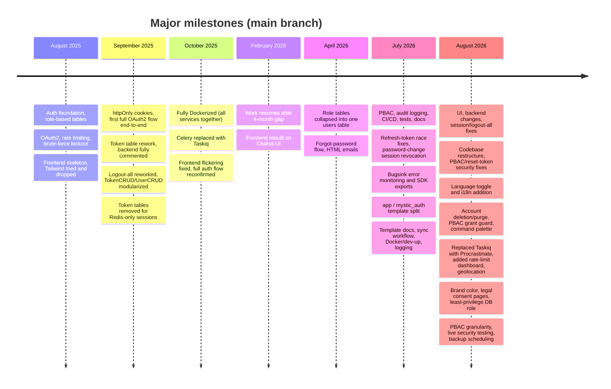

# How It Evolved

---

Companion to the [Project Story](README.md). That page covers _why_ this exists and how its
architecture settled into its current shape; this one is the day-by-day (well, commit-by-commit)
log of what actually happened, split out on its own since it only ever grows longer while the rest
of the story doesn't.

The commit history shows the real evolution, not a fully planned architecture from day one. The
first commit was on 18 August, 2025, the most recent below on 29 August, 2026. There's a 4-month
gap between October 2025 and February 2026. Below, days committed back-to-back are grouped into
one range while an isolated day stands on its own.

---

---

### 18 August, 2025 - 23 August, 2025

The first version focused on authentication. It started with a bare FastAPI skeleton, then in quick succession: modular auth logic with role-based tables, OAuth2 plus rate limiting and brute-force protection, a refactor of the auth flow and role tables around standard security practices, and a logout-from-all-devices endpoint (both on 21 August, 2025).

Then role-based routes landed with `main.py`, and the run closed with a move to generic, permission-injected routes plus the first Alembic migration. That same day, the frontend's first commits appeared: a bare TypeScript + React setup.

Rate limiting and brute-force protection showed up on day three because security concerns became obvious while building the foundation, not because they were planned upfront.

---

### 26 August, 2025 - 28 August, 2025

Tailwind CSS was tried and then replaced by plain CSS. Modular slice/types/button/form files and `store.ts` were added. Auth route pages were wired into `App.tsx`, and all `axios` calls were centralized into a single API folder: the frontend's first consistent shape.

---

### 30 August, 2025 - 2 September, 2025

Frontend imports were corrected and Tailwind re-added. Then HTTP-only cookies for tokens landed, and a basic OAuth2 flow started working end-to-end across frontend, backend, Redis, and Postgres: the first time all the moving pieces talked to each other. Auth code was modularized and a basic dashboard integrated into the frontend, and logout was reworked on both the frontend and backend, including component files for the logout/logout-all buttons.

---

### 4 September, 2025 - 5 September, 2025

The token table was changed and cookie-setting modularized. The backend was fully commented, with the token CRUD corrected across its call sites (the largest commit in this range, at ~2,000 changed lines). The OAuth2 service logic and the frontend's auth slice/API were updated to match.

---

### 7 September, 2025

Single-device OAuth2 login and logout both worked end-to-end with the updated token logic.

---

### 13 September, 2025 - 14 September, 2025

The logout-all handler was reworked alongside a round of backend commenting; its own commit message notes that the work was still in progress. Then `TokenCRUD` and `UserCRUD` were both fully modularized.

---

### 16 September, 2025

Logout logic was updated so `is_active` correctly flips to `false` on logout.

---

### 18 September, 2025

The token table's field structure changed again: mostly a cleanup, with more lines removed than added as redundant fields were dropped.

---

### 22 September, 2025 - 24 September, 2025

Token tables were removed entirely in favor of Redis-only token management (the last of these commits again flagged the migration as still in progress). OAuth2 login was re-verified against the new logic, and logout/logout-all was confirmed working end-to-end. `UserCRUD` was updated alongside a new signup page, and backend logging was added across the backend.

This four-week range, from late August through late September, was where the project stopped being "just implementing features" and started being about the underlying security decisions. Questions like where tokens should live, how refresh-token reuse detection should work, and what logout-all should actually revoke became architectural decisions, not coding tasks.

---

### 6 October, 2025

The app was fully Dockerized, with OAuth2 login and logout tested end-to-end inside containers. This was the first time backend, frontend, PostgreSQL, Redis, background workers, migrations, and environment configuration were all managed together as one system, instead of pieces run separately.

---

### 10 October, 2025

Celery was replaced with Taskiq. Celery was considered first because it's widely used, but since the backend was built around async patterns, the worker model created friction. After comparing ARQ, Dramatiq, and Taskiq, Taskiq fit the async-first approach best (ARQ was close, but Taskiq's FastAPI integration was cleaner). This was a large commit (61 files), and its own message admits it left "frontend issues" behind: the swap needed follow-up work, even though the actual requirement (reliably sending verification and password-reset emails) was simple.

---

### 14 October, 2025

The frontend flickering issue and the Taskiq swap was resolved, with signup, login, logout, and logout-all all confirmed working again.

---

### 21 February, 2026

Work resumed after the 4-month gap by fixing the OAuth2 login flow, which hadn't been fully solid before the break.

---

### 26 February, 2026 - 28 February, 2026

The UI was rebuilt on Chakra UI: the login page first, with Tailwind removed (the largest of the three commits, at ~2,000 changed lines), then signup, verify-account, and dashboard pages. The dashboard was updated to show real user details alongside a reworked signup page.

The frontend also moved toward feature-based organization, mirroring the backend: auth, dashboard, and profile. Redux was still the frontend state management foundation at this point.

---

### 12 April, 2026

Earlier role-based tables were collapsed into a single `users` table with a role enum: the authorization data model's first big simplification.

---

### 14 April, 2026

Forgot-password frontend support and stronger backend password-reset validation landed first (the larger of the two commits, at ~2,400 changed lines), followed the same day by HTML email templates, a reset cooldown, and a fix for loading-state flashes in the UI.

---

### 14 July, 2026

After a 3-month gap, the biggest change happened in a single commit: 364 files touched (+27,663/-8,184 lines), moving the project from a role-based authorization system to Policy-Based Access Control (PBAC). Instead of access being decided by a role column, authorization decisions are now based on assigned policies, allowed actions, resources, and optional conditions. Roles became descriptive metadata rather than the source of truth for permissions.

PBAC wasn't part of the original design. RBAC was set up on the backend first, before the frontend was built, then PBAC replaced it for clearer and more granular permissions. Since the RBAC UI wasn't done yet, switching didn't break much, and the backend RBAC work was minimal enough that removing it was easy. Adding PBAC took more effort, but it was worth doing early rather than retrofitting it later. So RBAC was replaced with PBAC entirely.

That same commit also added audit logging, security hardening, improved headers and middleware, stronger cookie/security handling, CI/CD pipelines, extensive backend and frontend testing, and broad documentation. The project moved from "a reusable auth module" into a broader authentication and authorization foundation in one large change, not incrementally. Frontend state management was redesigned too, in the same commit: Redux was replaced with Zustand for client state and TanStack Query for server state.

---

### 18 July, 2026

A couple of real session/token bugs (a roleless OAuth2 account getting logged out on refresh, a race condition in refresh-token rotation, an expired-token cleanup that never ran), a password-change flow that now asks for your current password and logs out other sessions, and a handful of smaller admin/config fixes were done. CI also got a real coverage gate and dependency scanning for the first time. This is roughly where `template-usage.md` and the project story were first written, and the known-issues doc got trimmed down to what was still actually true.

---

### 20 July, 2026

Running the template against other projects surfaced a couple of small logout and rate-limiter bugs, fixed here. That's the kind of thing real usage catches that reading the code alone wouldn't. Alongside that, self-hosted error monitoring landed via Bugsink, so real errors get logged somewhere instead of just showing up in server logs. The `sdk.py`/`sdk.ts` files were introduced too, a single file on each side that re-exports the pieces meant to be built on, so future code doesn't have to reach into the template's internals directly. The frontend also got reorganized into proper feature folders.

---

### 25 July, 2026 - 29 July, 2026

This range turned the repo from "reusable codebase" into a real template which mainly happened because of running the template against real downstream projects. The code was split into upstream-owned internals (`backend/mystic_auth/`, `frontend/src/mystic_auth/`) and thin project-owned shells (`backend/app/`, `frontend/src/app/`), with `sdk.py`/`sdk.ts` and `app_sdk.py`/`app_sdk.ts` as the extension surface. Docs and tests were split the same way, `scripts/upstream-sync/sync-upstream.sh` was added for future template updates, and the template-usage docs grew the ownership model, sync workflow, worked example, RBAC quickstart, and shared sidebar/CORS/nav extension points.

Caught an `sdk.ts` import bypass, an event-loop-blocking token signature, logout and rate-limiter bugs, a Bugsink Gunicorn timeout issue, a deployed OAuth redirect gotcha, and the stale `react-router-dom` package with an unpatched advisory, fixed by moving to `react-router` v8 and making npm audit blocking again. Docker and day-to-day operations were tightened too: `scripts/dev-up.sh` became the quieter default startup path, frontend Compose builds got `pull_policy: build`, `watch_for_late_dsn()` catches Bugsink's DSN after slow cold boots, backend logging became dev-readable and deployment-structured, and stale docs/comments/config were cleaned up. A resend verification email flow was added for users who tried to verify their account after the verification link had expired, the background email worker got terminal-visible logging, and a PowerShell dev-up bug got fixed so the startup logs it always promised actually showed up.

---

### 2 August, 2026 - 5 August, 2026

The template changed across UI, backend behavior, Docker, CI, tests, and documentation. The UI changed across account settings, dashboards, user management, policies, audit logs, shared tables, filters, pagination, and screenshots. Backend work expanded session management, audit data, user stats, token/session handling, typing, logging, and tests, and the codebase was split into smaller feature-shaped files where modules had grown too large. Active Sessions and Last Login now update immediately after login and logout-all via real-time session events, "me"-scoped query caches are cleared correctly so data can't leak between accounts in the same browser tab, and password changes keep the current device's session while revoking every other one. Docker and deployment coverage expanded with `docker-compose.local-prod.yml`, `docker-compose.prod.yml`, and `docker/Caddyfile`, alongside strict auth cookies, access-log rotation, and Compose validation.

Running a real upstream sync with Claude Code against another project surfaced four real gaps in `sync-upstream.sh`: a binary file mid-patch could make `git apply --3way` silently drop the rest of the diff while still looking like a normal result, nothing caught two migrations landing on the same alembic head, comment-only rewording upstream kept forcing the same conflict every sync, and Windows/Git Bash friction was still a manual workaround instead of just working. All four got fixed, `scripts/` was reorganized into `upstream-sync/`, `docker/`, and `db/` subfolders, and docs across the repo were updated to match.

---

### 7 August, 2026 - 10 August, 2026

A 202-file restructure matched frontend and backend to the feature-based layout, splitting `user_management_routes.py` into lifecycle, query, and update route files, alongside a tighter `users:assign_system_role` check, a reset-scoped password-reset token check, a `nanoid` advisory fix, a toast/navbar overlap fix, and real exponential backoff for Taskiq retries via `SmartRetryMiddleware` plus a new `taskiq_scheduler` container.

Downstream use kept surfacing real extension gaps: an `extraNavbarContent` prop let a project add its own navbar links without touching the shared sidebar, and a `DEFAULT_APP_POLICIES` setting let another grant a second default policy to every user without hand-editing upstream's signup/OAuth2 code. Row-action buttons across the tables got distinct, dark-mode-aware colors. A downstream bug report then caught that the oauth2 unit tests, and three auth/authorization integration tests asserting exact policy sets, only passed because `DEFAULT_APP_POLICIES` happened to be empty in this repo's own CI, so the unit tests were fixed to mock the extension point directly and the integration suite got a conftest that forces it empty, instead of either depending on that env var.

---

### 12 August, 2026

Sidebar links got a hover state, and the same fast, snappy hover transition (`FAST_HOVER_TRANSITION`) was extracted and applied consistently across buttons, pagination, and table action buttons.

---

### 15 August, 2026

A language toggle and translations store were added on the frontend, backed by a new `AppError` exception type that carries an error code/params through the API so the frontend can look up a translated message instead of showing the raw English `detail` string.

---

### 18 August, 2026

Self-service account deletion plus admin purge, a PBAC grant guard stopping a user from granting a policy more privileged than their own, a command palette (Cmd+K), route-loading/font-size UI infrastructure, and hi/gu/mr translations across every namespace were implemented, alongside a round of fixes (an `X-Forwarded-For` spoofing bug, a command-palette i18n leak, a stale mypy suppression). Docs were brought up to date to match, split one page per authentication flow with a diagram each.

---

### 20 August, 2026

Taskiq was replaced with Procrastinate for background jobs, and Manage Sessions gained offline GeoIP-based location, JWT issuer/audience claims, an admin rate-limits dashboard, and a user-export row cap. The full docs set was overhauled to match: stale references removed, diagrams redrawn vertically and fixed for legibility, and every page restructured tutorial-style.

---

### 22 August, 2026

Added brand colors, legal consent pages, and a least-privilege Postgres role. Fixed Redis session revocation to properly confirm password resets, deletions, and admin actions. Fixed PBAC permission filtering with 5 seeded policies and pagination. Patched cookie, React, and local DB issues with more tests. Fixed OAuth2 failure handling with specific error codes for deleted, deactivated, cancelled, and expired states, with rate-limited routes redirecting instead of returning raw JSON. Moved audit logging to Procrastinate background worker. Fixed nginx route leak and split three Docker Compose databases. Added documentation updates.

---

### 30 August, 2026

Fixed a duplicate security-header bug in `nginx.frontend.conf`, a `DATABASE_URL` override that silently shadowed `env_file` and had broken the stack mid-audit, a hardcoded Docker subnet collision between the two production-style Compose files, and a pydantic circular-reference flake in policy list serialization (fixed by building schemas row by row). Rebuilt the PBAC frontend surface, bulk actions on the Users page, the permission catalog, and an effective-permissions viewer, verified across themes, font sizes, and languages, then attacked the backend directly the way a real attacker would (forged JWTs, IDOR, mass assignment, privilege self-granting, IP spoofing, and more, all correctly blocked). Added client-side length validation matching the backend's limits and a `Retry-After` header with a translated wait-time message on login lockout, closed the "backups are scripted but nothing schedules them" gap with an on-by-default `db_backup` service on both production Compose files, and swept the docs for staleness, including the PBAC component table and color-coded flow diagrams. See the [security decisions](../security/decisions.md) and [concerns](../concerns/README.md) pages for the lasting details. The comments in all files, tests were trimmed down to be concise and simple to understand, with similar work in docs along proper formattings of sections.

---

## The tools that built it

See [The Tools That Built It](tools.md) for the two workflows: manual ChatGPT + VS Code for most of it, then Claude Code (and briefly Codex) from July 2026 on.

---
