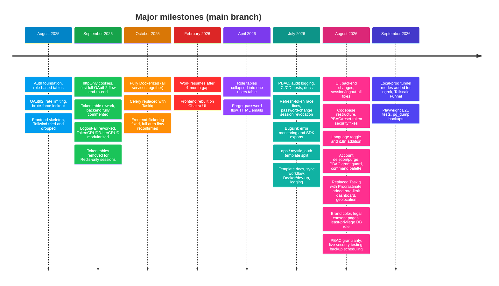

# How It Evolved

---

Companion to the [Project Story](../README.md). That page covers _why_ this exists and how its
architecture settled into its current shape; this one is the day-by-day (well, commit-by-commit)
log of what actually happened, split out on its own since it only ever grows longer while the rest
of the story doesn't.

The commit history shows the real evolution, not a fully planned architecture from day one. The
first commit was on 18 August, 2025, the most recent below on 4 September, 2026. There's a 4-month
gap between October 2025 and February 2026. Below, days committed back-to-back are grouped into
one range while an isolated day stands on its own.

---

---

## Pages

- [2025](2025.md): 18 August, 2025 to 14 October, 2025.
- [2026](2026.md): 21 February, 2026 to 4 September, 2026.

---

## The tools that built it

See [The Tools That Built It](../tools.md) for the two workflows: manual ChatGPT + VS Code for most of it, then Claude Code (and briefly Codex) from July 2026 on.

---
