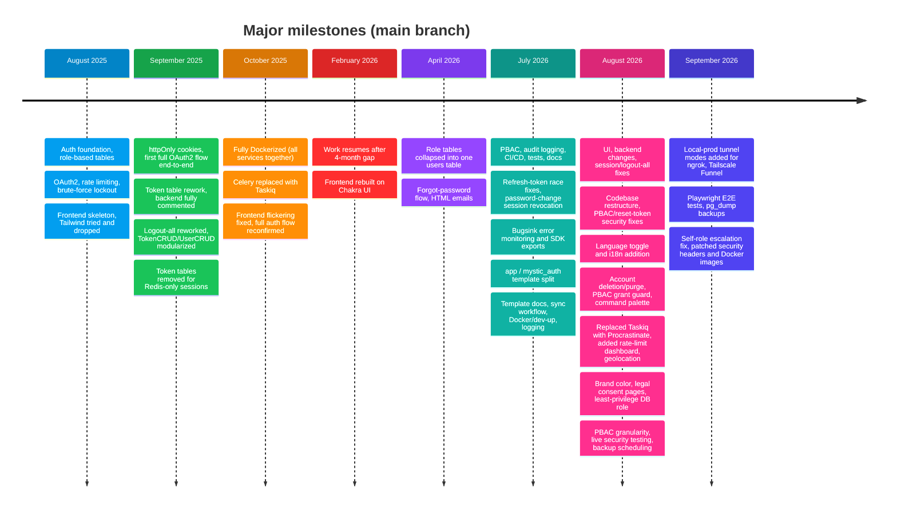

# How It Evolved

---

Companion to the [Project Story](../README.md). That page covers _why_ this exists and how its
architecture settled into its current shape; this one is the day-by-day (well, commit-by-commit)
log of what actually happened, split out on its own since it only ever grows longer while the rest
of the story doesn't.

The commit history shows the real evolution, not a fully planned architecture from day one. The
first commit was on 18 August, 2025, and there's a 4-month gap between October 2025 and February 2026.

Each entry below follows the same convention:

- Its own `### Commit N: <date>` heading, numbered sequentially across the whole history in commit
  order regardless of which of the four pages it lands on. No grouping by date range, and no
  relying on the date alone as a heading, since several days carry more than one commit. The
  numbering is split across four pages (see [Pages](#pages) below) purely to keep each file a
  readable size; it isn't a second, competing grouping.
- Opens with that commit's actual message in quotes.
- Then a bulleted (or numbered, for a longer commit with a natural sequence) list of what it
  actually did, checked against the real diff (`git show --stat` plus a real read of the changed
  files), not just the commit message: a terse or incomplete commit message doesn't excuse a terse
  or incomplete entry. Every entry stays bulleted rather than mixing in prose paragraphs, so the
  format stays uniform across a one-line fix and a 591-file rewrite alike.
- Closes with its exact files-changed count (and, once the commit actually exists, its
  lines-changed count too) from `git show --shortstat`: a short entry is a small commit, a long one
  is a large or architecturally significant commit, not an editorial choice about how interesting
  the day was.

---

---

## Pages

- [August 2025](2025-aug.md): commits 1-16, 18 August, 2025 to 31 August, 2025.
- [September-October 2025](2025-sep-oct.md): commits 17-36, 1 September, 2025 to 14 October, 2025.
- [February-July 2026](2026-feb-jul.md): commits 37-53, 21 February, 2026 to 29 July, 2026.
- [August-September 2026](2026-aug-sep.md): commits 54-71, 2 August, 2026 to 4 September, 2026.

---

## The tools that built it

See [The Tools That Built It](../tools.md) for the two workflows: manual ChatGPT + VS Code for most of it, then Claude Code (and briefly Codex) from July 2026 on.

---
