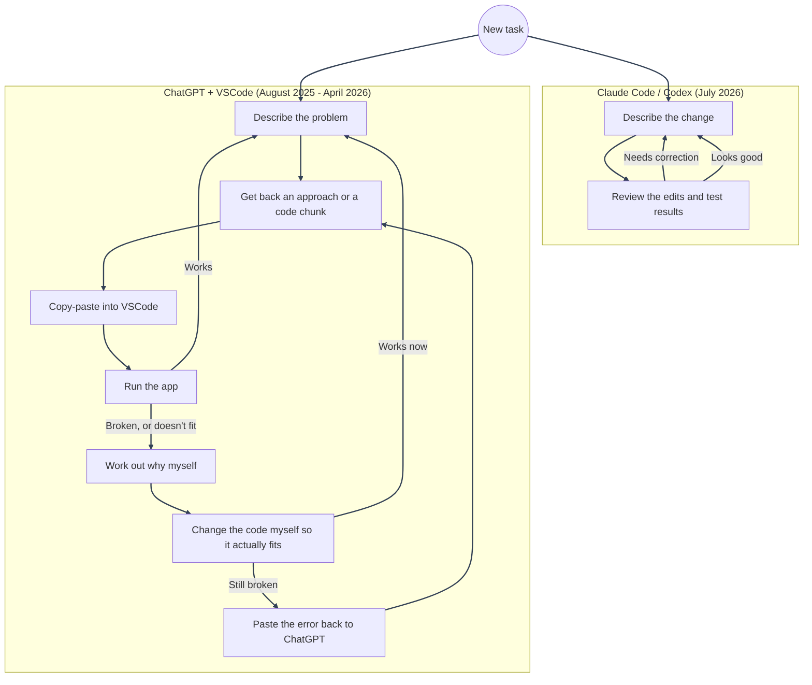

# The Tools That Built It

---

Companion to the [Project Story](README.md). That page covers _what_ happened and _when_, while this one covers _how_ the work actually got done, which changed partway through the project.

The project was worked on over several months, with gaps in between. Two workflows built it, and the agentic one later included both Claude Code and Codex:

---

---

## 18 August, 2025 - 14 April, 2026

Most of the early foundation, everything up through the single-`users`-table refactor and the forgot-password/email work, came out of the ChatGPT + VSCode loop above. "Manual" here means hand-editing and integrating ChatGPT's output, not writing everything from scratch. No tool had direct access to the codebase or applied changes automatically; every change passed through me first. Slower than the Claude Code loop, but it meant every system decision was actually understood before it landed.

Working through ChatGPT's suggestions and adjusting them to fit the real codebase is how I learned most of the underlying technologies during this period: Redis-based session management, Docker and multi-container setups, TypeScript, OAuth2/PKCE flows, background workers, security practices, and Redux-based state management. Some concepts, like PBAC, weren't part of this original architecture at all. PBAC came later as an exploration beyond RBAC.

---

## 14 July, 2026 - 5 September, 2026

Two days before this stretch started, I bought a Claude Code Pro plan to try it out. The Claude Code loop above replaced the ChatGPT + VSCode loop for the rest of the project. The first commit with it, on 14 July, 2026, was the big one: PBAC, audit logging, security hardening, the Redux-to-Zustand/TanStack-Query migration, CI/CD pipelines, documentation, and 650+ tests, all in one sitting, because the existing feature-based architecture meant most of it could be added as new domains rather than a rewrite. I hit the 5-hour usage window 2-3 times and used roughly 65% of my weekly quota just on that one commit.

Everything after that kept using the same agentic loop, in smaller passes rather than one big sprint; each one is described in the [Project Story](README.md#how-it-evolved). The foundation and architecture already existed by this point, so the main advantage was cutting implementation friction, not changing the overall direction. The decisions and trade-offs still came from the understanding built over the earlier phase.

Codex was used for the first time on 28 July, 2026, mainly because I hit my weekly limit on Claude Code 😅. Its role had been similar to the Claude Code loop above: read the existing codebase, compare docs against the current implementation, apply focused cleanup, and report what changed without rewriting the architecture. Currently I only use Claude Code since I have already exhausted the free Codex credits I had.

---
