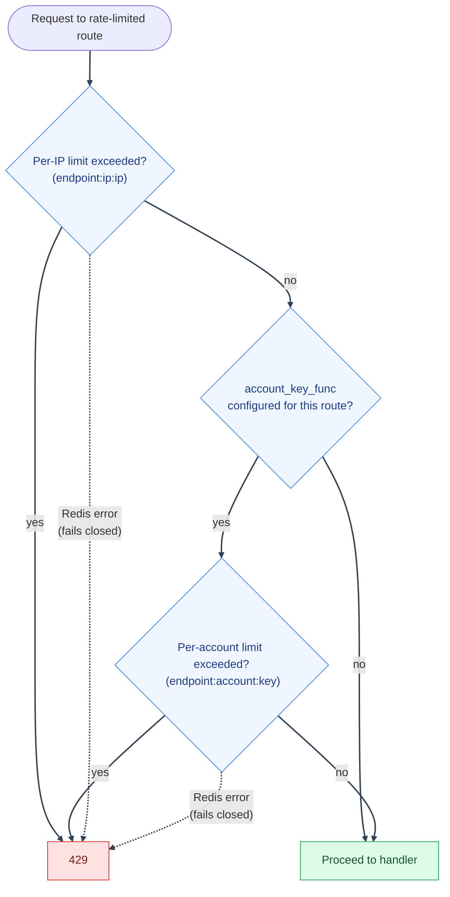
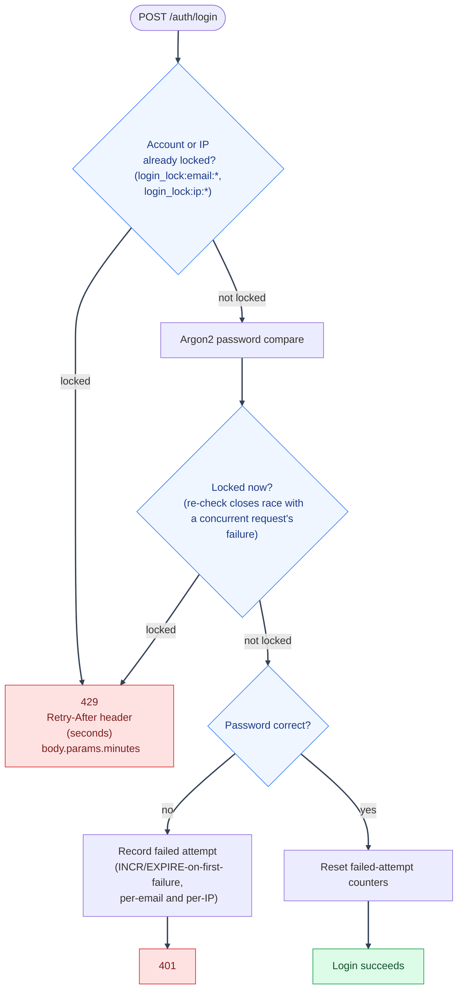

# Security Hardening: Abuse Prevention

---

Rate limiting, brute-force lockout, and timing-attack resistance: the mechanisms that push back on high-volume or automated abuse at the request layer. See [Security Hardening](hardening.md) for the full index, and [Security Decisions](decisions.md) for the _why_ behind non-obvious choices here.

---

## Rate limiting

`backend/mystic_auth/auth/security/rate_limiting/rate_limiter_service.py`: a generic sliding-window-by-fixed-bucket limiter backed by Redis (`INCR` + `EXPIRE` on first request in a window).

1. Applied via the `@rate_limiter_service.rate_limited("endpoint_name", account_key_func=...)` decorator on every route in `auth_routes.py`: signup, login, OAuth2 initiate/callback, `/auth/me`, logout, logout-all, password-reset request/confirm, verify-account request/confirm, list/revoke sessions.
2. **Not** applied to `refresh_token_routes.py` (`POST /auth/refresh/`). That route relies instead on its own single-use-token rotation and reuse-detection protection (see [Security Decisions](decisions-auth.md#rate-limiting-and-lockout-are-layered-not-singular)), which a generic request-volume limiter would only duplicate.

---

---

- **Always applies a per-IP limit** (`{endpoint_name}:ip:{ip}`), resolved via [`auth/security/client_ip.py`](../authorization/architecture/component-responsibilities.md#authorization-context-builder) (trusted-proxy-aware).
- **The two OAuth2 routes redirect instead of returning the JSON `429` shown as `R429` above**: `oauth2_login`/`oauth2_callback` pass `rate_limited(..., redirect_url=...)`, so an exceeded limit sends the browser to `/login?error=TOO_MANY_ATTEMPTS` instead - both routes are top-level navigations (they always return a `RedirectResponse`), not API calls with anywhere to render a JSON body. See [Google OAuth2 / PKCE](../authentication/oauth2-pkce.md#edge-cases--error-handling).
- **Optionally applies a per-account limit** when `account_key_func` is given (e.g. signup/password-reset-request key on the submitted email): closes the gap where an attacker spreads requests targeting one account across many source IPs to stay under the per-IP threshold alone.
- Both limits are configured by `MAX_REQUESTS_PER_WINDOW` / `REQUEST_WINDOW_SECONDS` (`env/.env.example`): one shared threshold/window for every rate-limited endpoint, not per-endpoint tunable today (see [Concerns](../concerns/README.md)).
- **Fails closed on Redis error, reviewed and kept intentionally**:
  1. `record_request` catches all exceptions, logs them, and returns `False` ("not allowed"): a Redis outage makes every rate-limited request appear over-limit and get rejected with `429`, rather than silently disabling rate limiting.
  2. This is the opposite tradeoff from the PBAC authorization cache, which fails open to the authoritative database on a Redis error: see [PBAC Troubleshooting: Redis cache management](../authorization/troubleshooting/redis-and-logging.md#redis-cache-management) for that contrast.
  3. Practical implication: a Redis outage makes the API fully unusable for any rate-limited auth route, not just slower. See [Security Decisions](decisions-auth.md#rate-limiter-fails-closed-on-a-redis-outage-reviewed-kept-intentionally) for why this was kept rather than changed.
- **`reset_counter` only ever deletes an actual rate-limit key**:
  1. `DELETE /rate-limits/{key}` (see [API Reference](../api/reference.md)) takes the key straight from the URL, but this same Redis instance also holds unrelated security-critical keys (`revoked:{jti}` token-revocation entries, password-reset/verify/account-delete tokens, the PBAC policy cache, and more).
  2. `reset_counter` rejects any key that doesn't match the `<endpoint>:<ip|account>:<identifier>` shape `list_active_limits` itself produces, so this endpoint can never be used to delete something outside the rate-limiter's own keyspace.

---

### Rate Limit Dashboard (`GET /rate-limits/`)

`RateLimitDashboardService.list_active_limits` powers the admin dashboard, and it doesn't only read `RateLimiterService.record_request`'s keys: it `SCAN`s the whole `<endpoint>:<ip|account|email>:<identifier>` keyspace, which also picks up [Brute-force lockout](#brute-force-lockout)'s `login_lock:*` keys below (`endpoint` shows as `login_lock` for those rows, and `_effective_limit` reports their own `MAX_FAILED_LOGIN_ATTEMPTS(_PER_IP)` threshold instead of `MAX_REQUESTS_PER_WINDOW`). So one dashboard, filterable by `scope` (`ip`/`account`/`email`), covers both mechanisms:

1. An `ip`-scoped row's identifier is always an IP address. This includes both a generic per-endpoint rate limit (e.g. `signup:ip:1.2.3.4`) and a `login_lock:ip:1.2.3.4` lockout row.
2. An `account`- or `email`-scoped row's identifier is always an account/email, **never an IP**, by design: both `account_key_func`-based limits and `login_lock:email:*` lockouts are deliberately keyed only by account, specifically so an attacker spreading requests across many source IPs at one account still gets caught (see the per-account bullet above and [Security Decisions](decisions-auth.md#rate-limiting-and-lockout-are-layered-not-singular)). There is no IP to show on those rows even in principle: the counter itself never recorded one.
3. To find which IP(s) were behind a given account's activity (e.g. investigating an `account`/`email`-scoped lockout), cross-reference the [Audit Log](#audit-log-cross-reference) instead, which does record `ip_address` per event; the rate limiter's own keys intentionally don't carry that.
4. **The matched-key listing is snapshotted for `_SCAN_SNAPSHOT_TTL_SECONDS` (5s)** per filter pattern (`RateLimitDashboardService._scan_snapshot_cache`, an in-process dict, not Redis), so that paging through one filtered view walks a consistent set of keys instead of two consecutive `SCAN`s disagreeing as counters expire/get created between page requests. `reset_counter` clears this entire snapshot cache on every successful delete, so an admin resetting a counter and immediately re-filtering the dashboard sees the key gone right away, rather than it lingering in the listing (with a correct, live-read count/TTL) for up to 5s until the snapshot naturally expires.

---

## Brute-force lockout

`backend/mystic_auth/auth/security/login_protection_service.py`: separate from and layered on top of the generic rate limiter (see [Security Decisions: rate limiting and lockout are layered](decisions-auth.md#rate-limiting-and-lockout-are-layered-not-singular)):

- Per-account: `MAX_FAILED_LOGIN_ATTEMPTS` failures within `LOGIN_LOCKOUT_TIME` seconds locks that email out (`login_lock:email:{email}`).
- Per-IP: `MAX_FAILED_LOGIN_ATTEMPTS_PER_IP` failures within `LOGIN_LOCKOUT_TIME_PER_IP` seconds locks that IP out across _any_ account it targets (`login_lock:ip:{client_ip}`).
- `check_and_record_action` double-checks `is_locked` both before and after the expensive password-hash comparison, closing a race where a concurrent request crosses the threshold mid-check.
- Both counters use `INCR`/`EXPIRE`-on-first-failure (not sliding), so the lockout window is fixed from the _first_ failure, not extended by each subsequent one.
- Both keys are visible and resettable from the [Rate Limit Dashboard](#rate-limit-dashboard-get-rate-limits) above, under endpoint `login_lock` - there's no separate lockout-specific admin view.
- The `429` a lockout returns tells the caller how long to actually wait, read straight from the tripped key's remaining Redis TTL (`get_remaining_seconds`): a standard `Retry-After` header (RFC 9110) plus `params.minutes` (rounded up) in the JSON body for the login form's own translated message. See [Login](../authentication/login.md) for the full response shape.

---

---

### Audit Log cross-reference

1. The rate limiter and lockout counters are ephemeral (Redis `TTL`-expired) and, for `account`/`email`-scoped keys, never store an IP at all.
2. For a durable, per-event history that does include `ip_address` (e.g. "which IPs hit this account's failed logins"), use the Audit Log instead: `backend/mystic_auth/audit_log/`, `GET /audit/security-log`, filterable by `ip_address` (see [API Reference](../api/reference.md)).
3. It's a separate Postgres-backed record of individual events, not a live counter.

---

## Timing-attack resistance

See [Security Decisions: timing-attack mitigations](decisions-auth.md#timing-attack-mitigations): applied at login (dummy-hash comparison), signup (unconditional hashing), and password-reset-request (identical generic response).

---
