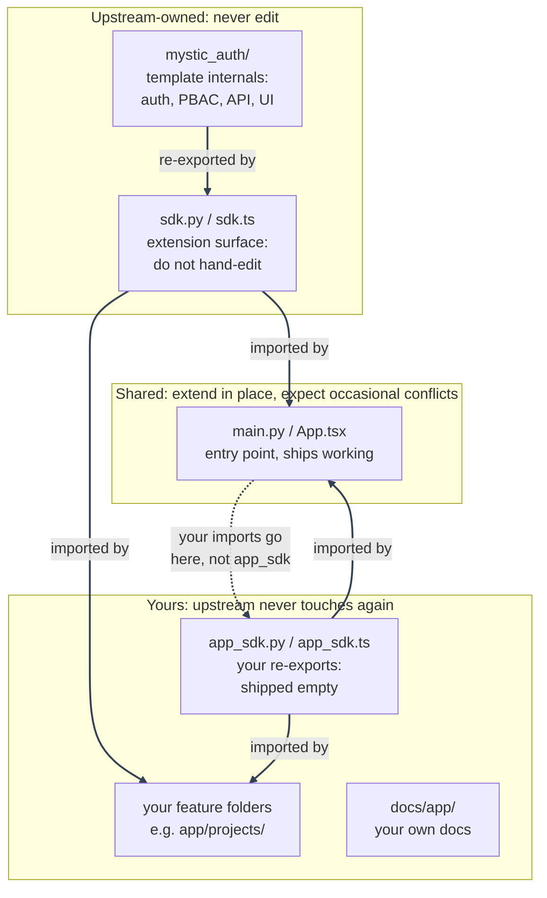

# Using This Repository as a Template

---

## What this template provides

This template ships the authenticated app shell (sidebar, top bar, and the auth/PBAC/audit-log pages listed below) plus a minimal pre-auth landing page at `/` (`frontend/src/app/landing_page/LandingPage.tsx`, mounted in `frontend/src/app/App.tsx`) that redirects an already-signed-in visitor straight to `/dashboard`. It's a worked example of the "outside the auth shell" page shape, not a page meant to ship as-is - rename, restyle, or replace it freely (see [worked example §6](worked-example.md#6-a-pre-auth-landing-page)).

- **Authentication**: email+password with Argon2 hashing, email verification, rate limiting + brute-force lockout, Google OAuth2 (PKCE), JWT access+refresh tokens as httpOnly cookies, refresh-token rotation with reuse detection, logout/logout-all, forgot/reset password. See [Authentication Overview](../authentication/overview.md).
- **Authorization**: Policy-Based Access Control (PBAC), not RBAC. Every protected route is gated by an assigned `Policy`, not by a user's `role`. Policies are data (rows in Postgres), so a new access rule is a new policy, not a new deploy. See [PBAC Architecture](../authorization/architecture.md).
- **Audit logging**: two append-only tables: security/session events, and every PBAC allow/deny decision. See [Database Design](../database/design.md#why-two-audit-tables-not-one).
- **Frontend**: React 19 + TypeScript, Vite, Chakra UI v3, Zustand, TanStack Query. See [Frontend Architecture](../architecture/frontend.md).
- **Infrastructure**: Docker Compose (dev + prod), PostgreSQL, Redis, Procrastinate async email (Postgres-native, no separate broker), Alembic migrations, GitHub Actions CI.
- **Error monitoring**: self-hosted Bugsink, on by default with the stack. See [Error Monitoring](../error-monitoring/overview.md).

---

## Quickstart

1. Click **[Use this template](https://github.com/Nachiket-2024/mystic-auth/generate)**, then clone _your_ new repo.
2. `cp .env.example .env`: prefilled with working (fake) values, so this just works for local dev as-is. Only two things need real values before those specific features work: `GOOGLE_CLIENT_ID`/`GOOGLE_CLIENT_SECRET` ([OAuth setup](#oauth-setup-google)) and `FROM_EMAIL`/`GMAIL_APP_PASSWORD` ([Email setup](#email-setup)). Everything else runs fine without them.
3. Run the dev helper for your shell: `./scripts/docker/dev-up.sh` (Git Bash, WSL, Linux, macOS), `.\scripts\docker\dev-up.ps1` (PowerShell), or `scripts\docker\dev-up.cmd` (Command Prompt).

   The helper brings up backend, frontend, Postgres, Redis, Procrastinate, and Bugsink, migrations included, then settles into showing just `backend`/`frontend`/`procrastinate_worker` logs instead of every service's full startup output (see [Docker Overview](../docker/overview.md#day-to-day-dev-up-helpers)). Plain `docker compose up` still works if you want everything's logs interleaved instead.

---

Once it's up:

- **Backend docs**: [http://localhost:8000/docs](http://localhost:8000/docs)
- **Frontend**: [http://localhost:5173](http://localhost:5173)
- **Bugsink** (error monitoring): [http://localhost:8010](http://localhost:8010)
- **Procrastinate** (email worker, retries, and scheduled account-purge, all in one process): no UI or port, it just runs. The dev helper includes `procrastinate_worker` in the live log tail. Use `docker compose logs -f procrastinate_worker` when you want only its logs. See [Background Email Delivery](../background-workers/procrastinate.md).
- Postgres/Redis are reachable on `localhost:5433`/`localhost:6380` (non-default host ports, to avoid clashing with anything else you have running locally).

Then create the reserved system superuser (one-time, CLI-only):

```bash
docker compose exec -it backend python -m mystic_auth.scripts.create_system_user
```

See root [`README.md`](https://github.com/Nachiket-2024/mystic-auth/blob/main/README.md#first-time-setup-creating-the-system-superuser) for the prompts.

---

## Environment configuration

Every setting is documented inline in [`.env.example`](https://github.com/Nachiket-2024/mystic-auth/blob/main/.env.example): treat that file as the source of truth, not this doc. `frontend/.env.example` only matters if you run the frontend locally with `npm run dev` instead of Docker.

To rename the app: set `APP_NAME` in the root `.env`, then `docker compose up --build`. `docker-compose.yml` aliases `VITE_APP_NAME` from that same `APP_NAME` (the frontend value is baked in at build time), so there's only one setting to change, not two. Nothing else hardcodes a product name. CI keeps using its own placeholder `APP_NAME` regardless; that's expected, not something to sync.

To change the default brand color: set `BRAND_COLOR` in the root `.env` the same way, aliased to `VITE_BRAND_COLOR`. See [Appearance: Per-User Brand Color](../appearance/overview.md#default-brand-color).

---

## The `app/` + `mystic_auth/` split

Both backend and frontend are split into two trees, and every file in the repo falls into exactly one of three ownership tiers. This is purely a **file-path convention**: there's no tooling enforcing it (no `CODEOWNERS`, no merge driver), just a rule both this template and your own code agree to follow. Knowing which tier a file is in tells you whether you can edit it freely, should never edit it, or should expect the occasional merge conflict there.

---

| Tier                                                     | Files                                                                                                                                                                                                                                                       | Who edits it    | Why                                                                                                                                                                                                                                                                                                                                                                                                                                                                                                                                                   |
| -------------------------------------------------------- | ----------------------------------------------------------------------------------------------------------------------------------------------------------------------------------------------------------------------------------------------------------- | --------------- | ----------------------------------------------------------------------------------------------------------------------------------------------------------------------------------------------------------------------------------------------------------------------------------------------------------------------------------------------------------------------------------------------------------------------------------------------------------------------------------------------------------------------------------------------------- |
| **Upstream-owned: never edit**                           | `backend/mystic_auth/`, `backend/app/sdk.py`, `frontend/src/mystic_auth/`, `frontend/src/app/sdk.ts`, `docs/mystic_auth/`, `screenshots/mystic_auth/`                                                                                                       | Only upstream   | This is the template's actual implementation. Since you never touch it, every `scripts/upstream-sync/sync-upstream.sh` merge applies here cleanly because there's nothing of yours for it to conflict with.                                                                                                                                                                                                                                                                                                                                           |
| **Yours: upstream never touches it again**               | `backend/app/app_sdk.py`, `frontend/src/app/app_sdk.ts`, `frontend/src/app/theme.ts`, `docs/app/`, `screenshots/app/`, root `README.md`, `SECURITY.md`                                                                                                      | Only you        | Upstream ships these once (`app_sdk.*`/`theme.ts` empty, the READMEs as generic starting points) and never edits them again in any future release. Since only you write to them, they never conflict either.                                                                                                                                                                                                                                                                                                                                          |
| **Shared: extend in place, expect occasional conflicts** | `backend/app/main.py`, `frontend/src/app/App.tsx`, plus root-level config neither side owns outright: `frontend/package.json`, `backend/requirements.txt`, `docker-compose.yml`, `docker-compose.local-prod.yml`, `docker-compose.prod.yml`, `.env.example` | Both, over time | These have to ship as real, working files (an entry point that mounts routers, a router that renders routes, a dependency list, a compose file), so they can't start empty the way `app_sdk.*` does. You're expected to extend them (register your own router, add your own `<Route>`, add your own dependency), and upstream may also touch the same file later (e.g. a middleware-ordering fix, or a dependency swap). This is the one tier where a sync merge can genuinely conflict, and it's a normal, expected part of syncing when it happens. |

---



---

`sdk.py`/`sdk.ts` re-export the pieces you're meant to build on (`require_authorization`, `Permission`, `useAuthorization`, `ProtectedRoute`, the shared `api` client, and more): import from there, not from internal `mystic_auth/` paths directly.

Your own new feature folders (`backend/app/projects/`, `frontend/src/app/projects/`) are effectively a fourth, unlisted case: upstream has no idea they exist, so they behave like the "yours" tier automatically, with no path convention needed.

The diagram above only shows code files, since it's tracing import relationships; the shared config files from the table above (`package.json`, `requirements.txt`, `docker-compose*.yml`, `.env.example`) don't import anything, but they're in the same "Shared" tier as `main.py`/`App.tsx` for the same reason: you're expected to add your own entries, and upstream may add or change its own later. See [Syncing Upstream Template Updates](syncing-upstream.md) for what a conflict in one of these actually looks like.

---

## Frontend customization

Theme, pages, routing, state, and your own code under `frontend/src/app/`, plus the shared-chrome
extension points (`extraNavItems`, `extraNavbarContent`, the command palette's `extraSearchItems`,
and `AuditLogPage`'s `extraResourceTypes`/`extraActions`) that let your own routes plug into
mystic_auth/-owned UI without editing it directly. See
[Frontend Customization](frontend-customization.md) for the full details.

---

## Backend customization

- **New domain/resource**: a new top-level package under `backend/app/` (sibling to `mystic_auth/`) with its own model/schema/CRUD/router, mounted in `backend/app/main.py`, importing from `backend/app/sdk.py`. See [Backend Architecture](../architecture/backend.md#module-layout) for the shape to follow.
- **Database changes**: an Alembic migration under `backend/alembic/versions/`: no `create_all()`. See [Database Design](../database/design.md#migrations).
- **Configuration**: settings live in `backend/mystic_auth/core/settings.py`: add new ones there, re-exported from `sdk.py` as `settings`.

---

## PBAC usage

Protecting a route always goes through `require_authorization(action, resource_type)`: never a role check:

```python
from fastapi import APIRouter, Depends
from sqlalchemy.ext.asyncio import AsyncSession
from app.sdk import require_authorization, Permission, database

router = APIRouter(prefix="/projects", tags=["Projects"])

@router.get("/")
async def list_all_projects(
    current_user: dict = Depends(require_authorization("projects:list_all", "projects")),
    db: AsyncSession = Depends(database.get_session)
):
    return await project_crud.get_all(db)
```

`resource_type`/`action` don't need to be `Permission` enum values: any string works, granted via a policy (see [Writing and Testing Policies](../authorization/writing-testing-policies.md#policy-creation-workflow)). Only add a `Permission` enum member if the action is sensitive enough to need the privilege-escalation guard (see [Adding New Permissions](../authorization/adding-permissions.md)).

See [Worked Example: Adding a New Domain, End to End](worked-example.md) for all of the above: model, schema, router, migration, policy, frontend page, route, and nav link, wired together for one fake domain as a copy-and-rename starting point for your first feature.

Don't need PBAC's full generality (conditions, per-resource scoping), just "everyone with role X gets these actions"? See [RBAC Quickstart](../authorization/rbac-quickstart.md): same policies, just unconditioned ones, no separate mechanism to learn.

---

## Replacing the frontend entirely

The backend is a stateless JSON API with no frontend-specific coupling: deleting `frontend/` and building a different client against it is supported. It expects cookie-based JWT auth (`access_token` + `refresh_token`, both httpOnly/secure/`SameSite=Strict`) from an origin matching `FRONTEND_BASE_URL`. Full route contract: [API Reference](../api/reference.md).

---

## OAuth setup (Google)

1. Create an OAuth 2.0 Client ID in the [Google Cloud Console](https://console.cloud.google.com/apis/credentials) (Web application type).
2. Add an authorized redirect URI matching `GOOGLE_REDIRECT_URI` exactly (scheme, host, path, trailing slash all matter).
3. Fill in `.env`: `GOOGLE_CLIENT_ID`, `GOOGLE_CLIENT_SECRET`, `GOOGLE_REDIRECT_URI` (e.g. `http://localhost:8000/auth/oauth2/callback/google` locally).

See [OAuth2 / PKCE](../authentication/oauth2-pkce.md) for the mechanics and troubleshooting.

---

## Email setup

| Variable             | Purpose                                                                               |
| -------------------- | ------------------------------------------------------------------------------------- |
| `FROM_EMAIL`         | The Gmail account sending mail (also the SMTP username)                               |
| `GMAIL_APP_PASSWORD` | A Gmail [App Password](https://myaccount.google.com/apppasswords) (needs 2FA enabled) |
| `SUPPORT_EMAIL`      | Optional `Reply-To`, falls back to `FROM_EMAIL`                                       |

Without these, signup/verification/reset emails fail to send after retries, but the rest of the app keeps working. See [Background Email Delivery](../background-workers/procrastinate.md).

---

## Deployment

See the [Deployment Guide](../deployment/guide.md) for Compose topology, required env vars, migrations, backups, and production host requirements. Use [`docker-compose.local-prod.yml`](https://github.com/Nachiket-2024/mystic-auth/blob/main/docker-compose.local-prod.yml) for a production-style local or self-hosted run behind an external TLS layer. Use [`docker-compose.prod.yml`](https://github.com/Nachiket-2024/mystic-auth/blob/main/docker-compose.prod.yml) for self-hosting on your own server, where Caddy terminates TLS.

---

## Staying in sync with upstream template updates

Pulling in fixes/features from the original template once your own project has diverged from it now lives in its own doc, including the full step-by-step walkthrough and a worked conflict-resolution example: see [Staying in Sync with Upstream Template Updates](syncing-upstream.md).

---

## Where to go next

- New to the codebase? Start at [`docs/mystic_auth/README.md`](../README.md) for the full index.
- Building a protected feature? [Adding New Permissions](../authorization/adding-permissions.md), protect the route above, then [Writing and Testing Policies](../authorization/writing-testing-policies.md).
- Something not behaving as documented? [PBAC Troubleshooting](../authorization/troubleshooting.md).

---

## Getting help

Search [existing Issues](https://github.com/Nachiket-2024/mystic-auth/issues) first, then open a new one with clear repro steps. PRs welcome. **Found a security vulnerability?** Don't open a public Issue: see [SECURITY.md](https://github.com/Nachiket-2024/mystic-auth/blob/main/SECURITY.md).

---
