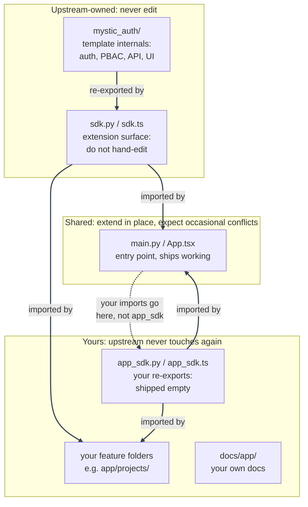

# The `app/` + `mystic_auth/` Split

---

_Part of [Using This Repository as a Template](overview.md). This is the file-ownership convention that makes [staying in sync with upstream](syncing-upstream/README.md) low-conflict: which files you can edit freely, which you should never touch, and which are shared and expect the occasional merge conflict._

Both backend and frontend are split into two trees, and every file in the repo falls into exactly one of three ownership tiers. This is purely a **file-path convention**: there's no tooling enforcing it (no `CODEOWNERS`, no merge driver), just a rule both this template and your own code agree to follow. Knowing which tier a file is in tells you whether you can edit it freely, should never edit it, or should expect the occasional merge conflict there.

---

| Tier                                                     | Files                                                                                                                                                                                                                                                                                                                                                           | Who edits it    | Why                                                                                                                                                                                                                                                                                                                                                                                                                                                                                                                                                                                                                                                                                                                                                                                                                                                      |
| -------------------------------------------------------- | --------------------------------------------------------------------------------------------------------------------------------------------------------------------------------------------------------------------------------------------------------------------------------------------------------------------------------------------------------------- | --------------- | -------------------------------------------------------------------------------------------------------------------------------------------------------------------------------------------------------------------------------------------------------------------------------------------------------------------------------------------------------------------------------------------------------------------------------------------------------------------------------------------------------------------------------------------------------------------------------------------------------------------------------------------------------------------------------------------------------------------------------------------------------------------------------------------------------------------------------------------------------- |
| **Upstream-owned: never edit**                           | `backend/mystic_auth/`, `backend/app/sdk.py`, `frontend/src/mystic_auth/`, `frontend/src/app/sdk.ts`, `docs/mystic_auth/`, `screenshots/mystic_auth/`, `scripts/mystic_auth/`, `agent-prompts/mystic_auth/`, `local-scripts/mystic_auth/`, `docker/mystic_auth/`, `env/mystic_auth/`, `makefiles/mystic_auth/`, root `Makefile`/`make.ps1`                      | Only upstream   | This is the template's actual implementation. Since you never touch it, every `scripts/mystic_auth/upstream-sync/sync-upstream.sh` merge applies here cleanly because there's nothing of yours for it to conflict with.                                                                                                                                                                                                                                                                                                                                                                                                                                                                                                                                                                                                                                  |
| **Yours: upstream never touches it again**               | `backend/app/app_sdk.py`, `frontend/src/app/app_sdk.ts`, `frontend/src/app/theme.ts`, `docs/app/`, `screenshots/app/`, `scripts/app/`, `agent-prompts/app/`, `local-scripts/app/`, `docker/app/`, `env/app/`, `makefiles/app/`, root `README.md`, `SECURITY.md`, `CONTRIBUTING.md`                                                                              | Only you        | Upstream ships these once (`app_sdk.*`/`theme.ts` empty, the READMEs as generic starting points, `app/` script/prompt/compose/env/makefiles folders empty) and never edits them again in any future release. Since only you write to them, they never conflict either.                                                                                                                                                                                                                                                                                                                                                                                                                                                                                                                                                                                   |
| **Shared: extend in place, expect occasional conflicts** | `backend/app/main.py`, `frontend/src/app/App.tsx`, plus root-level config neither side owns outright: `frontend/package.json`, `backend/requirements.txt`, `backend/alembic.ini`, `backend/pyproject.toml`, `.github/workflows/ci.yml`, `.vscode/settings.json`, `pytest.ini`, `CLAUDE.md`, `.gitignore`, `.dockerignore`, `docker/tailscale-serve-config.json` | Both, over time | These have to ship as real, working files (an entry point that mounts routers, a router that renders routes, a dependency list, a CI pipeline, ignore rules, a JSON config a tool expects at one specific path with no include mechanism of its own), so they can't start empty the way `app_sdk.*` does, and each has to stay a single file per its own tool's convention rather than splitting into `app/`/`mystic_auth/` folders. You're expected to extend them (register your own router, add your own `<Route>`, add your own CI job, ignore your own generated paths, add your own Tailscale serve handler), and upstream may also touch the same file later (e.g. a middleware-ordering fix, or a dependency swap). This is the one tier where a sync merge can genuinely conflict, and it's a normal, expected part of syncing when it happens. |

---

---

`sdk.py`/`sdk.ts` re-export the pieces you're meant to build on (`require_authorization`, `Permission`, `useAuthorization`, `ProtectedRoute`, the shared `api` client, and more): import from there, not from internal `mystic_auth/` paths directly.

Your own new feature folders (`backend/app/projects/`, `frontend/src/app/projects/`) are effectively a fourth, unlisted case: upstream has no idea they exist, so they behave like the "yours" tier automatically, with no path convention needed.

The diagram above only shows code files, since it's tracing import relationships; the shared config files from the table above (`package.json`, `requirements.txt`) don't import anything, but they're in the same "Shared" tier as `main.py`/`App.tsx` for the same reason: you're expected to add your own entries, and upstream may add or change its own later. See [Syncing Upstream Template Updates](syncing-upstream/README.md) for what a conflict in one of these actually looks like.

Compose files and env files aren't in that tier at all: each got the same `mystic_auth/`/`app/` split as everything else (`docker/mystic_auth/compose/` + `docker/app/compose/`, `env/mystic_auth/` + `env/app/`), so a sync never conflicts on them either. Every `docker compose` invocation in this template's own scripts passes both `-f` flags and both `--env-file` flags (mystic_auth's, then app's, so an app-declared value wins on overlap) - see [Docker: Compose Modes](../docker/compose-modes.md).

The same split reaches the rest of `docker/` too:

- `docker/mystic_auth/dockerfiles/` + `docker/app/dockerfiles/`: upstream's `backend.Dockerfile`/`frontend.Dockerfile`/`backend-entrypoint.sh` versus your own, for a whole new service (not just tweaking an existing one - that's a rare enough need to treat as a "Shared, extend in place" edit on the upstream file directly). Compose lets an override file introduce a brand-new service name, not just override an existing one, so your own `docker/app/compose/docker-compose.<mode>.yml` can add a service that builds from `docker/app/dockerfiles/your-service.Dockerfile` and it merges in cleanly alongside every upstream service - see `docker/app/dockerfiles/README.md` for the exact shape.
- `docker/mystic_auth/postgres-init/` + `docker/app/postgres-init/`: Postgres bootstrap scripts. Postgres only scans files directly inside `/docker-entrypoint-initdb.d/`, not subdirectories, so a fork's own init script needs an explicit per-file mount in its own `docker/app/compose/docker-compose.<mode>.yml` rather than just dropping a file in - see `docker/app/postgres-init/README.md` for the exact mount syntax.
- `docker/mystic_auth/Caddyfile` + `docker/app/caddy/`: the prod reverse-proxy config. Caddy's `import` directive with a glob matching zero files is a no-op, not an error, so upstream's Caddyfile ends with `import /etc/caddy/app/*.caddy` and `docker-compose.prod.yml` mounts `docker/app/caddy/` there unconditionally - a fork's own `.caddy` site block is picked up with no compose edit needed. Verified live: `caddy validate` passes against the real (empty) `docker/app/caddy/` as shipped.
- `docker/mystic_auth/nginx.frontend.conf` + `docker/app/nginx/`: same pattern for the frontend's production nginx config, using nginx's own `include` with a glob (also a no-op on zero matches). Since this file is baked into the image at build time rather than mounted, `docker/mystic_auth/dockerfiles/frontend.Dockerfile` copies `docker/app/nginx/` into the image unconditionally instead - verified live with a real `docker build --target production` and `nginx -t` against the built image.

`docker/tailscale-serve-config.json` is the one exception, and stays Shared tier: it's a single JSON document with no native include/merge mechanism (unlike Caddy/nginx), and building a custom merge step (e.g. a `jq`-based entrypoint wrapper) would add real fragility for a file that's normally under 20 lines and simplest to just hand-edit. The same reasoning applies to `backend/requirements.txt`/`alembic.ini`/`pyproject.toml` sitting at `backend/` and not under either split folder: each tool expects its config at one specific path, so it can't be split without either breaking the tool or building more machinery than the customization is worth.

The root `Makefile` and `make.ps1` get the split too, the same way. Both `make` and PowerShell can pull in another file at runtime (`include`/`-include` for Make, dot-sourcing for PowerShell), so unlike `main.py`/`App.tsx` there's no reason to force them into the Shared tier: the real targets live in `makefiles/mystic_auth/Makefile` + `makefiles/app/Makefile` (and the `make.ps1` equivalents, a `$MysticAuthTargets` hashtable merged with `$AppTargets`), and the root files themselves are two lines of `include` each - stable enough that a sync almost never touches them, and add-only for you: a target with the same name in `makefiles/app/` overrides the upstream one, verified live (`make hello`/`.\make.ps1 hello` after adding one).

---

See [Using This Repository as a Template](overview.md) for the rest: quickstart, customizing the frontend/backend, deployment, and staying in sync with upstream.

---
