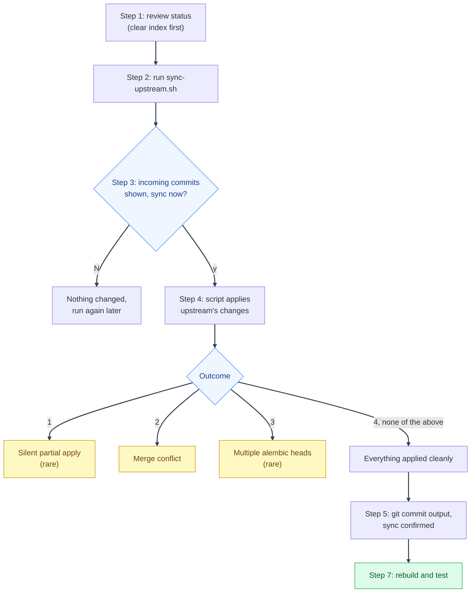

# Staying in Sync with Upstream Template Updates

---

"Upstream" just means the original mystic-auth template repo: the one you clicked **Use this template** on. Every so often it gets new fixes or features, and you can pull those into your own project whenever you want. See [Using This Repository as a Template](../overview.md) for everything else about building on top of this template; this page is just the sync mechanism itself.

**Before anything else, the thing most people worry about here: this will not fill your project's history with the template's own commits.** Your `git log` stays exactly what it's always been: your own commits, plus one extra commit for whatever you just pulled in after a sync. Upstream's own commit-by-commit history (all the work that went into building this template) never gets attached to your project at all, no matter how many times you sync over the life of your project. What follows is purely about _file changes_ landing in your project, not upstream's history becoming part of it.

If you've never pulled updates from a "template" repo into your own project before, that's fine. It's not a common everyday git workflow. Nothing below requires git knowledge beyond `git add` and `git commit`. Just follow the steps in order.

Prefer to hand this whole process to an AI coding agent (Claude Code, Codex, or similar) instead? See [`agent-prompts/sync-with-upstream.md`](https://github.com/Nachiket-2024/mystic-auth/blob/main/agent-prompts/mystic_auth/sync-with-upstream.md) at the repo root for a ready-to-paste prompt.

---

## Before you start

Run the command from the root of the downstream project created from this template. Do not run it from a separate clone of the upstream template. Confirm the following first:

- You know which downstream branch should receive the sync.
- `git status` has been reviewed and any staged work has been committed or stashed.
- You have a recent backup of important local work.
- Docker is available if you plan to run the post-sync rebuild and tests.

The script requires a clean Git index (`git diff --cached` must be empty). A completely clean working tree is still the recommended starting point. If unstaged or untracked downstream work exists, the script temporarily stashes it, including an app split, applies upstream against a clean tree, and restores the work after the sync commit. Ignored files, such as real env files, are not included. If restoration conflicts, the sync commit remains and the retained stash must be resolved manually.

Before making a preparatory stash, confirm that the current
`scripts/mystic_auth/upstream-sync/sync-upstream.sh` exists in the working
tree. On an older downstream checkout it may exist locally without being in
`HEAD`; preserve that current file and exclude it from any stash of the other
work. If it is staged, unstage only the script without discarding its contents.
Never replace it with an older copy recovered from a stash. If the script is
already inside a preserved stash, restore only that exact path, or restore it
from the fetched upstream branch. Leave the rest of the split stash untouched.
Files from an app split that are absent from `HEAD` do not block a first sync
between unrelated histories.

The sync is pull-only. It fetches from the `upstream` remote, applies approved upstream file changes, and creates one local sync commit. It never pushes to `origin`, changes root downstream documentation, or copies secret values into the agent's context.

---

## Step by step



Silent partial apply, conflict, and multiple alembic heads are safety nets, not expected steps. See [Troubleshooting](troubleshooting.md) for each. If upstream removes or moves a file, the script prints an explicit `DELETE`/`MOVE` plan before asking for confirmation. Intentional upstream-owned deletions and renames are applied directly from the fetched tree, even if the old path is already absent from the downstream index.

For an upstream-owned file that still exists in the recorded upstream baseline but is missing from the downstream `HEAD`, the script restores that baseline file to the index before applying the three-way patch. This gives Git the base it needs for a later upstream edit. True upstream deletions and renames skip that step and use the explicit structural operation instead.

The ownership guard runs before any patch is applied. It blocks the entire sync if upstream changes downstream-owned product code, tests, or app folders. It protects `backend/app/`, `frontend/src/app/`, every `tests/**/app/` tree, and the `app/` folders under `docs/`, `screenshots/`, `scripts/`, `agent-prompts/`, `local-scripts/`, `docker/`, `env/`, and `makefiles/`, except for the documented shared SDK and entry point files. Older template reference tests may be grandfathered when the same path exists in the recorded upstream baseline; newly added downstream tests remain blocked. On a first sync between unrelated histories, downstream-only paths, including app files temporarily absent because the app split was stashed, are not treated as incoming changes or ownership violations.

If a downstream checkout has the pre-grandfathering sync script, preserve the
pending work, verify the inherited test path existed at the last sync, replace
only that upstream-owned script with the fetched upstream version, and rerun.
Do not force the sync, skip the ownership check, or weaken it for new tests.

Root `README.md`, `SECURITY.md`, and `CONTRIBUTING.md` are downstream-owned starting points too. If upstream changed them, the script reports and excludes those changes so the local copies are preserved while unrelated upstream fixes continue. Most syncs go straight down the right-hand “Clean” path.

---

### Step 1: Check that you don't have unsaved work

```bash
git status
```

If this lists any files, save your work first when practical: either commit it normally, or run `git stash` to set it aside. The sync specifically refuses a dirty index (`git diff --cached`), even if the staged changes are unrelated, because the index is the sync's merge/apply workspace and commit boundary. Unstaged and untracked work can be preserved automatically, but starting clean makes the resulting sync commit and any recovery straightforward.

---

### Step 2: Run the sync script

Do this from the main folder of your project (the repo you created from **Use this template**).

```bash
./scripts/mystic_auth/upstream-sync/sync-upstream.sh        # Git Bash / WSL / Linux / macOS
# .\scripts\mystic_auth\upstream-sync\sync-upstream.ps1      # PowerShell
# scripts\mystic_auth\upstream-sync\sync-upstream.cmd        # Command Prompt
```

The real logic only exists once, as the bash script: it's dense git plumbing with its own regression suite, and a second, independently-written PowerShell copy of that same logic would just be two places for the same subtle bug to hide. The `.ps1`/`.cmd` entry points instead locate the Git Bash that already ships with Git for Windows (the same `git` install this needs either way) and run the real script through it, so PowerShell/Command Prompt users still get one command, no manual "open Git Bash first" step.

The very first time you run this, it also quietly sets up a second connection to the original template repo (git calls this a "remote", and this one's named `upstream`). That's just so the script knows where to download updates from. It does not touch your existing GitHub connection (`origin`) and does not push or upload anything anywhere. It only downloads.

---

### Step 3: Read what it found, and say yes or no

You'll see something like this printed:

```
Incoming commits from upstream/main:
a1b2c3d Add rate limiting to login
9f8e7d6 Fix OAuth redirect edge case

Sync these into the current branch now? [y/N]
```

That's the list of what's new upstream since you last synced (or ever, if this is your first time). Type `y` and press Enter if you want to bring those changes in. Type `N` (or just press Enter) if you'd rather wait: nothing will be changed, and you can run the script again later whenever you're ready.

---

### Step 4: The script copies upstream's changes into your files

This step is fully automatic: you don't type or decide anything here. For almost every file, this just quietly works: your code and upstream's code are kept in separate files and folders by design. See the [ownership split](../ownership-split.md) for the table. When it's done, one of four things will have happened, checked automatically in this order:

1. **Something silently failed to apply** (rare): go to [If it reports a silent partial apply](troubleshooting.md#if-it-reports-a-silent-partial-apply).
2. **It hit what's called a "conflict"**: go to [Step 6](troubleshooting.md#step-6-conflict-resolve-it).
3. **It produced two alembic migration heads** (rare, only if this app and upstream both added a migration since your last sync): go to [If it reports multiple alembic heads](troubleshooting.md#if-it-reports-multiple-alembic-heads).
4. **None of the above (everything applied cleanly)**: go to **Step 5**.

Most syncs hit none of 1-3 and go straight to Step 5. The two "rare" cases are safety nets, not expected steps, they exist so a bad sync fails loudly instead of quietly.

---

### Step 5: Clean sync: you're basically done

You'll see normal `git commit` output on screen, ending with a message confirming the sync succeeded. The commit contains the upstream changes and `.mystic-auth-sync-state`; it must not contain unrelated staged downstream work. There's no Step 6 here; that number belongs to the conflict-resolution path in [Troubleshooting](troubleshooting.md#step-6-conflict-resolve-it), which a clean sync skips entirely. Continue to [Step 7: Rebuild and test](rebuild-and-push.md#step-7-rebuild-and-test-before-you-trust-any-of-it).

If you want to review the sync before keeping its commit, run this immediately after a successful sync:

```bash
git reset --soft HEAD^    # remove only the generated sync commit
git diff --cached --stat  # review the staged sync changes
```

Commit the staged result when it is approved. Do not use `git reset --hard`, and do not run another sync while these changes remain staged. This review workflow does not commit or expose downstream secrets.

If a sync stops on a conflict or multiple Alembic heads, do not start another
sync. Resolve the existing staged changes, verify the migration graph, and
commit that pending sync result first. The state file is already staged by the
script and must remain aligned with the reviewed sync.

The same rule applies after the optional soft-reset review. If `HEAD` is older
than the staged sync result and `.mystic-auth-sync-state` is staged but not
committed, finish that review and commit it before syncing again. Do not stash
the staged result or let the next run fall back to a fresh first sync.

---

## Pages

- [Rebuild, Push, and Reference](rebuild-and-push.md): rebuilding and testing, pushing, how the sync stays fast across many syncs, and a worked conflict-resolution example.
- [Troubleshooting](troubleshooting.md): a silent partial apply, a merge conflict, or multiple alembic heads.
- [Syncing with an AI Coding Agent](agent-prompt.md): a copy-paste starting prompt for handing this whole process to an agentic coding tool instead of following the steps above by hand.

---
